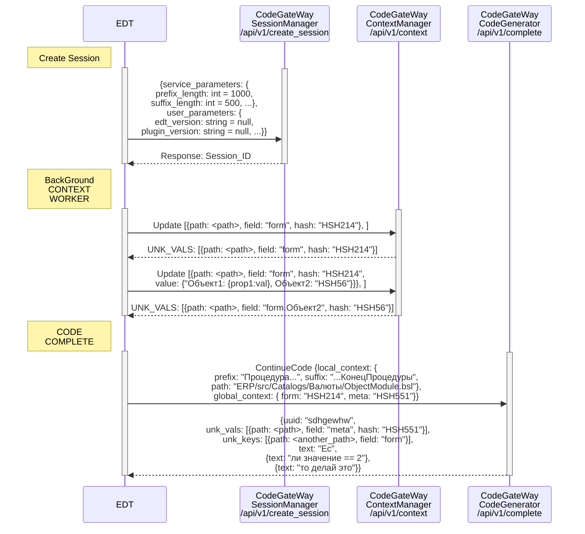
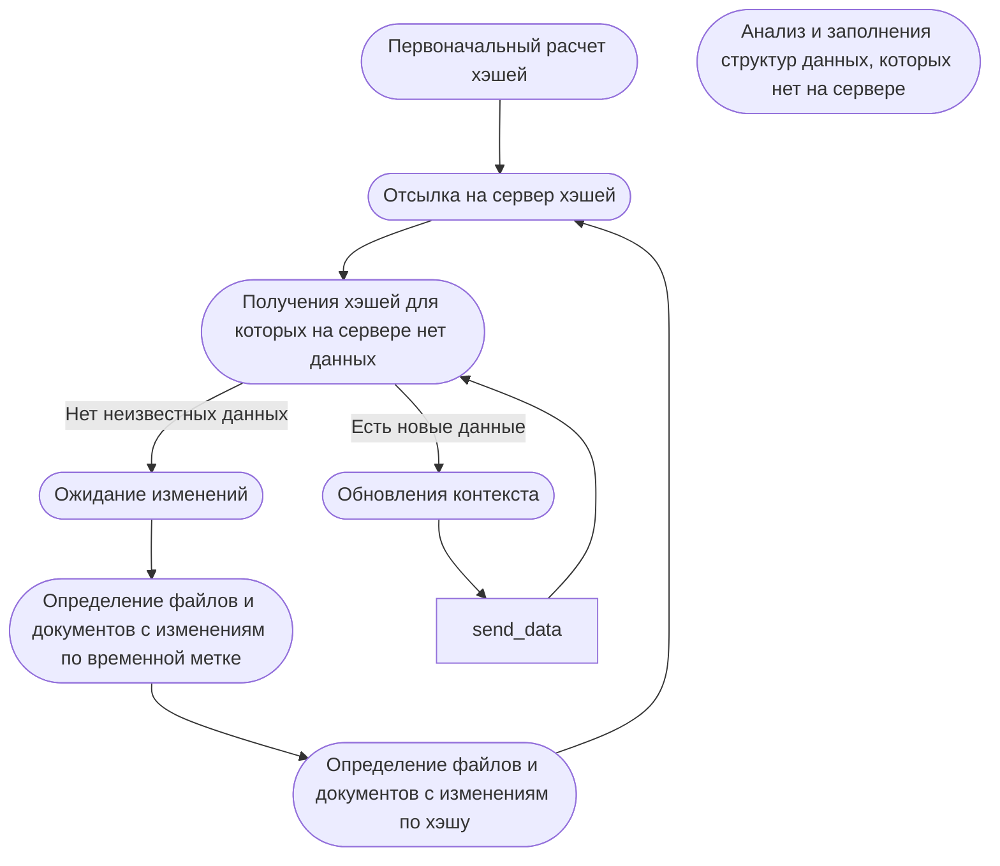
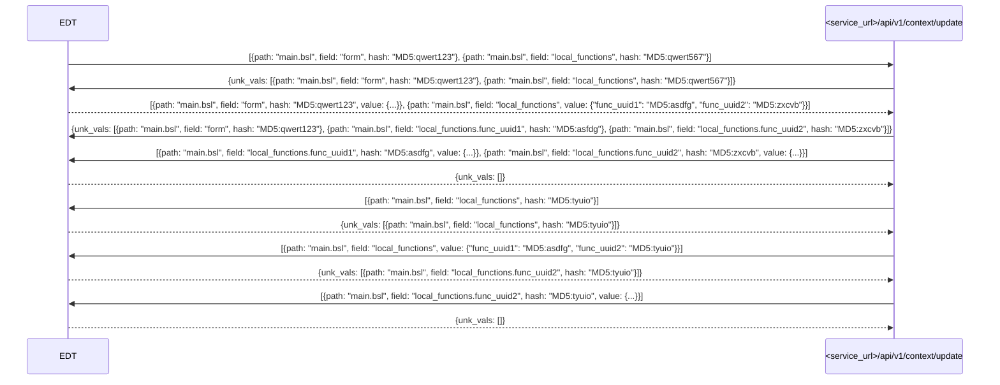

# 1С:Напарник

Набор плагинов для интеллектуальной поддержки разработчиков в среде 1С:EDT и Java:Eclipse, предоставляющий инструменты генерации кода, ИИ чат и другие
возможности повышения продуктивности.

___

## Возможности

1С:Напарник — это AI‑ассистент, который:

- Подсказывает продолжение кода и варианты автодополнения с учетом оперативного, локального и глобального контекста проектов
- Синхронизирует контекст (метаданные, формы, методы) для релевантных подсказок
- Собирает обратную связь для улучшения качества подсказок
- Предоставляет удобный чат с ИИ для решения различных задач
- Анализирует код и дает рекомендации по его улучшению
- Помогает в работе с Git:
    - Ревью кода
    - Генерация сообщений для коммитов

___

## Архитектура

Состоит из 3 плагинов:

- 1C:EDT — для работы с конфигурациями 1C как часть 1C:EDT
- Eclipse — для работы в Eclipse
- Semantic — для обучения моделей

___

## API

### Основные подсистемы сервиса _code_gateway_

Адреса сервисов (_service_url_):

| Адрес                    | Описание |
|--------------------------|----------|
| https://code.1c.ai/      | Основной |
| https://codestage.1c.ai/ | Тестовый |

Сервис code_gateway состоит из нескольких подсистем, каждая из которых отвечает за определенные функции:

- [Подсистема управления сессиями (Session Manager)](#подсистема-управления-сессиями-session-manager)
- [Подсистема генерации кода (Code Generation)](#подсистема-генерации-кода-code-generation)
- [Подсистема управления контекстом (Context Manager)](#подсистема-управления-контекстом-context-manager)
- [Подсистема обратной связи (Feedback)](#подсистема-обратной-связи-feedback)
- [Подсистема мониторинга (Monitoring)](#подсистема-мониторинга-monitoring)
___

### Подсистема управления сессиями (Session Manager)

Задачи:
- Создание сессий
- Хранение и управление параметрами сессий
- Обеспечение безопасности и аутентификации пользователей

Эндпоинты подсистемы управления сессиями необходимо вызывать при запуске редактора кода.
Если сессия истекает, то вызов любого эндпоинта сервиса, в котором есть привязка к сессии, вернет ошибку 401 (_Unauthorized_).
В таком случае необходимо создать новую сессию.
Сессия должна быть создана для каждой конфигурации. В рамках одного проекта IDE конфигураций может быть несколько.

```http request
POST <service_url>/api/v1/create_session
Accept: application/json
Content-Type: application/json
Unique-Id: уникальный идентификатор компьютера пользователя
Authorization: токен пользователя
Instance-Type: тип инстанса, сейчас `A` или `B`
```

<details>
<summary>SessionRequest: запрос</summary>

```java
/**
 * Запрос сессии.
 */
public class SessionRequest
{
    /**
     * Параметры сессии.
     */
    @SerializedName("service_parameters")
    public Parameters serviceParameters;

    /**
     * Параметры пользователя.
     */
    @SerializedName("user_parameters")
    public UserParameters userParameters;

    /**
     * Информация о системе пользователя.
     */
    @SerializedName("system_info")
    public SystemInfo systemInfo;
}
```

</details>

<details>
<summary>Parameters: параметры сессии</summary>

```java
/**
 * Параметры сессии.
 */
public class Parameters
{

/**
     * Максимальная длина префикса (токенов). Например, 2160.
     */
    @SerializedName("prefix_length")
    public Optional<Integer> prefixLength;

    /**
     * Максимальная длина суффикса (токенов). Например, 1080.
     */
    @SerializedName("suffix_length")
    public Optional<Integer> suffixLength;

    /**
     * Общая длина формы (символов). Например, 3240.
     */
    @SerializedName("form_length")
    public Optional<Integer> formLength;

    /**
     * Длина метаданных (символов). Например, 2160.
     */
    @SerializedName("meta_length")
    public Optional<Integer> metaLength;

    /**
     * Количество лучших результатов для выбора. Нужно определить только для изменения стандартных настроек модели.
     */
    @SerializedName("best_of")
    public Optional<Integer> bestOf;

    /**
     * Включать детали входного декодера. Нужно определить только для изменения стандартных настроек модели.
     */
    @SerializedName("decoder_input_details")
    public Optional<Boolean> decoderInputDetails;

    /**
     * Включать подробные логи. Нужно определить только для изменения стандартных настроек модели.
     */
    public Optional<Boolean> details;

    /**
     * Использовать выборку. Нужно определить только для изменения стандартных настроек модели.
     */
    @SerializedName("do_sample")
    public Optional<Boolean> doSample;

    /**
     * Максимальное количество новых генерируемых токенов. Нужно определить только для изменения стандартных настроек модели.
     */
    @SerializedName("max_new_tokens")
    public Optional<Integer> maxNewTokens;

    /**
     * Штраф за повторения (числовое значение). Нужно определить только для изменения стандартных настроек модели.
     */
    @SerializedName("repetition_penalty")
    public Optional<Double> repetitionPenalty;

    /**
     * Штраф за частотность слов (числовое значение). Нужно определить только для изменения стандартных настроек модели.
     */
    @SerializedName("frequency_penalty")
    public Optional<Double> frequencyPenalty;

    /**
     * Возвращать полный текст или только сгенерированную часть. Нужно определить только для изменения стандартных настроек модели.
     */
    @SerializedName("return_full_text")
    public Optional<Boolean> returnFullText;

    /**
     * Использовать фиксированное начальное значение для воспроизводимости. Нужно определить только для изменения стандартных настроек модели.
     */
    public Optional<Boolean> seed;

    /**
     * Список стоп-слов или фраз для остановки генерации. Нужно определить только для изменения стандартных настроек модели.
     */
    public List<String> stop = List.of();

    /**
     * Температура выборки (от 0 до 1). Нужно определить только для изменения стандартных настроек модели.
     */
    public Optional<Double> temperature;

    /**
     * Количество наиболее вероятных токенов для выборки. Нужно определить только для изменения стандартных настроек модели.
     */
    @SerializedName("top_k")
    public Optional<Integer> topK;

    /**
     * Количество токенов для выборки. Нужно определить только для изменения стандартных настроек модели.
     */
    @SerializedName("top_n_tokens")
    public Optional<Integer> topNTokens;

    /**
     * Параметр для выборочной генерации (от 0 до 1). Нужно определить только для изменения стандартных настроек модели.
     */
    @SerializedName("top_p")
    public Optional<Double> topP;

    /**
     * Включать усечение. Нужно определить только для изменения стандартных настроек модели.
     */
    public Optional<Boolean> truncate;

    /**
     * Параметр типичности (числовое значение). Нужно определить только для изменения стандартных настроек модели.
     */
    @SerializedName("typical_p")
    public Optional<Double> typicalP;

    /**
     * Включать водяные знаки. Нужно определить только для изменения стандартных настроек модели.
     */
    public Optional<Boolean> watermark;

    /**
     * Метод исправления токенов (None/guidance/streaming). Нужно определить только для изменения стандартных настроек модели.
     */
    @SerializedName("token_healing")
    public Optional<TokenHealing> tokenHealing;

    /**
     * Возвращать текст построчно. Нужно определить только для изменения стандартных настроек модели.
     */
    @SerializedName("return_line")
    public Optional<Boolean> returnLine;

    /**
     * Обрезать текст после стоп-слов. Нужно определить только для изменения стандартных настроек модели.
     */
    @SerializedName("trim_stop")
    public Optional<Boolean> trimStop;

    /**
     * URL для запросов. Например, "https://code.1c.ai/api/v1/".
     */
    @SerializedName("url")
    public URL url;

    /**
     * URL для чата. Например, "https://code.1c.ai/chat/".
     */
    @SerializedName("chat_url")
    public Optional<URL> chatUrl;

    /**
     * URL для обновлений. Например, "https://code.1c.ai/plugin/".
     */
    @SerializedName("update_url")
    public Optional<String> updateUrl;

    /**
     * Максимальная длина данных локальных функций. Например, 2590.
     */
    @SerializedName("local_functions_length")
    public Optional<Integer> localFunctionsLength;

    /**
     * Длина внешних функций. Например, 2160.
     */
    @SerializedName("external_functions_length")
    public Optional<Integer> externalFunctionsLength;

    /**
     * Длина метаданных (символов). Например, 2160.
     */
    @SerializedName("global_meta_length")
    public Optional<Integer> globalMetaLength;

    /**
     * Длина буфера обмена. Например, 2160
     */
    @SerializedName("clipboard_length")
    public Optional<Integer> clipboardLength;

    /**
     * Минимальная задержка миллисекунд. Например, 300.
     */
    @SerializedName("min_delay")
    public Optional<Integer> minDelay;

    /**
     * Время ожидания ответа миллисекунд. Например, 15000.
     */
    @SerializedName("timeout")
    public Optional<Integer> timeout;

    /**
     * Определяет передавать ли глобальный контекст. Например, true.
     */
    @SerializedName("global_context")
    public Optional<Boolean> globalContext;

    /**
     * Определяет использовать ли экспериментальные возможности. Например, true.
     */
    public Optional<Boolean> experimental;

    /**
     * Уровень детализации логов (error/warning/info/trace/debug). Например, warning.
     */
    public Verbosity verbosity;

    /**
     * Переопределяет пут к ресурсам. Например, "C:/Users/user/resources".
     */
    @SerializedName("resources")
    public Optional<String> resources;

    /**
     * Переопределяет размер контекста для git diff. Например, 16.
     */
    @SerializedName("git_diff_context_lines")
    public Optional<Integer> gitDiffContextLines;

    /**
     * Переопределяет тип экземпляра. Например, "A".
     */
    @SerializedName("instance_type")
    public Optional<String> instanceType;

}
```

</details>

<details>
<summary>UserParameters: параметры пользователя</summary>

```java
/**
 * Параметры пользователя.
 */
public class UserParameters
{
    /**
     * Версия EDT. Например, 2025.6.0.
     */
    @SerializedName("edt_version")
    public String edtVersion;

    /**
     * Версия плагина. Например, 1.0.4
     */
    @SerializedName("plugin_version")
    public String pluginVersion;

    /**
     * Количество пробелов в отступах. Например, 4.
     */
    @SerializedName("tab_width")
    public int tabWidth;

    /**
     * Количество строк завершения кода. Например, 5.
     */
    @SerializedName("code_completion_lines_count")
    public int codeCompletionLinesCount;

    /**
     * Политика завершения кода off/focusing/balance/creativity. Например, moderate.
     *
     * @see CodeCompletionPolicy
     */
    @SerializedName("code_completion_policy")
    public CodeCompletionPolicy codeCompletionPolicy;

    /**
     * Определяет включено ли автоматическое продолжение кода. Например, true.
     */
    @SerializedName("is_continuous_code_completion")
    public Boolean isContinuousCodeCompletion = true;

    /**
     * Минимальная задержка запроса для завершения кода.
     */
    @SerializedName("min_request_delay_ms")
    public long minRequestDelayMs;

    /**
     * Таймаут запроса милисекунд. Например, 10000.
     */
    @SerializedName("timeout_ms")
    public long timeoutMs;

    /**
     * Разделитель строк. Например, "\r\n".
     */
    @SerializedName("line_separator")
    public String lineSeparator;

    /**
     * Язык интерфейса. Например, "Russian".
     */
    @SerializedName("language")
    public String language;

    /**
     * Определяет передавать ли глобальный контекст. Например, true.
     */
    @SerializedName("global_context")
    public Optional<Boolean> globalContext;

    /**
     * Определяет использовать ли экспериментальные возможности. Например, true.
     */
    public Optional<Boolean> experimental;

    /**
     * Уровень детализации логов (error/warning/info/trace/debug). Например, warning.
     */
    public Verbosity verbosity;

    /**
     * Переопределяет пут к ресурсам. Например, "C:/Users/user/resources".
     */
    @SerializedName("resources")
    public String resources;

    /**
     * Переопределяет размер контекста для git diff. Например, 16.
     */
    @SerializedName("git_diff_context_lines")
    public Integer gitDiffContextLines;

    /**
     * Параметры проекта.
     */
    @SerializedName("configuration_parameters")
    public ConfigurationParameters configurationParameters;
}
```

</details>

<details>
<summary>SystemInfo: информация о системе пользователя</summary>

```java
/**
 * Информация о системе пользователя.
 */
public class SystemInfo
{
    /**
     * Имя операционной системы. Например, "Windows 11.
     */
    @SerializedName("os_name")
    public String osName;

    /**
     * Версия операционной системы. Например, "11.0".
     */
    @SerializedName("os_version")
    public String osVersion;

    /**
     * Архитектура операционной системы. Например, "amd64".
     */
    public String arch;

    /**
     * Количество процессоров. Например, "24".
     */
    @SerializedName("available_processors")
    public Integer availableProcessors;

    /**
     * Название процессора. Например, "AMD64 Family 25 Model 33 Stepping 2, AuthenticAMD".
     */
    @SerializedName("processor_name")
    public String processorName;

    /**
     * Объем оперативной памяти. Например, "34258628608".
     */
    @SerializedName("total_physical_memory_size")
    public Long totalPhysicalMemorySize;
}
```

</details>

<details>
<summary>Session: ответ</summary>

```java
/**
 * Информация о сессии.
 */
public class Session
{
    /**
     * Идентификатор сессии.
     */
    @SerializedName("session_id")
    public String sessionId;

    /**
     * Параметры пользователя, которые должны быть переопределены.
     */
    @SerializedName("user_parameters")
    public Parameters userParameters;
}
```

</details>

___

### Подсистема генерации кода (Code Generation)

Задачи:
- Обработка запросов на генерацию кода
- Использование локального и глобального контекста для генерации предложений по завершению кода
- Возвращение сгенерированного кода клиенту

Эндпоинты подсистемы генерации кода необходимо вызывать, когда необходимо показать подсказку с продолжением кода.
Это может происходить при наборе кода пользователем в автоматическом режиме либо, когда пользователь требует авто дополнение.

<details>
<summary>Диаграмма использования</summary>


</details>

Стоит заметить, что состояние глобального контекста для текущего рассматриваемого файла (модуля), можно передавать как в этом эндпоинте, так и через эндпоинты _Context Manager_.

> 💡 Договорились, что все хэши плагин будет передавать с префиксом <hash_prefix>, который пока равен "MD5:". В ответ на многие запросы мы возвращаем поле unk_vals, где тоже может быть поле hash, там в ответе тоже будет префикс <hash_prefix>. Этот префикс нужен, чтобы мы могли отличать просто строковые поля от хэшей. Дело в том что мы предполагаем, что есть сложные объекты, где внутренние значения могут быть хэшами, а значит нам нужно отличать простые строки от хэшей.

```http request
POST <service_url>/api/v1/complete
Accept: application/json
Content-Type: application/json
Unique-Id: уникальный идентификатор компьютера пользователя
Session-Id: уникальный идентификатор сессии
```

<details>
<summary>CompletionRequest: запрос</summary>

```java
/**
 * Запрос на продолжение кода.
 */
public class CompletionRequest
{
    /**
     * Оперативный контекст.
     */
    @SerializedName("local_context")
    public LocalContext localContext;
}
```

</details>

Оперативный контекст передается каждый раз при запросе на продолжение кода.

<details>
<summary>LocalContext: оперативный контекст</summary>

```java
/**
 * Оперативный контекст.
 */
public class LocalContext
{
    /**
     * Код перед курсором пользователя фиксированной длины. Например, "Процедура...".
     */
    public String prefix;

    /**
     * Код после курсора пользователя фиксированной длины. Например, "...КонецПроцедуры".
     */
    public String suffix;

    /**
     * Путь к редактируемому модулю, начиная с каталога конфигурации. Например, "ERP/src/Catalogs/Валюты/ObjectModule.bsl".
     */
    public String path;

    /**
     * Отступ курсора от начала файла.
     */
    public Integer offset;

    /**
     * True, если пользователь вызвал продолжение кода в ручную комбинацией клавиш.
     */
    public boolean forced;

    /**
     * Содержимое буфера обмена, которое попало туда из среды разработки.
     * Время жизни буфера обмена ограничено 15 минутами.
     */
    public ClipboardInfo clipboard;

    /**
     * True если у пользователя открыт контекст-помощник.
     */
    @SerializedName("content_assist")
    public boolean contentAssist;

    /**
     * Вариант язык программированичя "Russian"/"English". Например, "Russian".
     */
    @SerializedName("script_language")
    public String scriptLanguage;

    /**
     * Язык программирования 1с/java. Например, "1с".
     */
    @SerializedName("programing_language")
    public String programingLanguage;

    /**
     * Позиция курсора в редактируемом модуле. Например, "Procedure" или "ImplicitVariable".
     */
    @SerializedName("cursor_object")
    public String cursorObject;

    /**
     * Уникальное для модуля имя метода, в котором находится курсор. Например,  "СведенияОбОрганизации/0".
     */
    @SerializedName("current_method")
    public String currenMethodName;

    /**
     * Cписок вложенных областей для курсора. Например, "ПрограммныйИнтерфейс".
     */
    @SerializedName("cursor_areas")
    public List<String> cursorAreas;

    /**
     * Cписок связанных с кодом (prefix + suffix) объектов.
     * Передается, когда user_parameters.experimental == true.
     * Например, ["SERVER", "MOBILE_SERVER", "MOBILE_AUTONOMOUS_SERVER", "EXTERNAL_CONN", "CLIENT"],
     */
    @SerializedName("cursor_environments")
    public List<String> cursorEnvironments;

    /**
     * Список объектов, связанных с кодом (prefix + suffix).
     * Передается, когда user_parameters.experimental == true.
     * Например, ["Справочник.Организации", "Справочник.Организации.СведенияОбОрганизации", "Справочник.Организации.СведенияОбОрганизации.СведенияОбОрганизации"].
     */
    @SerializedName("related_objects")
    public List<IContextEntity> relatedObjects;

    /**
     * Список связанных с кодом (prefix + suffix) вызовов методов.
     * Передается, когда user_parameters.experimental == true.
     */
    @SerializedName("related_functions")
    public List<IContextEntity> relatedFunctions;

    /**
     * Список предложений от контекстного ассистента, которые могут быть вставлены в код.
     * Передается, когда user_parameters.experimental == true.
     */
    @SerializedName("proposals")
    public List<Proposal> proposals;
}
```

</details>

<details>
<summary>ObjectEntity: объект контекста</summary>

```java
public class ObjectEntity
    implements IContextEntity
{
    /**
     * Наименование объекта.
     */
    public String name;

    /**
     * Типы, которые принимает объект в коде.
     */
    public List<DataType> types;

    /**
     * Поля объекта.
     */
    public List<ObjectEntityField> fields;

    /**
     * Начало использование в коде.
     */
    public Integer start;

    /**
     * Конец использования в коде.
     */
    public Integer finish;

    /**
     * Фрагмент кода.
     */
    public String code;

    /**
     * Комментарий.
     */
    public List<String> comment;
}

```

</details>

<details>
<summary>MethodEntity: метод контекста</summary>

```java
public class MethodEntity
    implements IContextEntity
{
    /**
     * Уникальный идентификатор метода. Например, "file:/SSL/src/CommonForms/ФормаОтчета/Module.bsl?start\u003d147942\u0026finish\u003d148876".
     */
    public String uuid;

    /**
     * Путь к файлу, в котором объявлен метод. Например, "/SSL/src/CommonForms/ФормаОтчета/Module.bsl".
     */
    public String path;

    /**
     * Начальная позиции метода в файле.
     */
    public Integer start;

    /**
     * Конечная позиции метода в файле.
     */
    public Integer finish;

    /**
     * Имя метода.
     */
    public String name;

    /**
     * Вид метода Процедура/Функция/Procedure/Function.
     */
    public String kind;

    /**
     * Код метода.
     */
    public String code;

    /**
     * Список областей, в которых объявлен метод. Например, ["СлужебныеПроцедурыИФункции", "Сервер"].
     */
    public List<String> areas;

    /**
     * Список окружений, в которых объявлен метод. Например, ["SERVER", "MOBILE_SERVER", "MOBILE_AUTONOMOUS_SERVER"].
     */
    public List<String> environments;

    /**
     * Строка сигнатуры метода. Например, "Функция СведенияОбОрганизации(Знач Организация, Знач Поля = "", Знач Дата = Неопределено, Знач КодЯзыка = Неопределено) Экспорт".
     */
    @SerializedName("signature_str")
    public String signatureStr;

    /**
     * Структурированная сигнатура метода.
     */
    @SerializedName("signature_structurized")
    public SignatureStructurized signatureStructurized;

    /**
     * Список комментариев к методу.
     */
    public List<String> comment;

    /**
     * Структурированный комментарий к методу.
     */
    @SerializedName("сomment_structurized")
    public Comment structurizedComment;
}

```

</details>

<details>
<summary>SignatureStructurized: структурированная сигнатура метода</summary>

```java
public class SignatureStructurized
{
    /**
     * Имя метода.
     */
    public String name;

    /**
     * Директивы препроцессора. Например, [ "НаСервере" ]
     */
    public List<String> preprocess;

    /**
     * Атрибуты метода.
     */
    public List<String> attributes;

    /**
     * Параметры метода.
     */
    public List<Parameter> parameters;

    /**
     * Типы возвращаемых значений.
     */
    @SerializedName("return_types")
    public List<DataType> returnTypes;
}

```

</details>

<details>
<summary>Comment: структурированный комментарий</summary>

```java
public class Comment
{
    /**
     * Части комментария.
     */
    public List<CommentDescriptionPart> description;

    /**
     * Описание праметров метода.
     */
    public CommentParameters parameters;

    /**
     * Комментарии секции "примеры".
     */
    @SerializedName("example_description")
    public List<CommentDescriptionPart> exampleDescription;

    /**
     * Комментарии секции "опции вызова".
     */
    @SerializedName("call_options_description")
    public List<CommentDescriptionPart> callOptionsDescription;

    /**
     * Комментарии секции "возвращаемое значение".
     */
    @SerializedName("return")
    public CommentReturn returnInfo;
}

```

</details>

<details>
<summary>CommentDescriptionPart: часть комментария</summary>

```java
public class CommentDescriptionPart
{
    /**
     * Вид части комментария "text"/"link"/"type"/"parameters"/"return"/"field"/"linkWithType"/"unknown".
     */
    public String kind;

    /**
     * Текст комментария, когда kind == "text".
     */
    public String text;

    /**
     * Ссылка, когда kind == "link" или "linkWithType".
     */
    public String link;

    /**
     * Тип, когда kind == "type".
     */
    public CommentType type;

    /**
     * Поле, когда kind == "field".
     */
    public CommentFieldDefinition field;

    /**
     * Параметры, когда kind == "parameters".
     */
    public CommentParameters parameters;

    /**
     * Возвращаемое значение, когда kind == "return".
     */
    @SerializedName("return")
    public CommentReturn returnInfo;

    /**
     * Список типов, когда kind == "linkWithType".
     */
    @SerializedName("link_to_fields")
    public String linkToExtensionFields;

    /**
     * Имя типа, когда kind == "linkWithType".
     */
    @SerializedName("type_name")
    public String typeName;

    /**
     * Список типов, когда kind == "linkWithType".
     */
    @SerializedName("containing_type_definitions")
    public List<CommentTypeDefinition> containingTypeDefinitions;

    /**
     * Список полей, когда kind == "linkWithType".
     */
    @SerializedName("field_definitions")
    public List<CommentFieldDefinition> fieldDefinitions;
}

```

</details>

<details>
<summary>CommentType: комментарии к типу</summary>

```java
public class CommentType
{
    /**
     * Части комментария.
     */
    public List<CommentDescriptionPart> description;

    /**
     * Описание источников типа.
     */
    @SerializedName("source_description")
    public List<CommentDescriptionPart> sourceDescription;

    /**
     * Описание расширений типа.
     */
    @SerializedName("source_extension_description")
    public List<CommentDescriptionPart> sourceExtensionDescription;

    /**
     * Cписок описаний типов.
     */
    @SerializedName("type_definitions")
    public List<CommentTypeDefinition> typeDefinitions;
}

```

</details>

<details>
<summary>CommentFieldDefinition: комментарии к полю типа</summary>

```java
public class CommentFieldDefinition
{
    /**
     * Наименование поля.
     */
    public String name;

    /**
     * Описание поля.
     */
    public List<CommentDescriptionPart> description;

    /**
     * Типы, которые могут быть присвоены полю.
     */
    public List<CommentType> types;
}

```

</details>

<details>
<summary>CommentParameters: описание параметров метода</summary>

```java
public class CommentParameters
{
    /**
     * Список параметров метода.
     */
    public List<CommentParameter> parameters;

    /**
     * Список полей параметров метода.
     */
    @SerializedName("parameters_field_definitions")
    public List<CommentFieldDefinition> parametersFieldDefinitions;

    /**
     * Описанике параметров.
     */
    @SerializedName("parameters_description")
    public List<CommentDescriptionPart> parametersDescription;

    /**
     * Описание источника.
     */
    @SerializedName("source_description")
    public List<CommentDescriptionPart> sourceDescription;
}

```

</details>

<details>
<summary>CommentParameter: комментарии к параметру метода</summary>

```java
public class CommentParameter
{
    /**
     * Описание параметра.
     */
    public List<CommentDescriptionPart> description;

    /**
     * Имя параметра.
     */
    public String name;

    /**
     * Типы параметра.
     */
    public List<CommentType> types;
}

```

</details>

<details>
<summary>CommentReturn: комментарий к возвращаемому значению функции</summary>

```java
public class CommentReturn
{
    /**
     * Описание возвращаемого значения.
     */
    @SerializedName("return_description")
    public List<CommentDescriptionPart> returnDescription;

    /**
     * Описание типов возвращаемых значения.
     */
    @SerializedName("return_types")
    public List<CommentType> returnTypes;
}

```

</details>

<details>
<summary>Proposal: предложение от контекстного ассистента</summary>

```java
public class Proposal
{
    /**
     * Тот как контекстный ассистент отобразил это предложение.
     */
    @SerializedName("display_string")
    public String displayString;

    /**
     * Приоритет предложения в списке контекстного ассистента.
     */
    public int priority;

    /**
     * Префикс предложения. Определяется пользователем.
     */
    public String prefix;

    /**
     * Текст предложения, за исключением префикса.
     */
    public String text;

    /**
     * Описание предложения.
     */
    public String description;
}

```
</details>

<details>
<summary>ClipboardInfo: содержимое буфера обмена, которое попало туда из среды разработки</summary>

```java
public class ClipboardInfo
{
    /**
     * Текст буфера обмена.
     */
    public String text;

    /**
     * Путь к файлу, содержимое которого попало в буфер обмена.
     */
    public String path;
}

```
</details>

<details>
<summary>DataType: тип данных</summary>

```java
public class DataType
{
    /**
     * Название типа на английском.
     */
    public String type;

    /**
     * Название типа на русском.
     */
    @SerializedName("type_ru")
    public String typeRu;

    /**
     * Список полей типа.
     */
    public List<ObjectEntityField> fields;

    /**
     * Уникальный идентификатор типа.
     */
    public String uuid;

    /**
     * Список комментариев к типу.
     */
    public List<String> comment;

    @Override
    public int hashCode()
    {
        return Objects.hash(type, typeRu, uuid);
    }

    @Override
    public boolean equals(Object obj)
    {
        if (this == obj)
            return true;
        if (obj == null)
            return false;
        if (getClass() != obj.getClass())
            return false;
        DataType other = (DataType)obj;
        return Objects.equals(type, other.type) && Objects.equals(typeRu, other.typeRu)
            && Objects.equals(uuid, other.uuid);
    }
}

```

</details>

<details>
<summary>ObjectEntityField: поле объекта</summary>

```java
public class ObjectEntityField
{
    /**
     * Имя поля.
     */
    public String name;

    /**
     * Типы данных, которые принимает поле в коде.
     */
    public List<DataType> types;
}

```

</details>

Ответ приходит в виде потока текстовых строк. Каждая строка содержит часть ответа от LLM в формате JSON.

<details>
<summary>Completion: ответ</summary>

```java
/**
 * Ответ на запрос продолжения кода.
 */
public class Completion
{
    /**
     * Текст ответа. Содержиь часть ответа от LLM.
     * Для получения полного ответа необходимо склеить значения из всех пакетов.
     */
    @SerializedName("text")
    public String text;

    /**
     * Причина окончания. Содержит значение только в последнем пакете.
     */
    @SerializedName("finish_reason")
    public String finishReason;

    /**
     * Уникальный идентификатор запроса.
     */
    @SerializedName("uuid")
    public String uuid;

    /**
     * Неизвестные значения глобального контекста.
     */
    @SerializedName("unk_vals")
    public List<EntityValue> unknownValues;

    /**
     * Неизвестные ключи глобального контекста.
     */
    @SerializedName("unk_keys")
    public List<EntityKey> unknownKeys;

    /**
     * Использованные ключи глобального контекста.
     */
    @SerializedName("used_keys")
    public List<EntityKey> usedKeys;

}
```

Последний пакет содержит не пустое поле `finishReason`.

</details>

Для улучшения ответа могу требоваться дополнительные данные. Если такие данные требуются, то ответ содержит непустые поля:

<details>
<summary>EntityValue: неизвестное значение</summary>

```java
/**
 * Значение контекста.
 */
public class EntityValue
{
    /**
     * Путь к объекту, относительно корня проекта. Например, "SSL/src/CommonModules/ОрганизацииСервер/Module.bsl".
     */
    public String path;

    /**
     * Имя поля "meta" или "form" или "local_functions.method_name" или "related_objects" или "related_functions".
     */
    public String field;

    /**
     * Хэш объекта. Например, "MD5:977b0ec2292fe3994c174b2df9581163".
     */
    public String hash;
}
```

</details>

<details>
<summary>EntityKey: неизвестный ключ</summary>

```java
/**
 * Ключ контекста.
 */
public class EntityKey
{
    /**
     * Путь к объекту, относительно корня проекта. Например, "SSL/src/CommonModules/ОрганизацииСервер/Module.bsl".
     */
    public String path;

    /**
     * Имя поля "meta" или "form" или "local_functions.method_name" или "related_objects" или "related_functions".
     */
    public String field;
}
```

</details>

В данный момент плагин не реагирует на неизвестные данные при запросе на продолжение кода. Все необходимые данные передаются в глобальном и локальном контекстах. 

___

### Подсистема управления контекстом (Context Manager)

Задачи:
- Сбор и хранение локального и глобального контекста
- Обновление значений и ключей глобального контекста
- Обеспечение актуальности данных контекста и их синхронизация с клиентом

Эндпоинты подсистемы управления контекстом необходимо вызывать для обновления глобального контекста. Это может происходить в фоновом режиме при изменении данных, которые влияют на контекст.

```http request
POST <service_url>/api/v1/context/update
Accept: application/json
Content-Type: application/json
Unique-Id: уникальный идентификатор компьютера пользователя
Session-Id: уникальный идентификатор сессии
```

<details>
<summary>Запрос</summary>

```java
Collection<GlobalContextUpdate> updates;
```

где GlobalContextUpdate

```java
/**
 * Обновление глобального контекста.
 */
public class GlobalContextUpdate
{
    /**
     * Путь к объекту, относительно корня проекта. Например, "SSL/src/CommonModules/ОрганизацииСервер/Module.bsl".
     */
    public String path;

    /**
     * Имя поля "meta" или "form" или "local_functions.method_name" или "related_objects" или "related_functions".
     */
    public String field;

    /**
     * Хэш объекта. Например, "MD5:977b0ec2292fe3994c174b2df9581163".
     */
    public String hash;

    /**
     * Элемент глобального или локального контекста. Например:
     * {
     *  "РегистрационныеДанныеИндивидуальногоПредпринимателя/0": "MD5:977b0ec2292fe3994c174b2df9581163",
     *  "РегистрационныеДанныеГлавногоБухгалтера/0": "MD5:5d101aaa49f230baf5fe23a5ba42d25e"
     * }
     */
    public IContextEntity value;
}
```

</details>

поле `value` может содержать:

<details>
<summary>Словарь методов для модуля</summary>

Передаются все методы модуля.

`Map<String, String>`: имя метода -> хэш метода.

</details>

<details>
<summary>ObjectEntity: сущность</summary>

```java
public class ObjectEntity
    implements IContextEntity
{
    /**
     * Наименование объекта.
     */
    public String name;

    /**
     * Типы, которые принимает объект в коде.
     */
    public List<DataType> types;

    /**
     * Поля объекта.
     */
    public List<ObjectEntityField> fields;

    /**
     * Начало использование в коде.
     */
    public Integer start;

    /**
     * Конец использования в коде.
     */
    public Integer finish;

    /**
     * Фрагмент кода.
     */
    public String code;

    /**
     * Комментарий.
     */
    public List<String> comment;
}

```

</details>

<details>
<summary>FormEntity: форму</summary>

```java
public class FormEntity
    extends FormGroupEntity
    implements IContextEntity
{
    public List<AttributeEntity> attributes;

    public List<FormParameterEntity> parameters;
}

```

</details>

<details>
<summary>MethodEntity: метод</summary>

```java
public class MethodEntity
    implements IContextEntity
{
    /**
     * Уникальный идентификатор метода. Например, "file:/SSL/src/CommonForms/ФормаОтчета/Module.bsl?start\u003d147942\u0026finish\u003d148876".
     */
    public String uuid;

    /**
     * Путь к файлу, в котором объявлен метод. Например, "/SSL/src/CommonForms/ФормаОтчета/Module.bsl".
     */
    public String path;

    /**
     * Начальная позиции метода в файле.
     */
    public Integer start;

    /**
     * Конечная позиции метода в файле.
     */
    public Integer finish;

    /**
     * Имя метода.
     */
    public String name;

    /**
     * Вид метода Процедура/Функция/Procedure/Function.
     */
    public String kind;

    /**
     * Код метода.
     */
    public String code;

    /**
     * Список областей, в которых объявлен метод. Например, ["СлужебныеПроцедурыИФункции", "Сервер"].
     */
    public List<String> areas;

    /**
     * Список окружений, в которых объявлен метод. Например, ["SERVER", "MOBILE_SERVER", "MOBILE_AUTONOMOUS_SERVER"].
     */
    public List<String> environments;

    /**
     * Строка сигнатуры метода. Например, "Функция СведенияОбОрганизации(Знач Организация, Знач Поля = "", Знач Дата = Неопределено, Знач КодЯзыка = Неопределено) Экспорт".
     */
    @SerializedName("signature_str")
    public String signatureStr;

    /**
     * Структурированная сигнатура метода.
     */
    @SerializedName("signature_structurized")
    public SignatureStructurized signatureStructurized;

    /**
     * Список комментариев к методу.
     */
    public List<String> comment;

    /**
     * Структурированный комментарий к методу.
     */
    @SerializedName("сomment_structurized")
    public Comment structurizedComment;
}

```

</details>

<details>
<summary>GlobalContextUpdateResponse: ответ</summary>

```java
/**
 * Ответ на запрос обновления локального и глобального контекста.
 */
public class GlobalContextUpdateResponse
{
    /**
     * Список неизвестных значений.
     */
    @SerializedName("unk_vals")
    public List<EntityValue> unknownValues;

    /**
     * Список неизвестных ключей.
     */
    @SerializedName("unk_keys")
    public List<EntityKey> unknownKeys;

}
```

```java
/**
 * Значение контекста.
 */
public class EntityValue
{
    /**
     * Путь к объекту, относительно корня проекта. Например, "SSL/src/CommonModules/ОрганизацииСервер/Module.bsl".
     */
    public String path;

    /**
     * Имя поля "meta" или "form" или "local_functions.method_name" или "related_objects" или "related_functions".
     */
    public String field;

    /**
     * Хэш объекта. Например, "MD5:977b0ec2292fe3994c174b2df9581163".
     */
    public String hash;
}
```

```java
/**
 * Ключ контекста.
 */
public class EntityKey
{
    /**
     * Путь к объекту, относительно корня проекта. Например, "SSL/src/CommonModules/ОрганизацииСервер/Module.bsl".
     */
    public String path;

    /**
     * Имя поля "meta" или "form" или "local_functions.method_name" или "related_objects" или "related_functions".
     */
    public String field;
}
```

</details>

> ⚠️ Раньше предполагали, что path может быть None. Но на стороне сервиса мы не обрабатываем такие случаи, потому что не понятно как их потом использовать. Поэтому лучше не присылать такие данные. В сервис все равно можно присылать с пустым path, просто такие данные игнорируются.

> 💡 В поле value, передается значение объекта, которое внутри себя тоже может содержать хэши. И чтобы мы могли отличать хэши от простых строк, нужно чтобы каждый хэш начинался с особого префикса <hash_prefix> (нужно договориться чему он будет равен).

<details>
<summary>Логика синхронизации глобального контекста</summary>



</details>

Логика обработки на сервере:

- Если оба поля (hash и value) указаны в запросе (предполагаем что такой запрос приходит после того как наша система сказала, что она не знает про такой хэш)
  - Значение value записывается в Ceph по ключу "c_{hash}"
- Если только value указан в запросе (предполагаем что value короткий и не хочется для него считать hash)
  - На стороне сервера считается хэш по данным. Пусть он будет равен server_hash.
  - Значение value записывается в Ceph по ключу "s_{server_hash}"
- Если только hash указан в запросе (предполагаем что сначала приходит запрос без значений, потому что есть вероятность, что данные есть в системе)
  - Выполняется поиск в Ceph по хэш. Если данные есть то записываем в PostgreSQL hash с флагом in_storage=True, иначе с флагом in_storage=False.

Процесс обновления происходит итерационно. Если списки неизвестных значений или ключей, то сервер содержит все данные, иначе требуется дополнительно обновление.
Для оптимизации работы с сервером данные объединяются в пакеты по 100 элементов. Размер пакета влияет на время задержки ответа от сервера. Для 100 элементов задержка ответа около 1 секунды.

<details>
<summary>Пример обновления глобального контекста</summary>



</details>

___

### Подсистема обратной связи (Feedback)

Задачи:
- Передать информация о принятом фрагменте кода.
- Передать информацию о финальном коде (то, что у пользователя получилось в итоге).
- Обеспечить обратную связь с пользователем

#### Информация о принятом фрагменте кода

Принятый подсказанный код. Если пользователь отклонил предсказание, то отправляется пустая строка.

Пользователю показывается сгенерированный код, и он может принять часть кода или отклонить продолжение кода. Если он принял, то к нам приходит отзыв ACCEPTED_CODE с принятым кодом, иначе приходит пустая строка.

Задачи:
- Замер удовлетворенности пользователя.
- Максимально быстро получаем отзыв от пользователя, как только ему показали продолжение строки и он принял или отклонил продолжение.

```http request
POST <service_url>/api/v1/feedbacks/accepted_code
Accept: application/json
Content-Type: application/json
Unique-Id: уникальный идентификатор компьютера пользователя
Session-Id: уникальный идентификатор сессии
```

<details>
<summary>AcceptedCodeFeedback: запрос</summary>

```java
/**
 * Информация о принятом фрагменте кода.
 */
public class AcceptedCodeFeedback
{
    /**
     * Принятый фрагмент кода.
     */
    @SerializedName("accepted_code")
    public String acceptedCode;

    /**
     * Информация о начальной позиции фрагмента кода.
     */
    @SerializedName("cursor_start_info")
    public CursorInfo cursorStartInfo;

    /**
     * Информация о конечной позиции фрагмента кода.
     */
    @SerializedName("cursor_end_info")
    public CursorInfo cursorEndInfo;

    /**
     * Идентификатор запроса на продолжение кода, связанного с принятым фрагментом кода.
     */
    @SerializedName("request_uuid")
    public String requestUuid;
}
```

</details>

<details>
<summary>CursorInfo: информация о позиции</summary>

```java
/**
 * Информация о курсоре.
 */
public class CursorInfo
{
    /**
     * Позиция курсора.
     */
    @SerializedName("location")
    public CursorLocation location;

    /**
     * Относительная позиция курсора.
     */
    @SerializedName("relative_location")
    public RelativeLocation relativeLocation;
}
```

```java
/**
 * Позиция курсора в редакторе.
 */
public enum CursorLocation
{
    /**
     * Внутри комментария.
     */
    @SerializedName("comment")
    Comment,

    /**
     * Внутри метода.
     */
    @SerializedName("outside_function")
    OutsideFunction,

    /**
     * Внутри названия метода.
     */
    @SerializedName("function_name")
    FunctionName,

    /**
     * Внутри аргументов метода.
     */
    @SerializedName("function_arguments")
    FunctionArguments,

    /**
     * Внутри тела метода.
     */
    @SerializedName("function_body")
    FunctionBody
}
```

```java
/**
 * Относительная позиция.
 */
public enum RelativeLocation
{
    /**
     * Ближе к началу.
     */
    @SerializedName("start")
    Start,

    /**
     * Ближе к середине.
     */
    @SerializedName("middle")
    Middle,

    /**
     * Ближе к концу.
     */
    @SerializedName("end")
    End
}
```

</details>

#### Информация о финальном коде

Итоговый код, который написал пользователь.

Плагин в итоге присылает код всей процедуры/функции в которой работал пользователь в момент, когда пользователь прекращает работу в функции.

Задачи:
- Замер качества работы модели
- Автоматический поиск ошибок
- Обучение системы

```http request
POST <service_url>/api/v1/feedbacks/final_code
Accept: application/json
Content-Type: application/json
Unique-Id: уникальный идентификатор компьютера пользователя
Session-Id: уникальный идентификатор сессии
```

<details>
<summary>FinalCodeFeedback: запрос</summary>

```java
/**
 * Информация о финальном фрагменте кода.
 */
public class FinalCodeFeedback
{
    /**
     * Финальный фрагмент кода.
     */
    @SerializedName("final_code")
    public String finalCode;

    /**
     * Идентификатор запроса на продолжение кода, связанного с фмнальным фрагментом кода.
     */
    @SerializedName("request_uuid")
    public String requestUuid;
}
```

</details>

#### Обратная связь с пользователем

Сбор жалоб на сервис и идей.

Задачи:
- Для оперативного исправления ошибок в ручном режиме

```http request
POST <service_url>/api/v1/feedbacks/issue
Accept: application/json
Content-Type: application/json
Unique-Id: уникальный идентификатор компьютера пользователя
Session-Id: уникальный идентификатор сессии
```

<details>
<summary>IssueFeedback: запрос</summary>

```java
/**
 * Отзыв от пользователя.
 */
public class IssueFeedback
{
    /**
     * Тип проблемы.
     */
    @SerializedName("issue_type")
    public IssueType issueType;

    /**
     * Описание проблемы.
     */
    @SerializedName("issue_description")
    public String issueDescription;

    /**
     * Идентификатор запроса на продолжение кода, связанного с принятым фрагментом кода.
     */
    @SerializedName("request_uuid")
    public String requestUuid;

    /**
     * Полезная информацию об окружении пользователя
     * EDT_version (Строка) - версия EDT
     * plugin_version (Строка) - версия плагина
     */
    @SerializedName("meta_info")
    public Map<String, String> metaInfo;
}
```

```java
/**
 * Тип проблемы.
 */
public enum IssueType
{
    /**
     * Неизвестный тип.
     */
    @SerializedName("undefined")
    Undefined(Messages.IssueTypeUndefined, 0),

    /**
     * Идея.
     */
    @SerializedName("idea")
    Idea(Messages.IssueTypeIdea, 1),

    /**
     * Низкая производительность.
     */
    @SerializedName("low_performance")
    Performance(Messages.IssueTypePerformance, 2),

    /**
     * Низкое качество кода.
     */
    @SerializedName("low_code_quality")
    Quality(Messages.IssueTypeQuality, 3),

    /**
     * Ошибка.
     */
    @SerializedName("error")
    Error(Messages.IssueTypeError, 4);

}
```

</details>

___

### Подсистема мониторинга (Monitoring)

Задача: обеспечение возможности отслеживания производительности и выявления проблем

Эндпоинт системы мониторинга необходимо периодически (~ каждые 15 секунд) вызывать для проверки состояния сервера.

```http request
POST <service_url>/api/v1/health
Accept: application/json
Content-Type: application/json
Unique-Id: уникальный идентификатор компьютера пользователя
```

___
