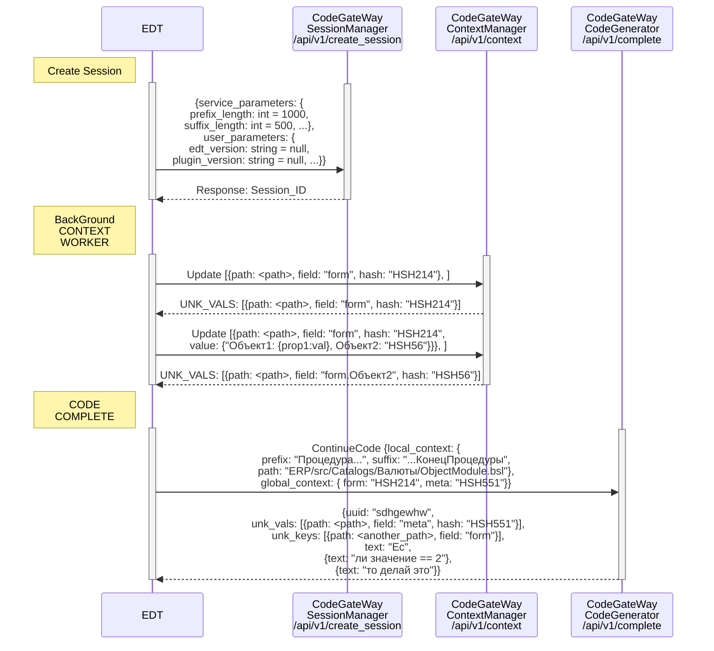
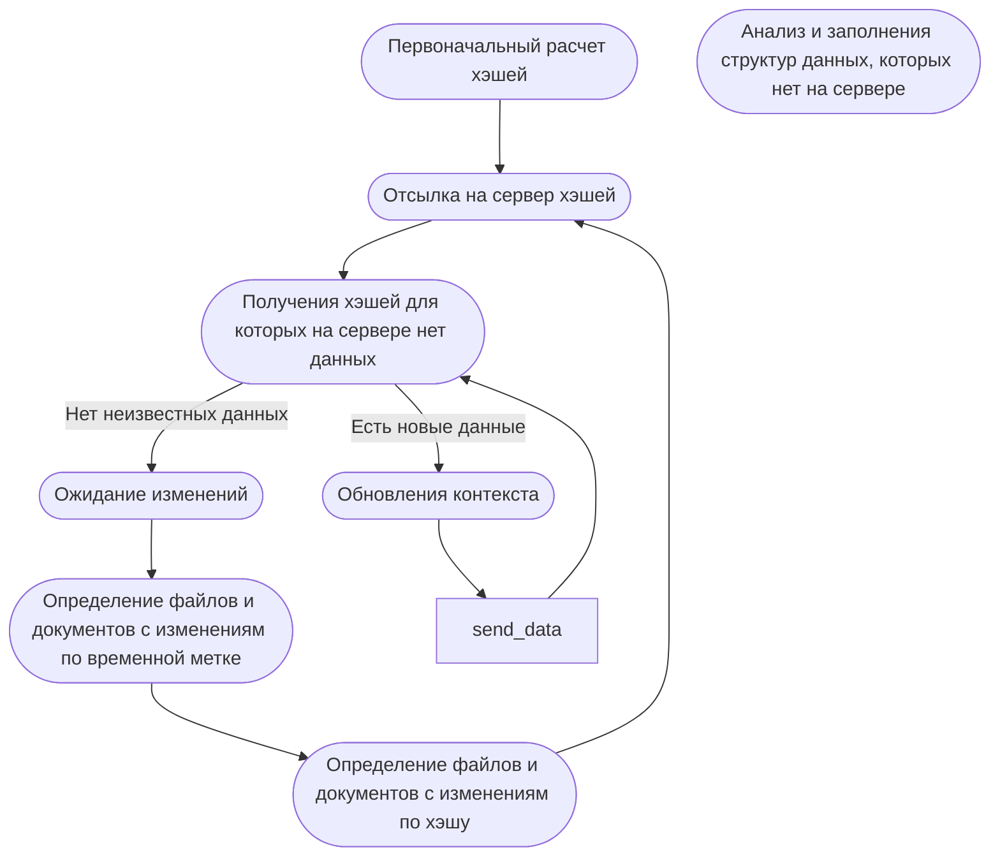
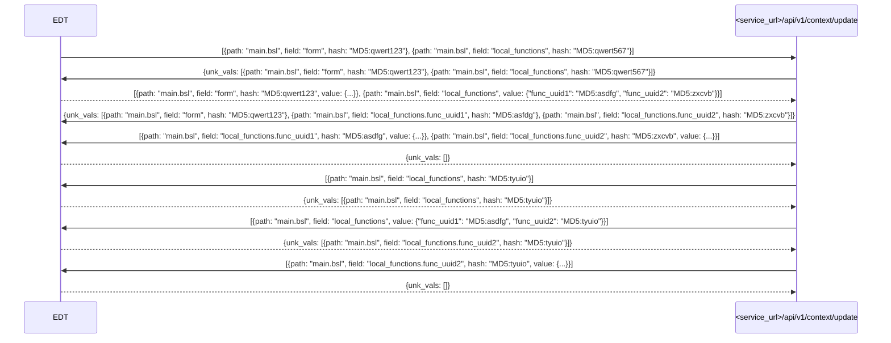

# 1С:Напарник

Набор плагинов для интеллектуальной поддержки разработчиков в среде 1С:EDT и Java:Eclipse, предоставляющий инструменты генерации кода, ИИ чат и другие
возможности повышения продуктивности.

___

## Возможности

1С:Напарник — это AI‑ассистент, который:

- Подсказывает продолжение кода и варианты автодополнения с учетом оперативного, локального и глобального контекста проектов
- Синхронизирует контекст (метаданные, формы, методы) для релевантных подсказок
- Собирает обратную связь для улучшения качества подсказок
- Предоставляет удобный чат с ИИ для решения различных задач
- Анализирует код и дает рекомендации по его улучшению
- Помогает в работе с Git:
    - Ревью кода
    - Генерация сообщений для коммитов

___

## Архитектура

Состоит из 3 плагинов:

- 1C:EDT — для работы с конфигурациями 1C как часть 1C:EDT
- Eclipse — для работы в Eclipse
- Semantic — для обучения моделей

___

## API

### Основные подсистемы сервиса _code_gateway_

Адреса сервисов (_service_url_):

| Адрес                    | Описание |
|--------------------------|----------|
| https://code.1c.ai/      | Основной |
| https://codestage.1c.ai/ | Тестовый |

Сервис code_gateway состоит из нескольких подсистем, каждая из которых отвечает за определенные функции:

- [Подсистема управления сессиями (Session Manager)](#подсистема-управления-сессиями-session-manager)
- [Подсистема генерации кода (Code Generation)](#подсистема-генерации-кода-code-generation)
- [Подсистема управления контекстом (Context Manager)](#подсистема-управления-контекстом-context-manager)
- [Подсистема обратной связи (Feedback)](#подсистема-обратной-связи-feedback)
- [Подсистема мониторинга (Monitoring)](#подсистема-мониторинга-monitoring)
___

### Подсистема управления сессиями (Session Manager)

Задачи:
- Создание сессий
- Хранение и управление параметрами сессий
- Обеспечение безопасности и аутентификации пользователей

Эндпоинты подсистемы управления сессиями необходимо вызывать при запуске редактора кода.
Если сессия истекает, то вызов любого эндпоинта сервиса, в котором есть привязка к сессии, вернет ошибку 401 (_Unauthorized_).
В таком случае необходимо создать новую сессию.
Сессия должна быть создана для каждой конфигурации. В рамках одного проекта IDE конфигураций может быть несколько.

```http request
POST <service_url>/api/v1/create_session
Accept: application/json
Content-Type: application/json
Unique-Id: уникальный идентификатор компьютера пользователя
Authorization: токен пользователя
Instance-Type: тип инстанса, сейчас `A` или `B`
```

<details>
<summary>SessionRequest: запрос</summary>

```java
////!bundles/com.e1c.edt.ai/src/com/e1c/edt/ai/assistent/model/SessionRequest.java
```

</details>

<details>
<summary>Parameters: параметры сессии</summary>

```java
////!bundles/com.e1c.edt.ai/src/com/e1c/edt/ai/assistent/model/Parameters.java
```

</details>

<details>
<summary>UserParameters: параметры пользователя</summary>

```java
////!bundles/com.e1c.edt.ai/src/com/e1c/edt/ai/assistent/model/UserParameters.java
```

</details>

<details>
<summary>SystemInfo: информация о системе пользователя</summary>

```java
////!bundles/com.e1c.edt.ai/src/com/e1c/edt/ai/assistent/model/SystemInfo.java
```

</details>

<details>
<summary>Session: ответ</summary>

```java
////!bundles/com.e1c.edt.ai/src/com/e1c/edt/ai/assistent/model/Session.java
```

</details>

___

### Подсистема генерации кода (Code Generation)

Задачи:
- Обработка запросов на генерацию кода
- Использование локального и глобального контекста для генерации предложений по завершению кода
- Возвращение сгенерированного кода клиенту

Эндпоинты подсистемы генерации кода необходимо вызывать, когда необходимо показать подсказку с продолжением кода.
Это может происходить при наборе кода пользователем в автоматическом режиме либо, когда пользователь требует авто дополнение.

<details>
<summary>Диаграмма использования</summary>


</details>

Стоит заметить, что состояние глобального контекста для текущего рассматриваемого файла (модуля), можно передавать как в этом эндпоинте, так и через эндпоинты _Context Manager_.

> 💡 Договорились, что все хэши плагин будет передавать с префиксом <hash_prefix>, который пока равен "MD5:". В ответ на многие запросы мы возвращаем поле unk_vals, где тоже может быть поле hash, там в ответе тоже будет префикс <hash_prefix>. Этот префикс нужен, чтобы мы могли отличать просто строковые поля от хэшей. Дело в том что мы предполагаем, что есть сложные объекты, где внутренние значения могут быть хэшами, а значит нам нужно отличать простые строки от хэшей.

```http request
POST <service_url>/api/v1/complete
Accept: application/json
Content-Type: application/json
Unique-Id: уникальный идентификатор компьютера пользователя
Session-Id: уникальный идентификатор сессии
```

<details>
<summary>CompletionRequest: запрос</summary>

```java
////!bundles/com.e1c.edt.ai/src/com/e1c/edt/ai/assistent/model/CompletionRequest.java
```

</details>

Оперативный контекст передается каждый раз при запросе на продолжение кода.

<details>
<summary>LocalContext: оперативный контекст</summary>

```java
////!bundles/com.e1c.edt.ai/src/com/e1c/edt/ai/assistent/model/LocalContext.java
```

</details>

<details>
<summary>ObjectEntity: объект контекста</summary>

```java
////!bundles/com.e1c.edt.ai.context/src/com/e1c/edt/ai/context/DTO/ObjectEntity.java
```

</details>

<details>
<summary>MethodEntity: метод контекста</summary>

```java
////!bundles/com.e1c.edt.ai.context/src/com/e1c/edt/ai/context/DTO/MethodEntity.java
```

</details>

<details>
<summary>SignatureStructurized: структурированная сигнатура метода</summary>

```java
////!bundles/com.e1c.edt.ai.context/src/com/e1c/edt/ai/context/DTO/SignatureStructurized.java
```

</details>

<details>
<summary>Comment: структурированный комментарий</summary>

```java
////!bundles/com.e1c.edt.ai.context/src/com/e1c/edt/ai/context/DTO/Comment.java
```

</details>

<details>
<summary>CommentDescriptionPart: часть комментария</summary>

```java
////!bundles/com.e1c.edt.ai.context/src/com/e1c/edt/ai/context/DTO/CommentDescriptionPart.java
```

</details>

<details>
<summary>CommentType: комментарии к типу</summary>

```java
////!bundles/com.e1c.edt.ai.context/src/com/e1c/edt/ai/context/DTO/CommentType.java
```

</details>

<details>
<summary>CommentFieldDefinition: комментарии к полю типа</summary>

```java
////!bundles/com.e1c.edt.ai.context/src/com/e1c/edt/ai/context/DTO/CommentFieldDefinition.java
```

</details>

<details>
<summary>CommentParameters: описание параметров метода</summary>

```java
////!bundles/com.e1c.edt.ai.context/src/com/e1c/edt/ai/context/DTO/CommentParameters.java
```

</details>

<details>
<summary>CommentParameter: комментарии к параметру метода</summary>

```java
////!bundles/com.e1c.edt.ai.context/src/com/e1c/edt/ai/context/DTO/CommentParameter.java
```

</details>

<details>
<summary>CommentReturn: комментарий к возвращаемому значению функции</summary>

```java
////!bundles/com.e1c.edt.ai.context/src/com/e1c/edt/ai/context/DTO/CommentReturn.java
```

</details>

<details>
<summary>Proposal: предложение от контекстного ассистента</summary>

```java
////!bundles/com.e1c.edt.ai/src/com/e1c/edt/ai/assistent/model/Proposal.java
```
</details>

<details>
<summary>ClipboardInfo: содержимое буфера обмена, которое попало туда из среды разработки</summary>

```java
////!bundles/com.e1c.edt.ai/src/com/e1c/edt/ai/assistent/model/ClipboardInfo.java
```
</details>

<details>
<summary>DataType: тип данных</summary>

```java
////!bundles/com.e1c.edt.ai.context/src/com/e1c/edt/ai/context/DTO/DataType.java
```

</details>

<details>
<summary>ObjectEntityField: поле объекта</summary>

```java
////!bundles/com.e1c.edt.ai.context/src/com/e1c/edt/ai/context/DTO/ObjectEntityField.java
```

</details>

Ответ приходит в виде потока текстовых строк. Каждая строка содержит часть ответа от LLM в формате JSON.

<details>
<summary>Completion: ответ</summary>

```java
////!bundles/com.e1c.edt.ai/src/com/e1c/edt/ai/assistent/model/Completion.java
```

Последний пакет содержит не пустое поле `finishReason`.

</details>

Для улучшения ответа могу требоваться дополнительные данные. Если такие данные требуются, то ответ содержит непустые поля:

<details>
<summary>EntityValue: неизвестное значение</summary>

```java
////!bundles/com.e1c.edt.ai/src/com/e1c/edt/ai/assistent/model/EntityValue.java
```

</details>

<details>
<summary>EntityKey: неизвестный ключ</summary>

```java
////!bundles/com.e1c.edt.ai/src/com/e1c/edt/ai/assistent/model/EntityKey.java
```

</details>

В данный момент плагин не реагирует на неизвестные данные при запросе на продолжение кода. Все необходимые данные передаются в глобальном и локальном контекстах. 

___

### Подсистема управления контекстом (Context Manager)

Задачи:
- Сбор и хранение локального и глобального контекста
- Обновление значений и ключей глобального контекста
- Обеспечение актуальности данных контекста и их синхронизация с клиентом

Эндпоинты подсистемы управления контекстом необходимо вызывать для обновления глобального контекста. Это может происходить в фоновом режиме при изменении данных, которые влияют на контекст.

```http request
POST <service_url>/api/v1/context/update
Accept: application/json
Content-Type: application/json
Unique-Id: уникальный идентификатор компьютера пользователя
Session-Id: уникальный идентификатор сессии
```

<details>
<summary>Запрос</summary>

```java
Collection<GlobalContextUpdate> updates;
```

где GlobalContextUpdate

```java
////!bundles/com.e1c.edt.ai/src/com/e1c/edt/ai/assistent/model/GlobalContextUpdate.java
```

</details>

поле `value` может содержать:

<details>
<summary>Словарь методов для модуля</summary>

Передаются все методы модуля.

`Map<String, String>`: имя метода -> хэш метода.

</details>

<details>
<summary>ObjectEntity: сущность</summary>

```java
////!bundles/com.e1c.edt.ai.context/src/com/e1c/edt/ai/context/DTO/ObjectEntity.java
```

</details>

<details>
<summary>FormEntity: форму</summary>

```java
////!bundles/com.e1c.edt.ai.context/src/com/e1c/edt/ai/context/DTO/FormEntity.java
```

</details>

<details>
<summary>MethodEntity: метод</summary>

```java
////!bundles/com.e1c.edt.ai.context/src/com/e1c/edt/ai/context/DTO/MethodEntity.java
```

</details>

<details>
<summary>GlobalContextUpdateResponse: ответ</summary>

```java
////!bundles/com.e1c.edt.ai/src/com/e1c/edt/ai/assistent/model/GlobalContextUpdateResponse.java
```

```java
////!bundles/com.e1c.edt.ai/src/com/e1c/edt/ai/assistent/model/EntityValue.java
```

```java
////!bundles/com.e1c.edt.ai/src/com/e1c/edt/ai/assistent/model/EntityKey.java
```

</details>

> ⚠️ Раньше предполагали, что path может быть None. Но на стороне сервиса мы не обрабатываем такие случаи, потому что не понятно как их потом использовать. Поэтому лучше не присылать такие данные. В сервис все равно можно присылать с пустым path, просто такие данные игнорируются.

> 💡 В поле value, передается значение объекта, которое внутри себя тоже может содержать хэши. И чтобы мы могли отличать хэши от простых строк, нужно чтобы каждый хэш начинался с особого префикса <hash_prefix> (нужно договориться чему он будет равен).

<details>
<summary>Логика синхронизации глобального контекста</summary>



</details>

Логика обработки на сервере:

- Если оба поля (hash и value) указаны в запросе (предполагаем что такой запрос приходит после того как наша система сказала, что она не знает про такой хэш)
  - Значение value записывается в Ceph по ключу "c_{hash}"
- Если только value указан в запросе (предполагаем что value короткий и не хочется для него считать hash)
  - На стороне сервера считается хэш по данным. Пусть он будет равен server_hash.
  - Значение value записывается в Ceph по ключу "s_{server_hash}"
- Если только hash указан в запросе (предполагаем что сначала приходит запрос без значений, потому что есть вероятность, что данные есть в системе)
  - Выполняется поиск в Ceph по хэш. Если данные есть то записываем в PostgreSQL hash с флагом in_storage=True, иначе с флагом in_storage=False.

Процесс обновления происходит итерационно. Если списки неизвестных значений или ключей, то сервер содержит все данные, иначе требуется дополнительно обновление.
Для оптимизации работы с сервером данные объединяются в пакеты по 100 элементов. Размер пакета влияет на время задержки ответа от сервера. Для 100 элементов задержка ответа около 1 секунды.

<details>
<summary>Пример обновления глобального контекста</summary>



</details>

___

### Подсистема обратной связи (Feedback)

Задачи:
- Передать информация о принятом фрагменте кода.
- Передать информацию о финальном коде (то, что у пользователя получилось в итоге).
- Обеспечить обратную связь с пользователем

#### Информация о принятом фрагменте кода

Принятый подсказанный код. Если пользователь отклонил предсказание, то отправляется пустая строка.

Пользователю показывается сгенерированный код, и он может принять часть кода или отклонить продолжение кода. Если он принял, то к нам приходит отзыв ACCEPTED_CODE с принятым кодом, иначе приходит пустая строка.

Задачи:
- Замер удовлетворенности пользователя.
- Максимально быстро получаем отзыв от пользователя, как только ему показали продолжение строки и он принял или отклонил продолжение.

```http request
POST <service_url>/api/v1/feedbacks/accepted_code
Accept: application/json
Content-Type: application/json
Unique-Id: уникальный идентификатор компьютера пользователя
Session-Id: уникальный идентификатор сессии
```

<details>
<summary>AcceptedCodeFeedback: запрос</summary>

```java
////!bundles/com.e1c.edt.ai/src/com/e1c/edt/ai/assistent/model/AcceptedCodeFeedback.java
```

</details>

<details>
<summary>CursorInfo: информация о позиции</summary>

```java
////!bundles/com.e1c.edt.ai/src/com/e1c/edt/ai/assistent/model/CursorInfo.java
```

```java
////!bundles/com.e1c.edt.ai/src/com/e1c/edt/ai/assistent/model/CursorLocation.java
```

```java
////!bundles/com.e1c.edt.ai/src/com/e1c/edt/ai/assistent/model/RelativeLocation.java
```

</details>

#### Информация о финальном коде

Итоговый код, который написал пользователь.

Плагин в итоге присылает код всей процедуры/функции в которой работал пользователь в момент, когда пользователь прекращает работу в функции.

Задачи:
- Замер качества работы модели
- Автоматический поиск ошибок
- Обучение системы

```http request
POST <service_url>/api/v1/feedbacks/final_code
Accept: application/json
Content-Type: application/json
Unique-Id: уникальный идентификатор компьютера пользователя
Session-Id: уникальный идентификатор сессии
```

<details>
<summary>FinalCodeFeedback: запрос</summary>

```java
////!bundles/com.e1c.edt.ai/src/com/e1c/edt/ai/assistent/model/FinalCodeFeedback.java
```

</details>

#### Обратная связь с пользователем

Сбор жалоб на сервис и идей.

Задачи:
- Для оперативного исправления ошибок в ручном режиме

```http request
POST <service_url>/api/v1/feedbacks/issue
Accept: application/json
Content-Type: application/json
Unique-Id: уникальный идентификатор компьютера пользователя
Session-Id: уникальный идентификатор сессии
```

<details>
<summary>IssueFeedback: запрос</summary>

```java
////!bundles/com.e1c.edt.ai/src/com/e1c/edt/ai/assistent/model/IssueFeedback.java
```

```java
////!bundles/com.e1c.edt.ai/src/com/e1c/edt/ai/assistent/model/IssueType.java
```

</details>

___

### Подсистема мониторинга (Monitoring)

Задача: обеспечение возможности отслеживания производительности и выявления проблем

Эндпоинт системы мониторинга необходимо периодически (~ каждые 15 секунд) вызывать для проверки состояния сервера.

```http request
POST <service_url>/api/v1/health
Accept: application/json
Content-Type: application/json
Unique-Id: уникальный идентификатор компьютера пользователя
```

___