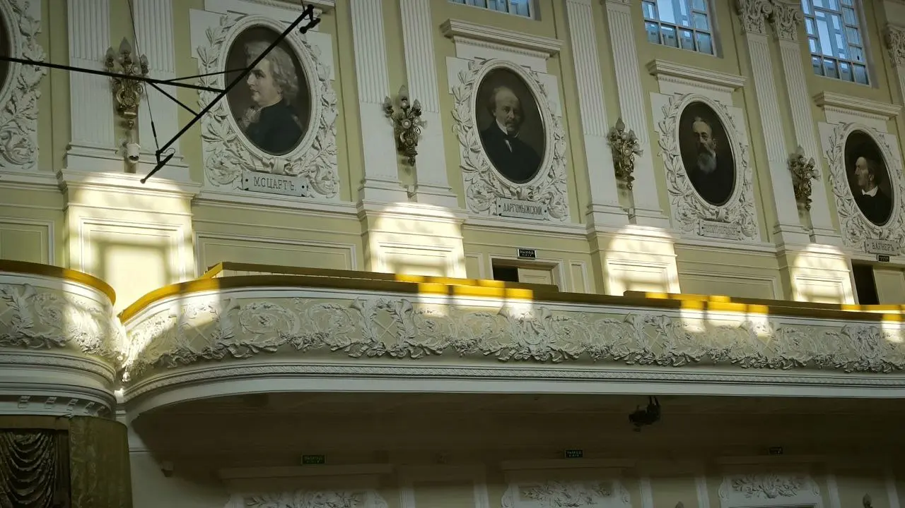
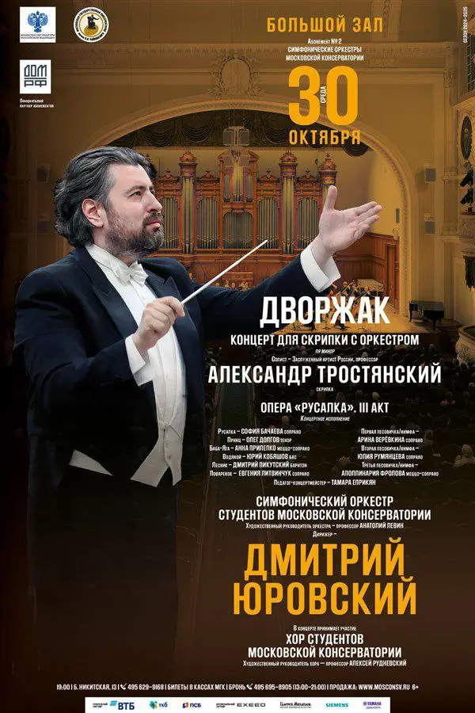

:::gallery
{width="1280" height="720" data-color="#6e6e57"}

{width="600" height="900" data-color="#4b3b2b"}
:::

В среду 30 октября будем играть Скрипичный концерт Дворжака и 3-й акт его оперы «Русалка» в концертном исполнении, дирижирует Дмитрий Юровский.

🎫 [Билеты и подробная информация](http://www.mosconsv.ru/ru/concert/187761)

📍[Средний Кисловский пер., 4](https://yandex.ru/maps/org/moskovskaya_gosudarstvennaya_konservatoriya_imeni_p_i_chaykovskogo_bolshoy_zal/30276832269?si=hkgv88xffz97ba3h76tajv9ey0)
