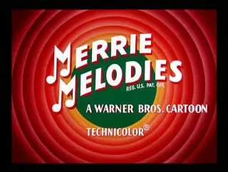

[{width="320" height="242" data-color="#7b332d"}](https://t.me/gattavasis/108){.video data-duration="385"}

Я точно знаю, что здесь есть знатоки)) Они ждут ответы с таймкодами под постом до 31 октября.
\_\_\_
Мультфильм «Что за опера, док?» (What's Opera, Doc?) — короткометражный рисованный мультфильм из мультсериала Весёлые мелодии режиссёра Чака Джонса. Лента занимает 1-е место в списке 50 величайших мультфильмов, составленном в 1994 году историком анимации Джерри Беком.
