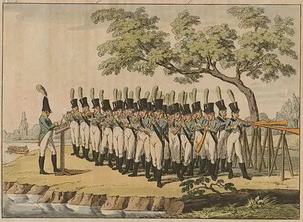
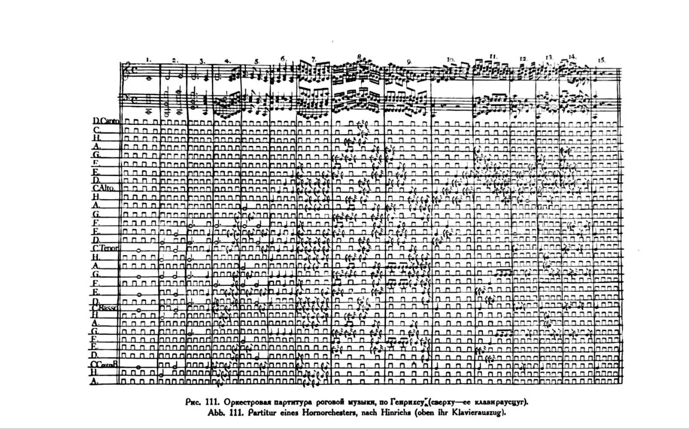
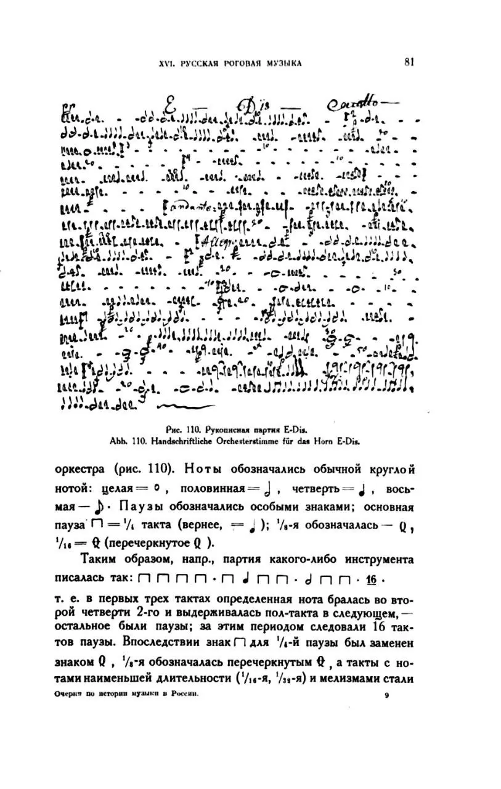
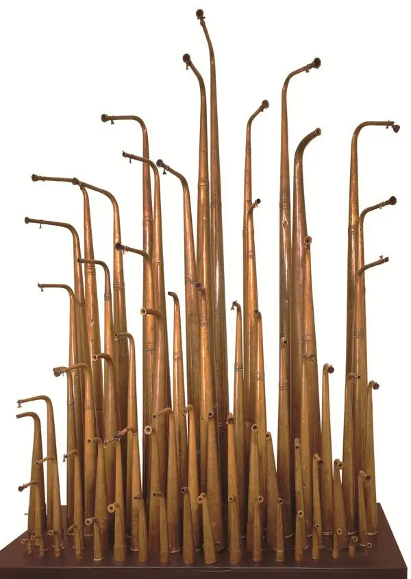
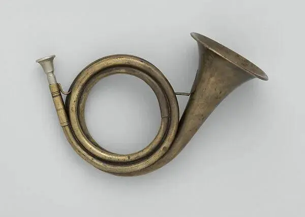
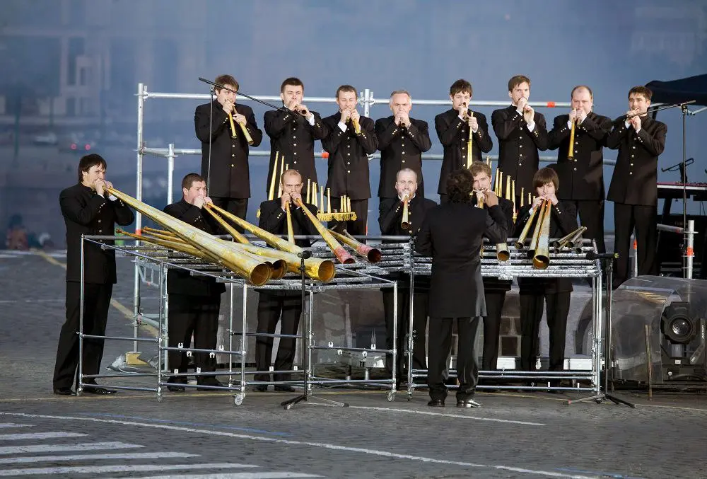

:::gallery
{width="440" height="323" data-color="#9c896b"}

{width="1280" height="797" data-color="#cbcbcb"}

{width="813" height="1280" data-color="#e5e5e5"}

{width="600" height="844" data-color="#c6b3a2"}

{width="600" height="428" data-color="#abaaa4"}

{width="1000" height="677" data-color="#4c4d50"}
:::

Обсуждали недавно на Истории музыки Роговой оркестр.

Был создан то ли по велению графа Бестужева, который в 1740-е как раз налаживал отношения России с Австрийским домом, то ли по велению знаменитого бонвивана Семена Нарышкина.

Во всяком случае, примерно в это время в Россию из Вены приехал  валторнист Ян Мареш, чех по национальности.
Ему предложили заняться охотничьими оркестрами императрицы.

Ему в голову пришла блестящая идея!
На основе почтового рожка он создал рога разной звуковысотности. Так у него получился портативный орган под открытым небом!

Но каждый музыкант оркестра отвечал не то, что за один голос, а всего лишь за одну-единственную ноту. **Безвольный человек-клавиша.**

Елизавета Петровна была просто в восторге! И не только она.

Постепенно почти в каждом приличном доме в России появился свой роговой оркестр.

Однако к середине XIX в. интерес к ним стал угасать из-за развития симфонического оркестра, а после отмены крепостного права они полностью исчезли.

1 — партитура «уставщика» — дирижера. Слева — ноты, к каждой относится строка. На ней указываются ноты и паузы для конкретного рожка определённой высоты.

2 — партия одного музыканта.

Позднее музыканты стали играть последовательно на нескольких рожках в одном произведении. Ещё появилась клапанная система, благодаря которой на одном рожке можно было сыграть до 4 разных нот.

**А раньше такие оркестры могли насчитывать до двухсот человек...**

Некоторое время Роговой оркестр был практически забыт, концертов для широкой публики почти не было, но он звучал на коронациях Александра III и Николая II.

Коронационный роговой оркестр сейчас хранится в [Музее музыки в Шереметевском дворце в Петербурге](https://yandex.ru/maps/org/sheremetevskiy_dvorets/70750281357?si=hkgv88xffz97ba3h76tajv9ey0) — на фото.

Почтовый рожок — предок рогового оркестра
 📯📯📯

Так пешие и конные почтальоны давали о себе знать.

В 2006 году Роговой оркестр был возрожден!

🎧 Предлагаю вам послушать [«](https://youtu.be/2dtr1ssQFYk?feature=shared)[Молитву» Чайковского](https://youtu.be/2dtr1ssQFYk?feature=shared) в таком необычном исполнении.
