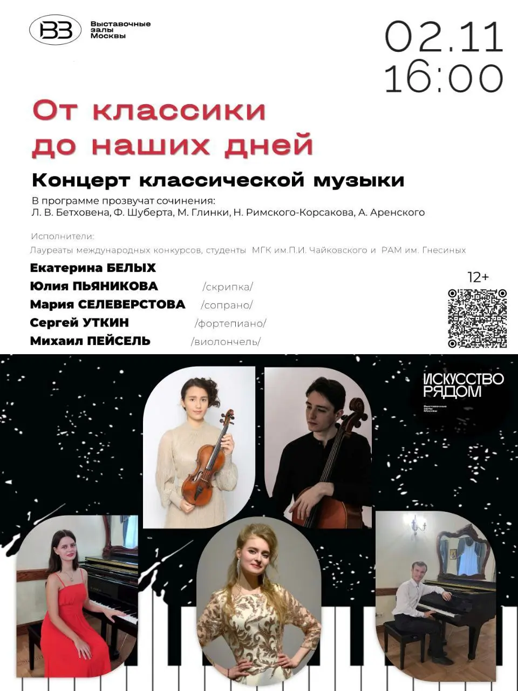

{width="960" height="1280" data-color="#9f9b9a"}

**Вечер камерной музыки в** [Галерее Тушино](https://yandex.ru/maps/org/galereya_tushino/1022255037?si=hkgv88xffz97ba3h76tajv9ey0)

Мы представим несколько знаковых сочинений разных эпох для классического состава фортепианного трио — со скрипкой и виолончелью. Сравним трио классическое, романтической эпохи и авторства современного композитора.

Также мы исполним сочинения для скрипки и фортепиано, в том числе в самом зрелищном и эффектном виртуозно-романтическом «салонном» стиле XIX века.

На концерте прозвучат романсы для голоса и фортепиано, а также фортепианный дуэт!

📍[бульвар Яна Райниса, д. 19, к. 1](https://yandex.ru/maps/org/galereya_tushino/1022255037?si=hkgv88xffz97ba3h76tajv9ey0)

🎫 [Билеты](https://tickets.mos.ru/widget/visit?eventId=49286&agentId=museum41&date=2024-11-02)
