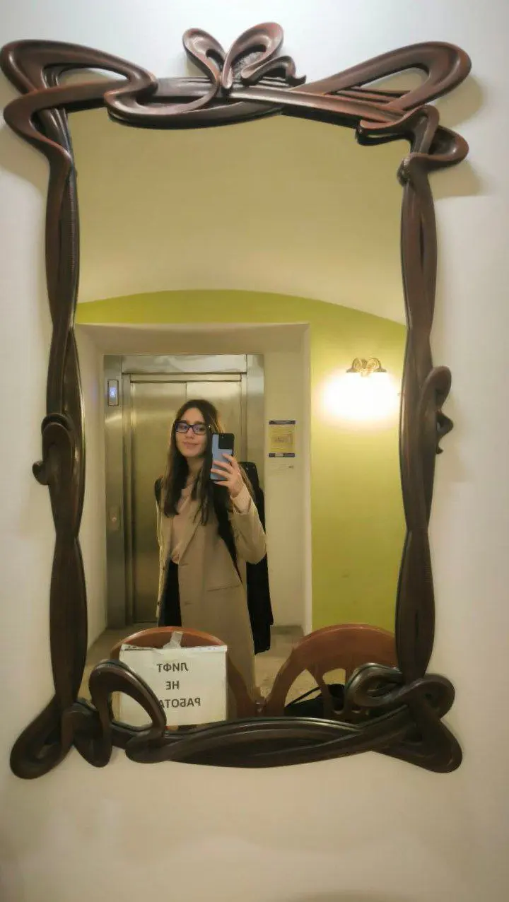
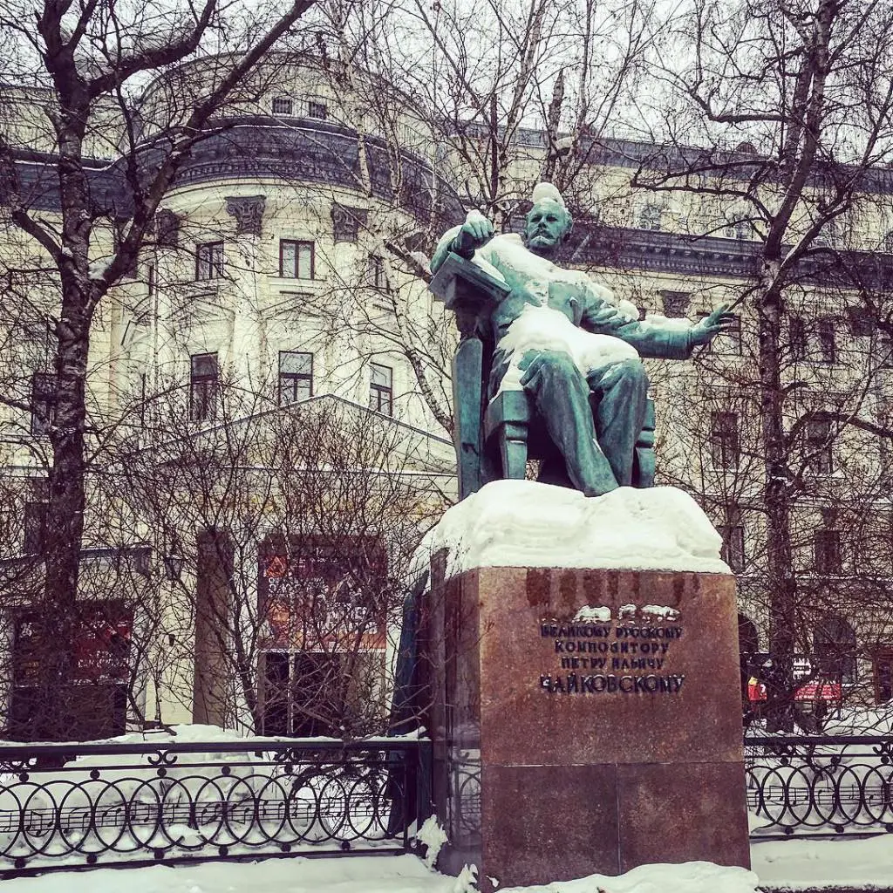

:::gallery
{width="720" height="1276" data-color="#8b7e5b"}

{width="1024" height="1024" data-color="#7c7073"}
:::

**Если бы Гиляровский написал «Москву и москвичей» в 21 веке, он бы точно черкнул про Большую Никитскую.**

Она длинная, но я говорю именно про тот отрезок, где соседствуют консерватория и самые фешенебельные рестораны Москвы.

Есть некий собирательный образ человека, с которым можно там пересечься.
Вы видели того [благожелетального цветущего винно-водочного капиталиста](https://youtube.com/shorts/WaRigzc_6Bo?feature=shared)? Наверное, он таков.

Великими консерваторскими умами прошлого была выведена формула: чем чаще человек заходит проведать рибай, тем реже — звучание консерваторских залов...

В нашем случае, к сожалению, чем чаще человек бывает в консерватории, тем реже кутит в ресторанах. Или отмечаете после концертов, друзья? Далеко ходить не надо)

Во всяком случае, основная аудитория концертов классической музыки — бабушки. Они, наверное, и сами замечательно готовят.

Дедушки вот, наоборот, очень редкие гости почему-то...

Народная забава —
приметишь кого-нибудь, составишь поверхностное мнение «по одежке» и ждёшь, куда же он пойдёт, в сторону Петра Ильича или напротив.
