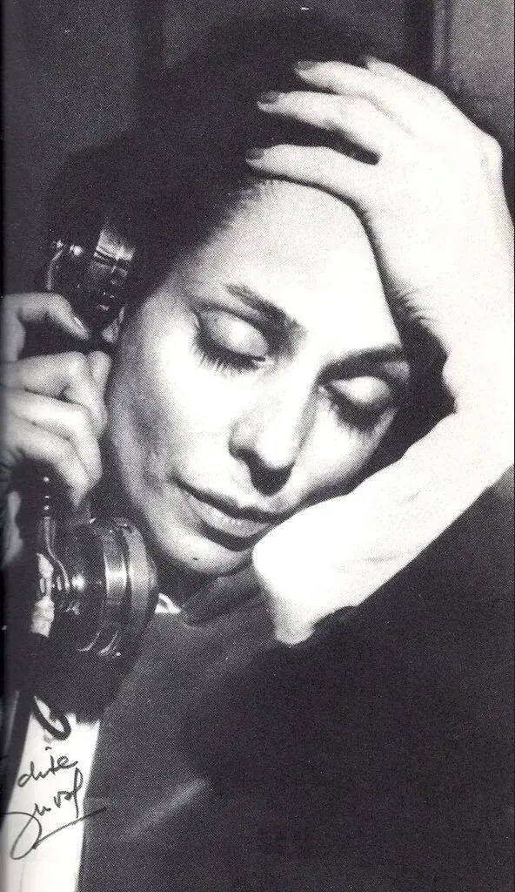

...И такое было в истории музыки.

Я говорю, конечно, о «Человеческом голосе» (1958) Франсиса Пуленка.

Текст драмы Жана Кокто состоит из отдельных коротких реплик женщины, которую покинул возлюбленный.

Особым психологизмом оперу наделяют лейт-темы любви и смерти, которые в эпилоге объединяются как продолжение друг друга.

Это моноопера — исполнительница одна.
О фразах всех остальных героев — возлюбленного, слуги, телефонистки — в эпизодах, где связь между героями обрывается, — мы можем догадываться только из слов женщины.

Опера длится всего лишь 45 минут. За это короткое время Пуленк погружает слушателя в мир, наполненный страданиями одного очень несчастного человека.

Первое прослушивание производит неизгладимое впечатление. Музыка здесь следует за словом — интонационное прочтение текста в каждом музыкальном мотиве.

🎧 [Эталонная запись Дениз Дюваль, для которой Пуленк создавал это произведение. За роялем композитор](https://vk.com/video84014589_152521266?list=c1293cdc4e7c43dc92).

🎧 [Советский фильм 1968 года. В главной роли — Валентина Талызина. Вокальная партия — Надежда Юренева (на русском языке).](https://vk.com/video217304871_170242920)

Вообще про советские фильмы-оперы хочется как-нибудь написать отдельно. Это потрясающее наследие! Хотя бы ради них стоило ходить на музлит))

{width="592" height="1024" data-color="#878687"}

Дениз Дюваль
