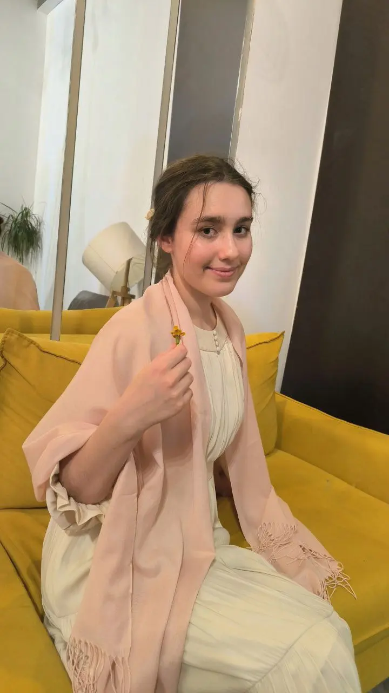
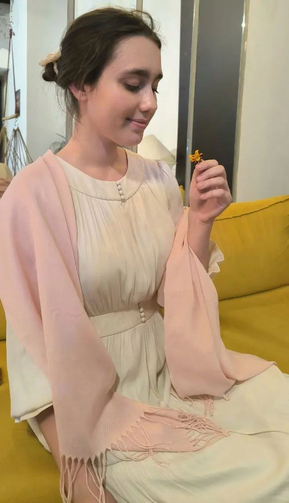
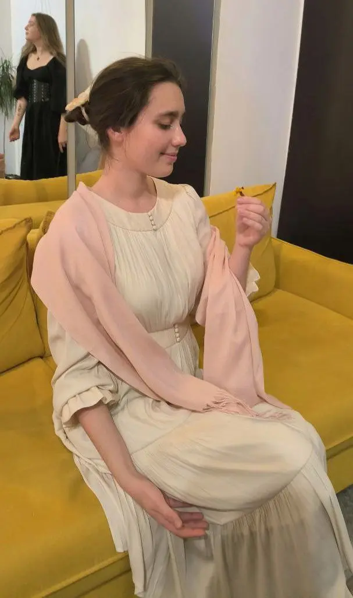

:::gallery
{width="720" height="1280" data-color="#a38766"}

{width="659" height="1146" data-color="#b3977a"}

{width="607" height="1026" data-color="#a2835e"}
:::

(в отличие от героини, которая попала в кадр на 3-м фото!))

К слову, это образ из русской литературы, а мой визуальный референс экспонируется в Третьяковской галерее))

Кто же она?
