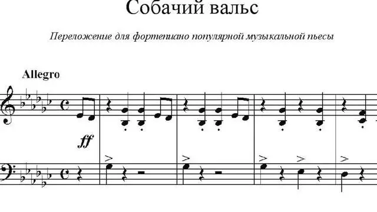

[Видео](https://t.me/gattavasis/123){.video data-duration="10"}

**Собачий вальс** — интернациональный гимн обучения игре на фортепиано.
С него обычно все начинают.

Помню, как соседская девочка каждый день в течение нескольких недель разучивала его с полвосьмого до восьми утра. День после этого ощущался очень сюрреалистично.

Должна сказать, что на нем она, похоже, и закончила свое музыкальное образование. Больше я её не слышала...

Но, во-первых, Собачий вальс — это никакой не вальс. Вальс — трехдольный танец с характерным счётом на «раз-два-три». Больше всего Собачий вальс напоминает польку!

Во-вторых, совершенно необязательно он должен быть собачьим. В Болгарии, например, он называется Кошачий марш, в Венгрии — Ослиный, в Китае — Марш воров.  Кошачья полька — в Финляндии, Полька дураков — на Мальорке. Маленькие обезьянки — в Мексике...

В Польше и Франции — Котлетка. И здесь уже прослеживается связь с датским «Фрикадельки убегают через забор».

{width="640" height="360" data-color="#e7e7e7"}

Между прочим, Собачий вальс записан в соль-бемоль мажоре (там 6 бемолей при ключе). Думаю, чтобы пианисты привыкали к суровой жизни с молодых когтей.

Собачий вальс приписывали Шопену. Но оказалось, что его «Вальс маленьких собачек» — это совсем другой опус.

Была ещё мистификация с неким Фердинандом Ло. Потом обнаружилось, что F.Lho по-немецки — «блоха», а в Германии эта пьеса называется «Блошиный вальс».

В 1962 году британский композитор и пианист **Расс Конвей** переписал Собачий вальс в рок-н-ролльном рэгтаймовом стиле и назвал всё это дело [🎧](https://vk.com/video-153170829_456239237)[«Первым уроком».](https://vk.com/video-153170829_456239237)
