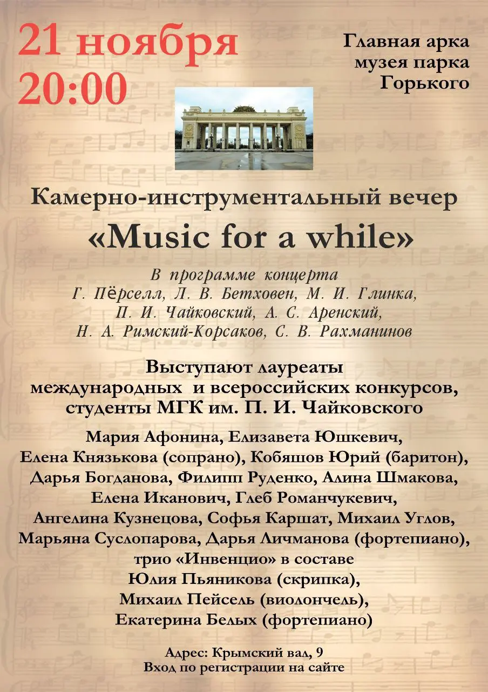
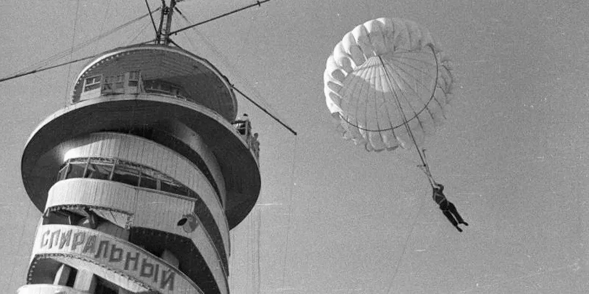

:::gallery
{width="904" height="1280" data-color="#ccb79d"}

{width="1200" height="600" data-color="#868686"}
:::

В небольшом зале музея, посвященного истории Парка Горького, который находится в левом антаблементе Главного входа в парк, состоится **концерт камерной музыки!**

🎫 [Вход свободный, регистрация по ссылке!](https://gorky-park.timepad.ru/event/3126304/)

Начало в 20 часов.

📍[Музей Парка Горького](https://yandex.ru/maps/org/muzey_parka_gorkogo/1702515828?si=hkgv88xffz97ba3h76tajv9ey0)
[ул. Крымский Вал, 9, стр. 9](https://yandex.ru/maps/org/muzey_parka_gorkogo/1702515828?si=hkgv88xffz97ba3h76tajv9ey0)

[м.Парк культуры/Октябрьская](https://yandex.ru/maps/org/muzey_parka_gorkogo/1702515828?si=hkgv88xffz97ba3h76tajv9ey0)

В музее очень интересная экспозиция, советую заглянуть туда тоже!

Например, чтобы рассмотреть макет вышки **для прыжков с парашютом))**
*(см. фото)*

Её возвели летом 1929 года в парке, ближе к Крымскому Валу. Это башня спирального спуска высотой с девятиэтажку, по которому посетители съезжали на ковриках.

Ильф и Петров обозвали её тогда **«сенсацией XIX века»** в своём фельетоне для «Правды».

**Любой желающий мог заплатить один рубль и прыгнуть с парашютом!**
