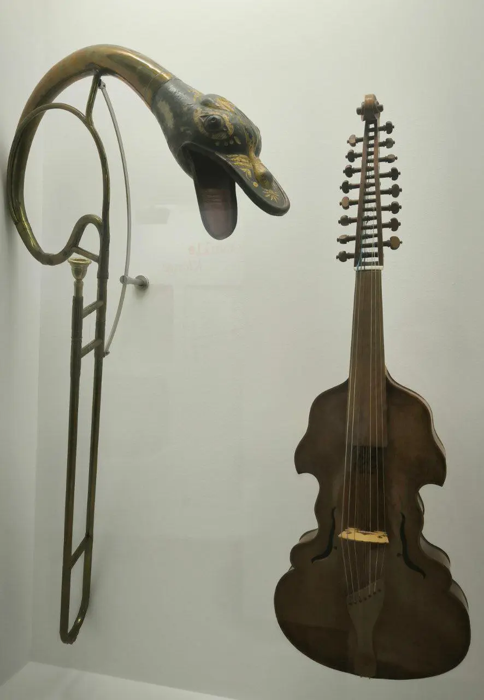

{width="886" height="1280" data-color="#979688"}

Уже завтра мы с **Аней Севостьяновой** совместно с проектом Московского Долголетия «Музыкальные вечера» открываем серию лекций-концертов о классической музыке!

Среди сочинений, которые прозвучат завтра — знаменитая Чакона Иоганна Себастьяна Баха для скрипки соло и сонаты Вольфганга Амадея Моцарта.
Также будут представлены сочинения менее известных композиторов, с творчеством которых многие слушатели, вероятно, встретятся впервые.

Мы обсудим, как трансформировался музыкальный язык и какой была музыка на протяжении XVII–XIX веков, а также как за это время изменились музыкальные инструменты.

**Начало в 19 часов.**

Самое замечательное в этом всём, что **вход на концерт свободный для всех желающих**. Ждём вас, вечер обещает быть интересным!

✏️Для записи на концерт напишите в телеграм по телефону 89890473842

📍[ул. Краснобогатырская, д. 87](https://yandex.ru/maps?whatshere%5Bpoint%5D=37.71186851542503%2C55.802128038408036&whatshere%5Bzoom%5D=19.075758&ll=37.71160789823895%2C55.80193065821434&z=19.075758&si=hkgv88xffz97ba3h76tajv9ey0)
     [м. Преображенская площадь](https://yandex.ru/maps?whatshere%5Bpoint%5D=37.71186851542503%2C55.802128038408036&whatshere%5Bzoom%5D=19.075758&ll=37.71160789823895%2C55.80193065821434&z=19.075758&si=hkgv88xffz97ba3h76tajv9ey0)
