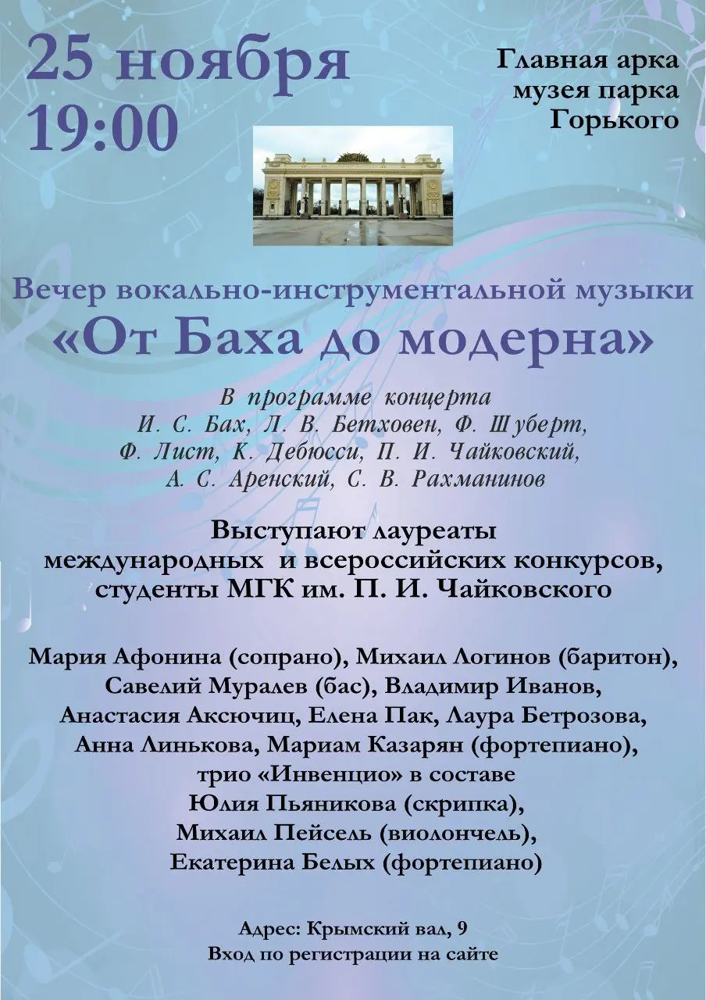

{width="904" height="1280" data-color="#99adc8"}

Сегодня в небольшом зале музея, посвященного истории Парка Горького, который находится в левом антаблементе Главного входа в парк, состоится **концерт камерной музыки!**

🎫 [Вход свободный, регистрация по ссылке!](https://m.vk.com/away.php?to=https%3A%2F%2Fclck.ru%2F3Ems2p&post=-27098092_67095&track_code=da0f6deeJ1tJNQ5Pb9khXGGC7aye6UGjiBMV6EQ_FrKu-HIYfn8bNgkCbXxX7hAwTLDU_8i8HO_Uf1emK3ZC1cv9dHUfDQ)

Начало в 19 часов.

📍[Музей Парка Горького](https://yandex.ru/maps/org/muzey_parka_gorkogo/1702515828?si=hkgv88xffz97ba3h76tajv9ey0)
[ул. Крымский Вал, 9, стр. 9](https://yandex.ru/maps/org/muzey_parka_gorkogo/1702515828?si=hkgv88xffz97ba3h76tajv9ey0)

[м.Парк культуры/Октябрьская](https://yandex.ru/maps/org/muzey_parka_gorkogo/1702515828?si=hkgv88xffz97ba3h76tajv9ey0)
