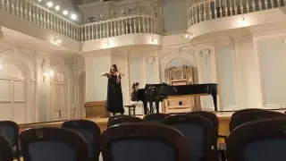
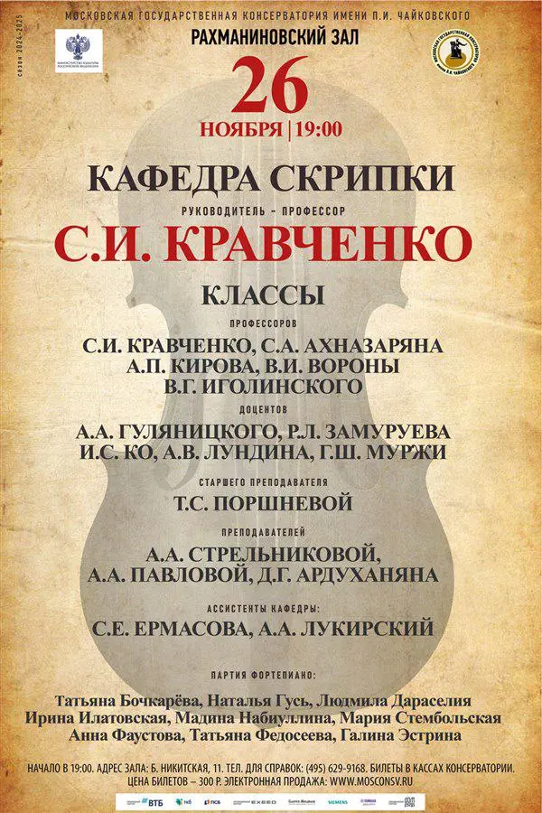

[{width="320" height="180" data-color="#897761"}](https://t.me/gattavasis/139){.video data-duration="67"}

Готовимся к нашему кафедральному концерту, который состоится завтра в 19 часов в Рахманиновском зале Московской консерватории!

Сочинения этого автора не так часто исполняют...На кого вообще похоже?

**Пишите варианты в комментариях))**

{width="600" height="900" data-color="#c8b393"}

**26.11 19:00**
**Рахманиновский зал Московской консерватории**

Приходите к нам в гости! ❤️

🎫 [Билеты](http://www.mosconsv.ru/ru/concert/190150)

📍 [Большая Никитская ул., 11/4с1](https://yandex.ru/maps/org/moskovskaya_gosudarstvennaya_konservatoriya_imeni_p_i_chaykovskogo_rakhmaninovskiy_zal/38104528288?si=hkgv88xffz97ba3h76tajv9ey0)
      [Рахманиновский зал](https://yandex.ru/maps/org/moskovskaya_gosudarstvennaya_konservatoriya_imeni_p_i_chaykovskogo_rakhmaninovskiy_zal/38104528288?si=hkgv88xffz97ba3h76tajv9ey0)

      [м. Арбатская/ Библиотека им. Ленина/ Боровицкая](https://yandex.ru/maps/org/moskovskaya_gosudarstvennaya_konservatoriya_imeni_p_i_chaykovskogo_rakhmaninovskiy_zal/38104528288?si=hkgv88xffz97ba3h76tajv9ey0)
