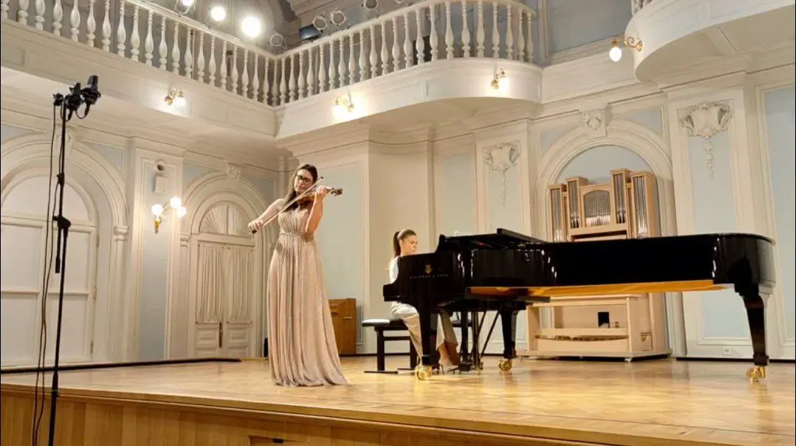

{width="1086" height="610" data-color="#a38d71"}

Опубликовала полную версию с кафедрального концерта на моем [ютюб-канале](https://youtu.be/TnrUvTmvFno)!
**Приходите в гости))**

Клара Шуман считается одной из самых выдающихся пианисток эпохи романтизма. Тогда великого Роберта Шумана знали потому, что он был мужем блистательной, всемирно известной пианистки Клары Вик! А не наоборот))

[https://youtu.be/TnrUvTmvFno](https://youtu.be/TnrUvTmvFno)
