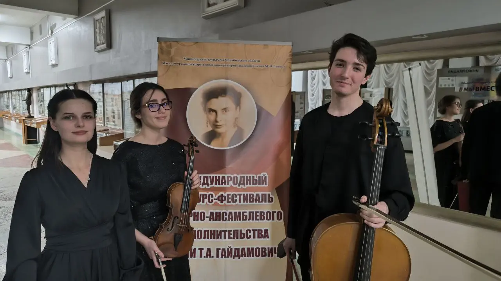
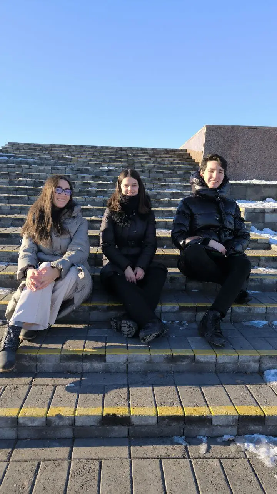
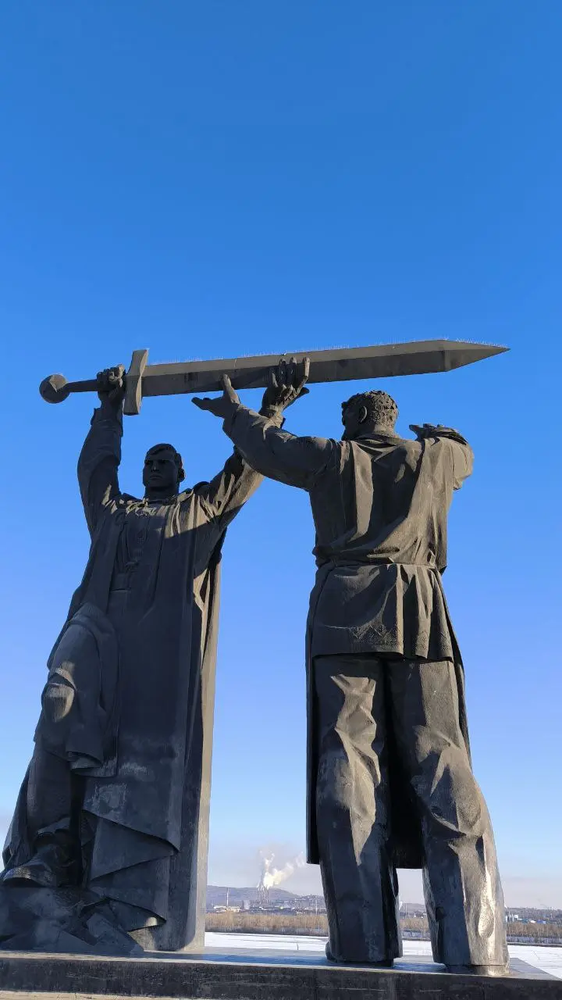
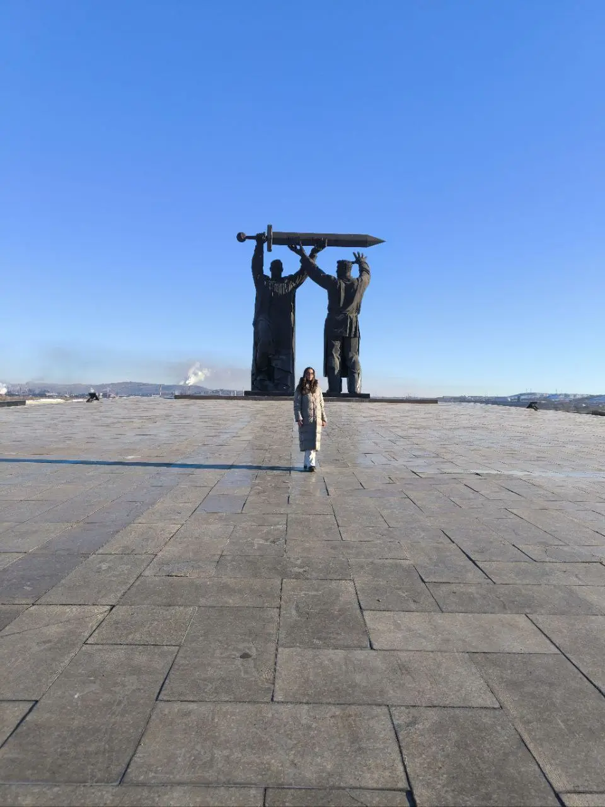
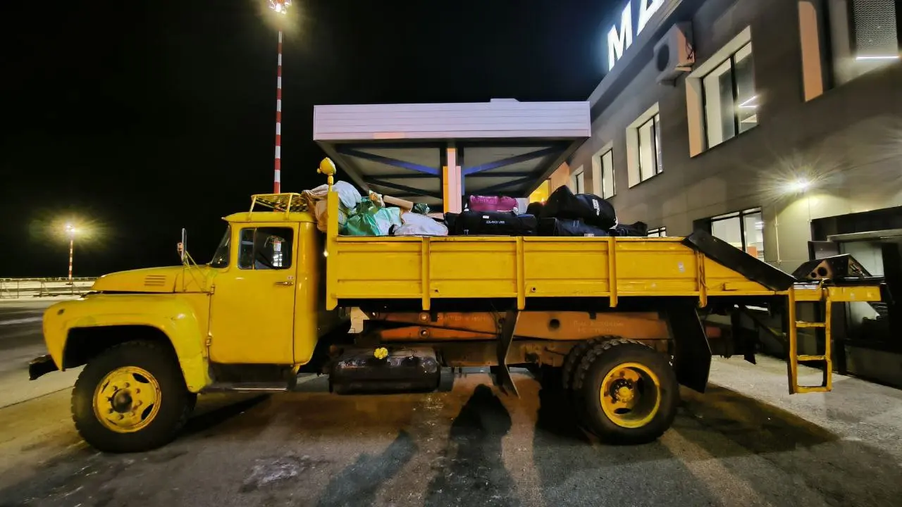
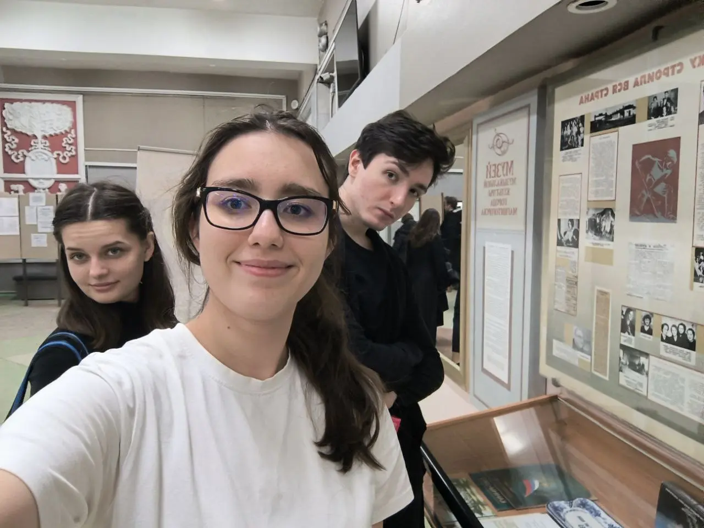
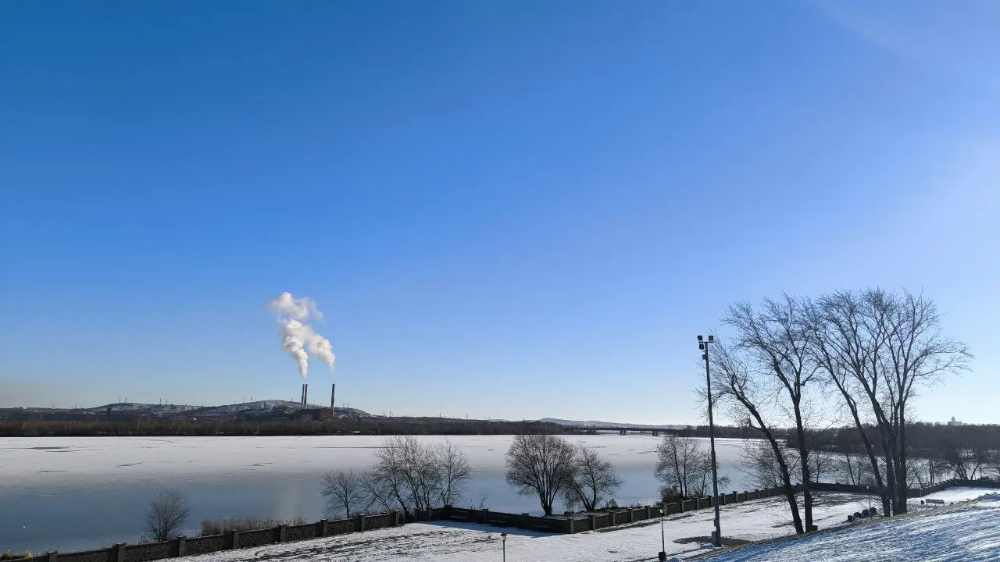
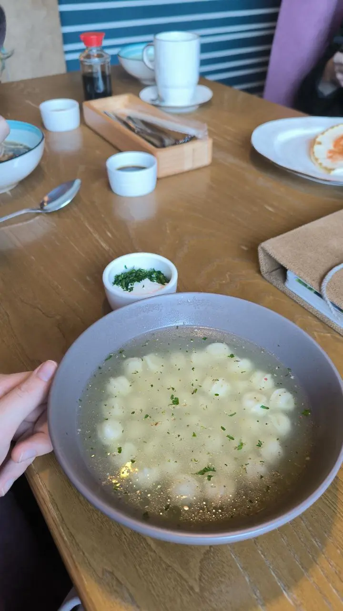

:::gallery
{width="1280" height="720" data-color="#5a534d"}

{width="720" height="1280" data-color="#586270"}

{width="720" height="1280" data-color="#476ea2"}

{width="960" height="1280" data-color="#7e91b0"}

{width="1280" height="720" data-color="#4d4224"}

{width="1280" height="960" data-color="#89817a"}

{width="1280" height="720" data-color="#6a90c0"}

{width="720" height="1280" data-color="#817c74"}
:::

Съездили с Катей Белых и Мишей Пейселем на большой праздник камерной музыки в Магнитогорск — конкурс имени Татьяны Алексеевны Гайдамович.

За пару месяцев подготовили огромную программу из трех трио разных эпох! Поиграли в снежки, погуляли и вообще! Ну и привезли третье лауреатство)

Очень классный город!
