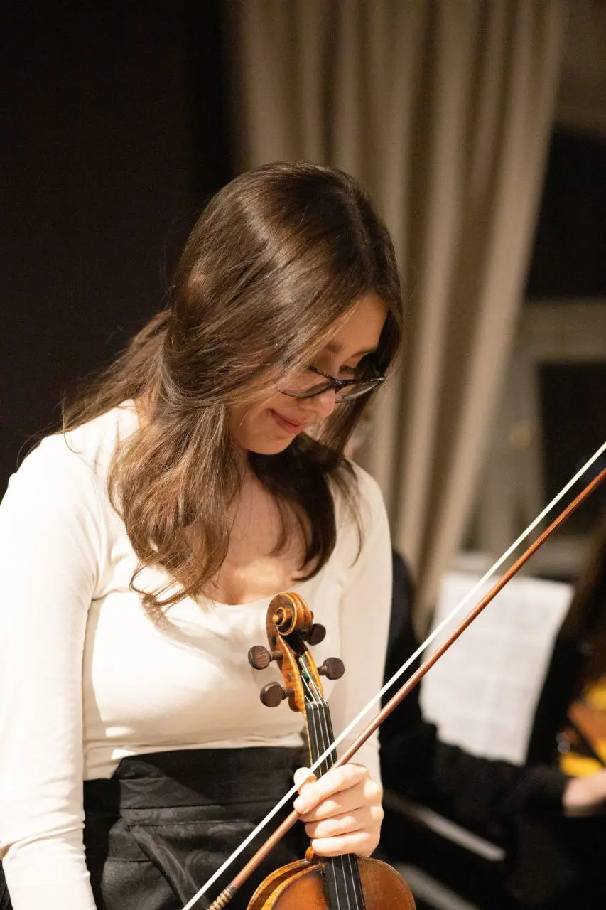
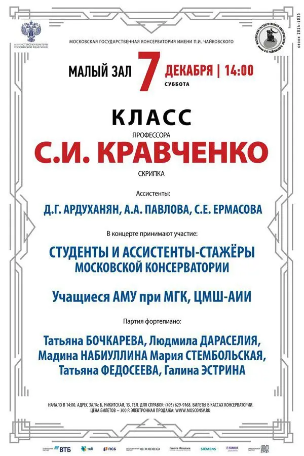

:::gallery
{width="853" height="1280" data-color="#725d4c"}

{width="600" height="900" data-color="#e2e1e4"}
:::

**Приходите насладиться классикой!**

❄️ Сегодня в 19:00  проведём лекцию-концерт **«Звучание эпох: музыкальный путеводитель от барокко до романтизма» с Аней Севостьяновой** по адресу [ул. 9-я Парковая 5А, ст. м. Первомайская](https://yandex.ru/maps/org/tsentr_moskovskogo_dolgoletiya/115286632055?si=hkgv88xffz97ba3h76tajv9ey0)

Вход свободный, регистрация по телефону: 84958704444

❄️ Уже завтра **в** [Малом зале консерватории](https://yandex.ru/maps/org/moskovskaya_gosudarstvennaya_konservatoriya_imeni_p_i_chaykovskogo_maly_zal/156510578885?si=hkgv88xffz97ba3h76tajv9ey0)! 7 декабря в 14:00 пройдёт концерт класса моего профессора Заслуженного артиста России Сергея Ивановича Кравченко!!!  Очень много классных скрипачей в одном концерте 🎻🎻🎻🎻🎻

🎫 Пригласительные в лс)

❄️ В воскресенье в [Большом зале консерватории](https://yandex.ru/maps/org/moskovskaya_gosudarstvennaya_konservatoriya_imeni_p_i_chaykovskogo_bolshoy_zal/30276832269?si=hkgv88xffz97ba3h76tajv9ey0) прозвучит 3-я симфония Яна Сибелиуса под управлением дирижера Анатолия Левина.

Пишите в лс, будут пригласительные))
