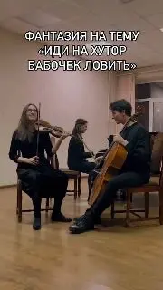

[{width="180" height="320" data-color="#625046"}](https://t.me/gattavasis/152){.video data-duration="37"}

По легенде, когда-то Элла Фитцджеральд и Люк Эллингтон придумали самый известный музыкальный эвфемизм для матерщины.
И с тех пор... началось!

Под таинственным мотивом «до-ре-ми-до-ре-до» скрывается прозаичное «да пошёл ты...»

Вы слышали его много раз. Например, когда набирали в домофоне неправильный код)) Такая традиция в постсоветских странах у инженеров по домофонам...

Если вдруг кто-то насвистит вам «до-ре-ми-до-ре-до», не смущайтесь, ведь великие умы прошлого придумали остроумный ответ —
«соль-фа-ми-ре-до-до-до#»
\[сам пошёл туда же\].
