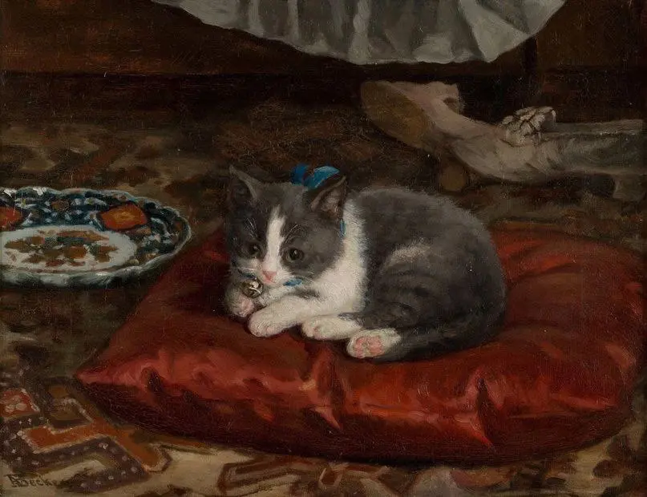
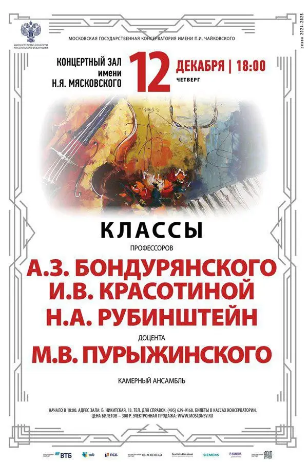

:::gallery
{width="807" height="620" data-color="#3c261b"}

{width="600" height="900" data-color="#dacac6"}
:::

Думкой называют маленькую подушечку, «подушенку (под ухо)», как у Даля.

«Перины в рост, подушки до потолка, роскошь!» — это у него же)

Кладут под голову, думаю, чтобы думы лучше думались. Как на картине с котиком финского художника **Адольфа Беккера**.

Ещё у многих славянских народов Думка — это лирическая песня. Думками вдохновлялись и Лист, и Балакирев, и Чайковский.

У чешского композитора Антонина Дворжака больше всего Думок. Например, у него есть знаменитое трио — цикл пьес с таким заглавием.
Мы с **Анастасией Барабановой** (фортепиано) и **Яромилой Преподобной** (виолончель) исполним их для вас...

❄️ 1-ю часть в четверг в 18 часов в [зале Мясковского](https://yandex.ru/maps/org/moskovskaya_gosudarstvennaya_konservatoriya_imeni_p_i_chaykovskogo_kontsertny_zal_imeni_n_ya_myaskovskogo/1037877252?si=hkgv88xffz97ba3h76tajv9ey0) в Московской консерватории на [концерте класса наших профессоров по камерному ансамблю](http://www.mosconsv.ru/ru/concert/190475).

Пригласительные в лс)

❄️ А в пятницу в 19 часов по адресу [Чусовская, 6](https://yandex.ru/maps/org/tsentr_moskovskogo_dolgoletiya/141449208533?si=hkgv88xffz97ba3h76tajv9ey0)
представим втроём большую камерную инструментальную программу и проведём небольшой музыкально-исторический экскурс

Вход свободный, для записи на концерт звоните по номеру 84958704444
