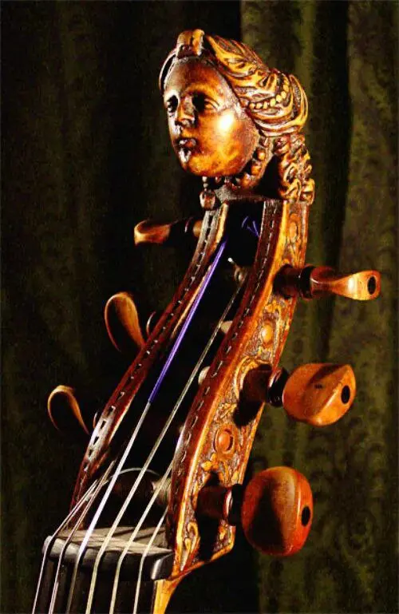
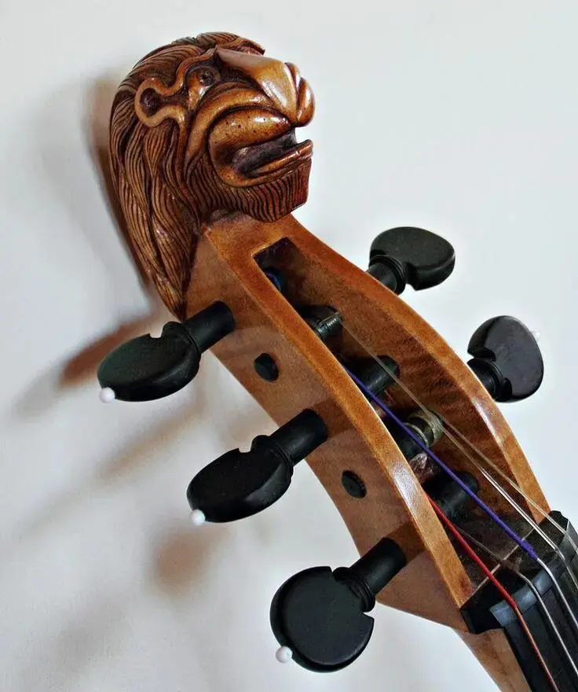
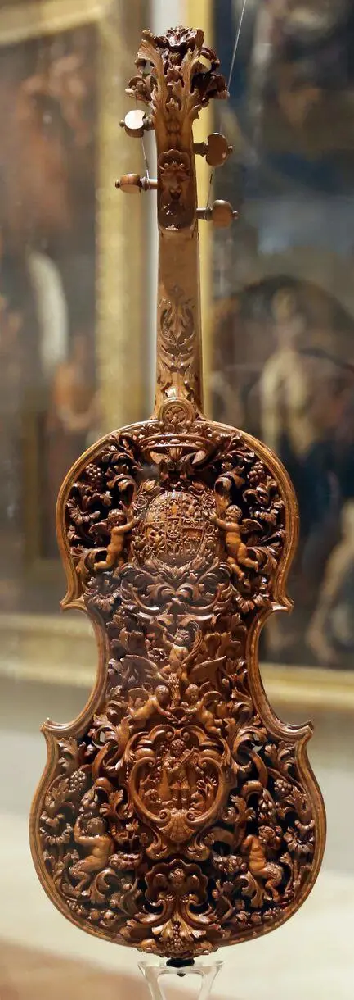
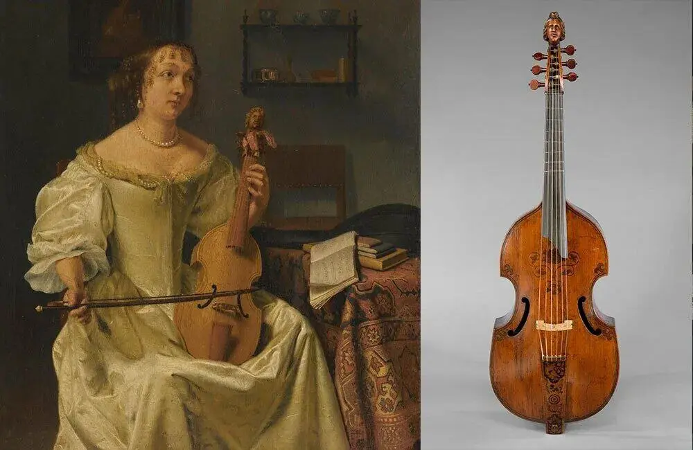
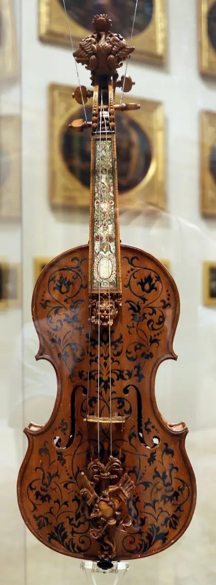

:::gallery
{width="500" height="769" data-color="#3d2511"}

{width="736" height="880" data-color="#928680"}

{width="433" height="1220" data-color="#6f5640"}

{width="1000" height="650" data-color="#74634e"}

{width="473" height="1280" data-color="#947f69"}
:::

> Сколько стоит контрабас? А контрабас с вот таким грифом? Кажется, этот контрабас нужно с кортежем охраны транспортировать.

Спасибо за интересный вопрос!

Вообще украшать головки струнных смычковых инструментов — очень старинная традиция, ещё со времен виол.
В последнее время все же у инструментов более унифицированный вид, такое реже встречается. Но есть энтузиасты!

Хотя к контрабасам единообразие меньше всего относится.

Например, контрабасы, в отличие от скрипки, альта и виолончели, бывают не только четырёхструнными, но и пятиструнными.
 Они бывают разных форм.
По размеру — от маленьких с виолончель до 1,8 м.

Я не интересовалась раньше покупкой контрабаса, но если считать по количеству затраченного пиломатериала, то [октобас](https://vk.com/video-36203869_163143112) никто не переплюнет!!!

P. S. Скорее всего, некоторые из инструментов на фото изначально создавались и использовались как элемент интерьера. Практическое значение уходило на второй план)
