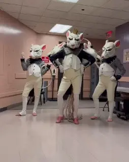

[{width="254" height="320" data-color="#806f69"}](https://t.me/gattavasis/162){.video data-duration="13"}

Всем привет!
На связи [Юля Пьяникова](https://vk.com/julia_pianikova), скрипачка и автор канала [КАТАВАСИС](https://t.me/gattavasis)))

На моем камерном канале собралось уже довольно много моих друзей и единомышленников.
И я с радостью приглашаю вас на новогоднее чаепитие ~~шампанскопитие тоже~~🍾, которое мы проведём у меня дома/в антикафе в эту субботу, 28.12!

**В планах:**
🎁 Посмотреть какую-нибудь классную версию балета «Щелкунчик»
🍊Раскрасить елочные шары акриловыми красками
🎄Пообщаться в кругу друзей))

Не стесняйтесь написать мне в личные сообщения, если хотите поучаствовать. Расскажу все подробности и добавлю в беседу! [@Julia\_violin](https://t.me/Julia_violin)  🎅🎅🎅

Даже если мы не очень хорошо знакомы. Особенно если мы не очень хорошо знакомы!!!

Жду всех❤️

P. S. Видео от American Ballet Theatre завирусилось в сети😁😁😁
