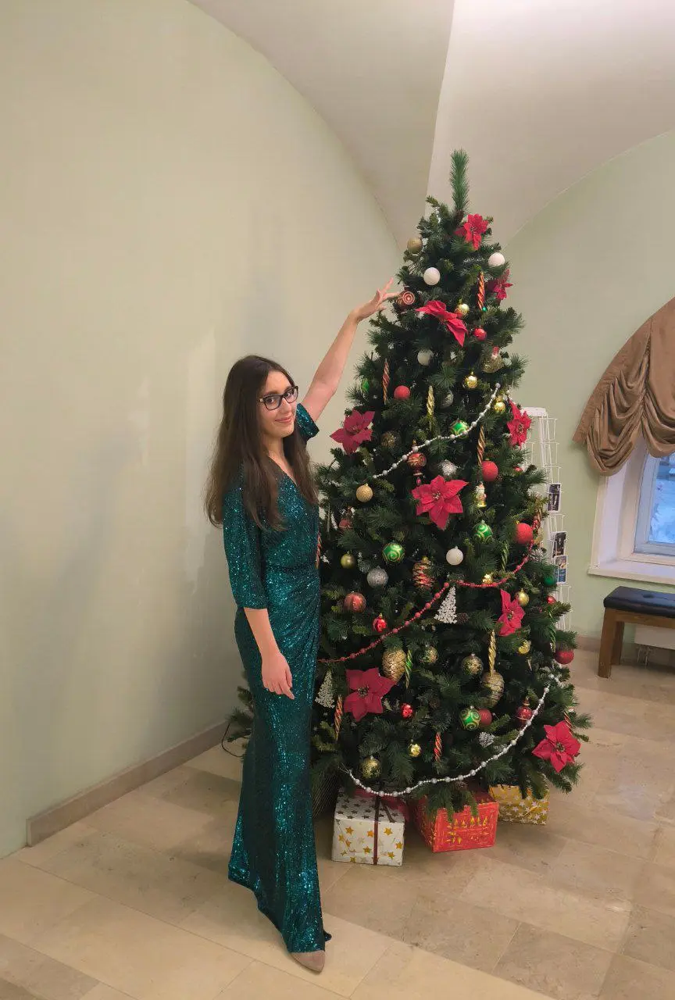
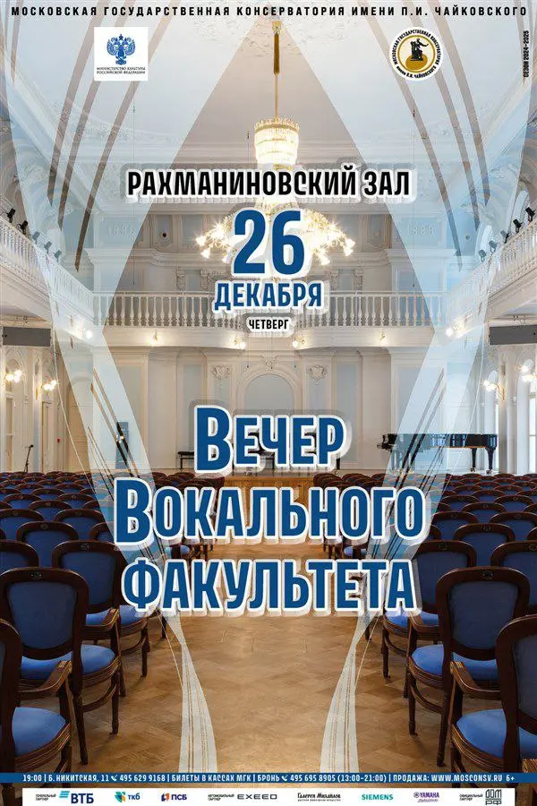

:::gallery
{width="864" height="1280" data-color="#8a7d6a"}

{width="600" height="900" data-color="#8e8d8c"}
:::

❄️  **Завтра в 19 часов** сыграю на [Вечере Вокального факультета](http://www.mosconsv.ru/ru/concert/190274) в [Рахманиновском зале](https://yandex.ru/maps/org/moskovskaya_gosudarstvennaya_konservatoriya_imeni_p_i_chaykovskogo_rakhmaninovskiy_zal/38104528288?si=hkgv88xffz97ba3h76tajv9ey0)✨
Будет очень красиво, приходите! Сочетание прекрасного сопрано и скрипки...🥺🥺🥺
🎫 [Билеты](https://mosconsv.zapomni.ru/events/383d11e8-1a79-4257-9069-92c97cfc3408?schedule=4e96ac8c-51d1-48b4-be83-1cd2afca3a75)

❄️ **27.12 (пт) 19:00** 🎻🎻🎻
**Вечер скрипичной музыки!**

Позвольте мне затронуть некоторые **незыблемые постулаты**, которые не подвергаются сомнению на этом тг-канале.

Прежде всего, по моему экспертному мнению (говорю как скрипачка), скрипка — это самый чарующий и совершенный музыкальный инструмент из всех существующих. Без обид, коллеги. Ни в коем случае не хочу умалить достоинства других инструментов.

Из первого тезиса вытекает следующий: лучший способ провести вечер пятницы — сходить на вечер скрипичной музыки.

В пятницу исполню для вас множество сочинений золотого репертуара для скрипки.
Если вы любите скрипку так же, как люблю её я, — приходите!
❤️❤️❤️

🎫 Вход свободный, запись по номеру (тг) 89939101317
📍[Первомайская ул., 107А](https://yandex.ru/maps/org/tsentr_moskovskogo_dolgoletiya/90811605843?si=hkgv88xffz97ba3h76tajv9ey0)

❄️ [Напоминаю про Щелкунчиковую тусовку в субботу🎄](https://t.me/gattavasis/162)🤩
