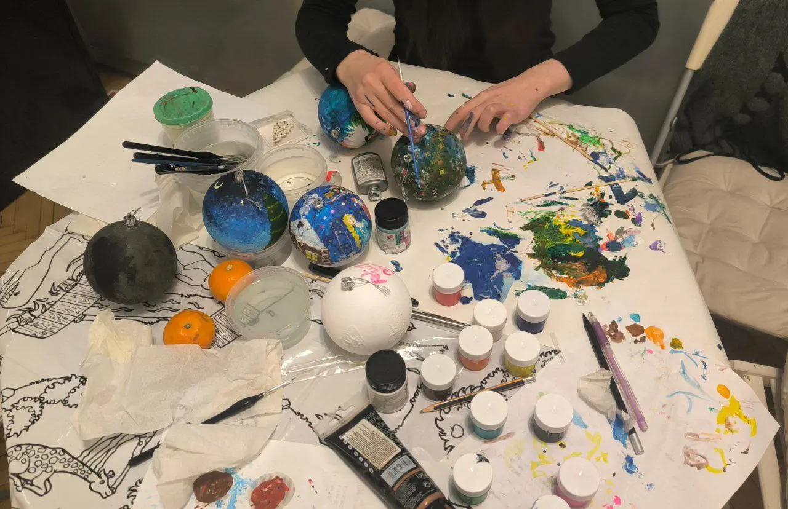
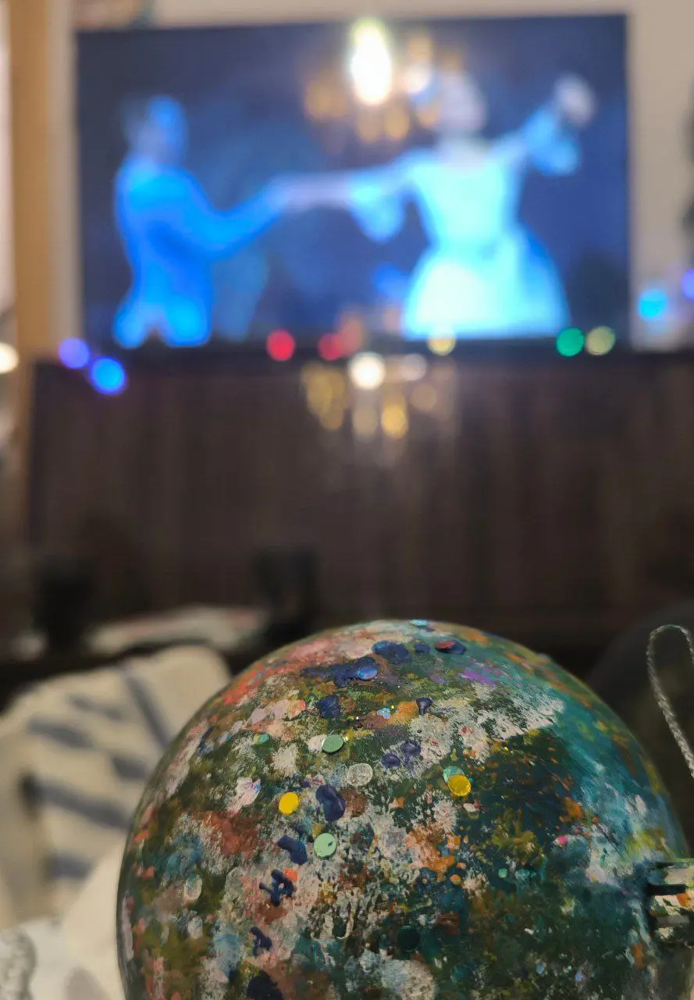
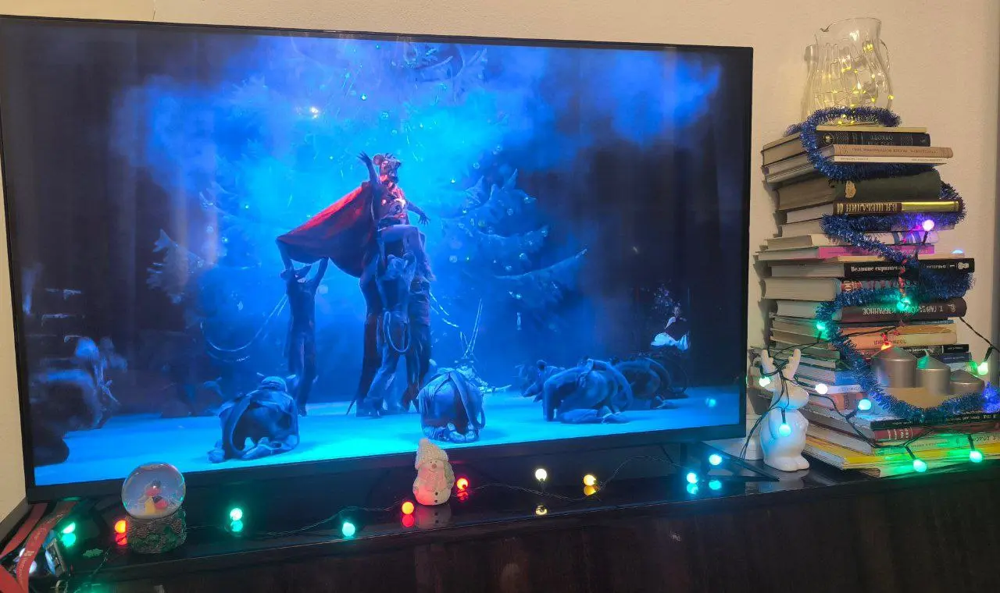
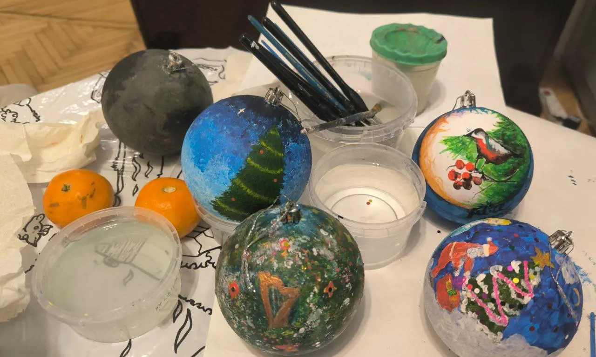
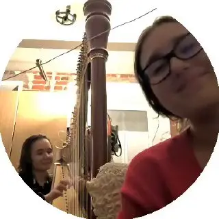

:::gallery
{width="1280" height="828" data-color="#948774"}

{width="889" height="1280" data-color="#4f555b"}

{width="1280" height="760" data-color="#305780"}

{width="1280" height="767" data-color="#8d806c"}
:::

**Мы посмотрели «Щелкунчика» Нуреева в Венской опере, Григоровича в Большом, Вайнонена в Мариинском...**
**И именно в таком порядке))**

Бытует мнение, что при звуках Pas de deux любого академического музыканта начинает мутить, но все прошло без эксцессов!

**Предновогоднее настроение создано!** Спасибо моим дорогим друзьям, которые нашли время посреди зачётной недели для нашей Щелкунчиковой тусовки 🥰🥰🥰

[{width="320" height="320" data-color="#a69284"}](https://t.me/gattavasis/169){.video .round data-duration="59"}
