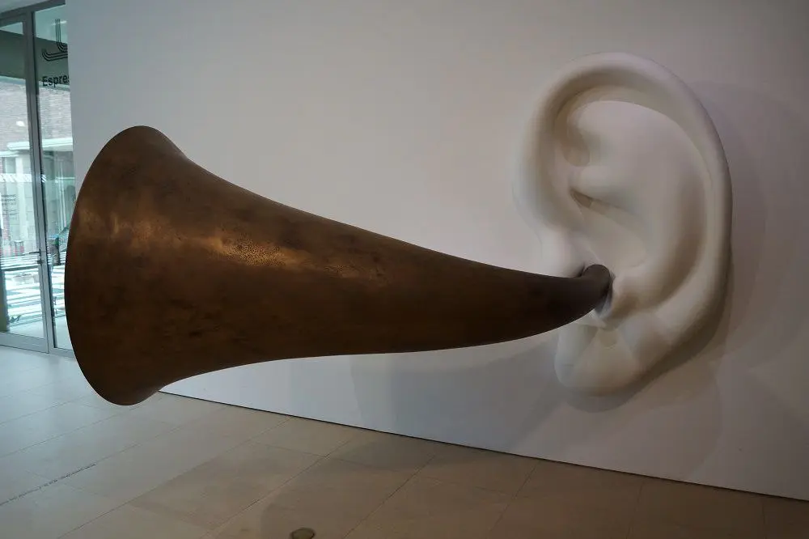

**HÖRROHR**
(нем. \[ˈhœʁˌʔoːɐ‌\] сущ. n  -es,-s;-e)

— früher verwendetes einfaches Hörgerät, das zur Vergrößerung der schallauffangenden Fläche in Trichterform konstruiert war.

Отофон или слуховая трубка —ранее использовавшийся простой слуховой аппарат, выполненный в форме воронки для увеличения площади улавливания звука.

1 - старинный отофон

2 - ухо Бетховена со слуховой трубкой от Джона Бальдессари. Если в нее что-нибудь сказать, в ответ можно услышать музыкальную фразу одного из бетховенских опусов, написанных им в период глухоты, музей Бойманса ван Бёнингена, Роттердам

:::gallery
{width="819" height="1280" data-color="#b39e82"}

{width="1000" height="666" data-color="#6c655f"}
:::
