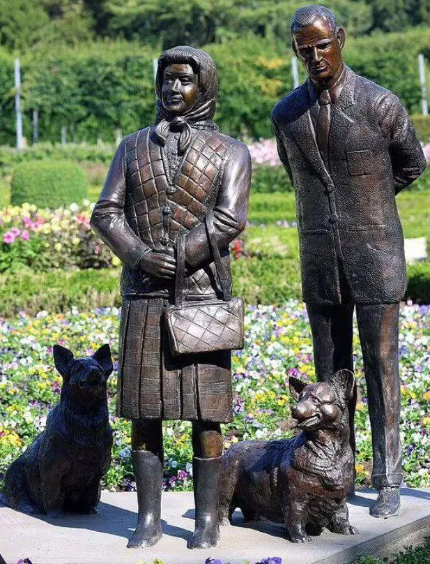
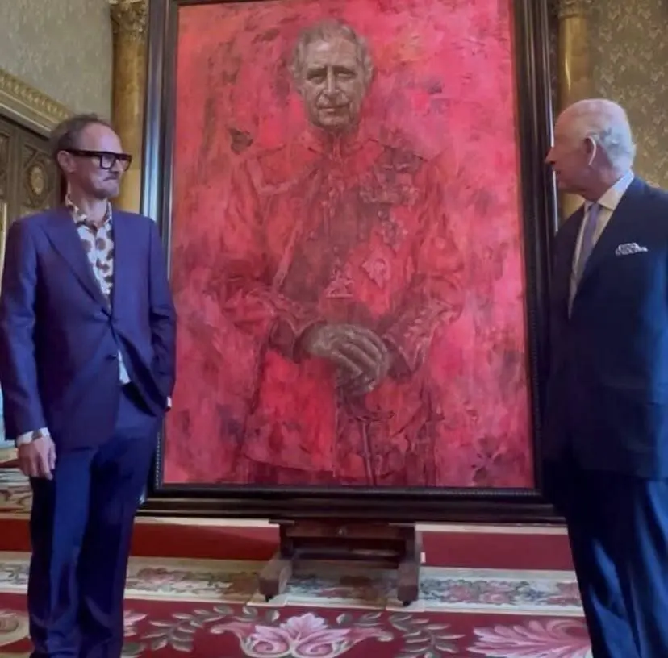
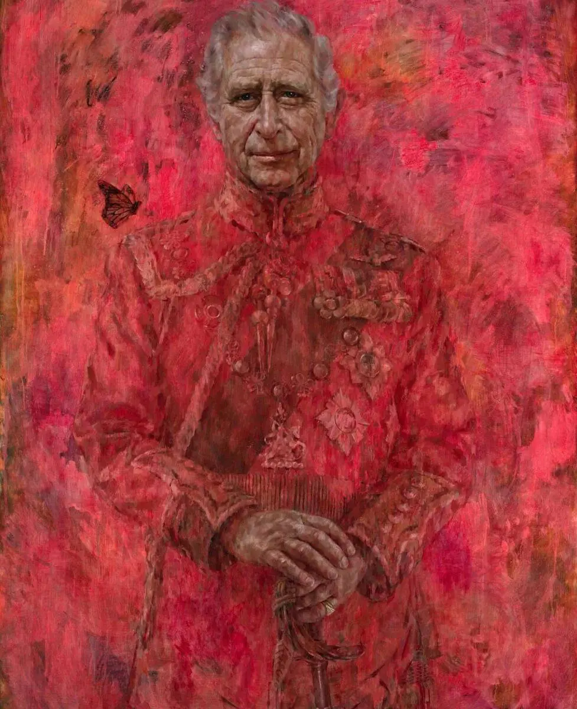

:::gallery
{width="617" height="808" data-color="#666d5b"}

{width="828" height="816" data-color="#6a3a4d"}

{width="977" height="1200" data-color="#a03436"}
:::

Не успели утихнуть споры по поводу первого официального портрета короля Карла III, **сИмПаТиЧнЫй, пРаВдА**?...как в Антрим-Касл-Гарденс в Северной Ирландии была создана бронзовая статуя покойной британской королевы работы Энто Бреннана.
Елизавета II изображена рядом с принцем Филиппом и двумя корги.

«Скульптура показывает королеву в величественной позе, отражая ее грацию, стойкость и преданность государственной службе», — отметили в городском совете Антрима и Ньютаунэбби.

Я в полном восторге, а вы?)
