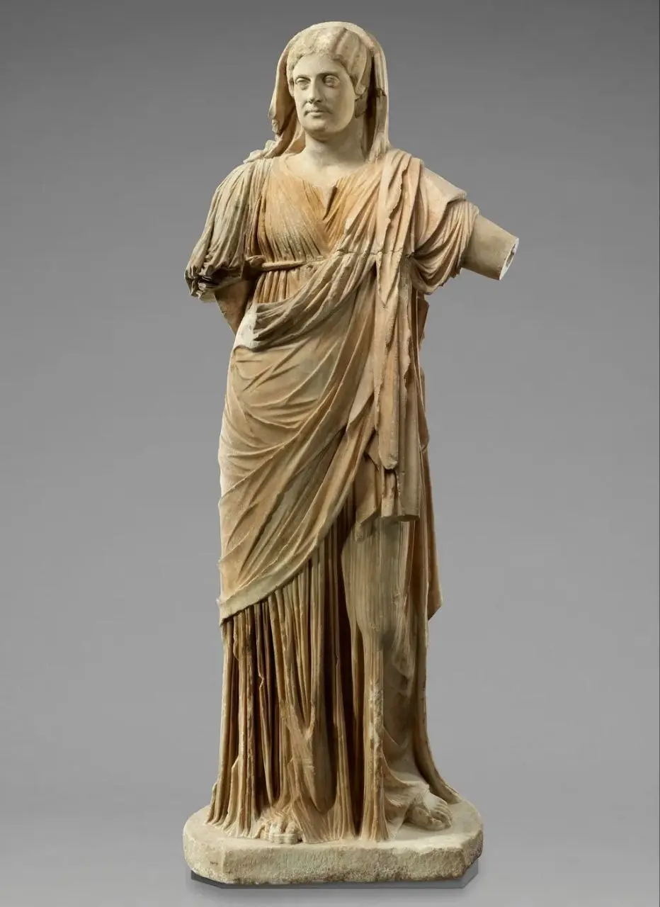

Есть у человечества очень странное увлечение — воплощать кумиров в камне, а потом лет через -дцать их разрушать. Если плодами первого я восхищаюсь, то второе, конечно, не понимаю. Но, к сожалению, так было всегда.

Недавно узнала, что в этой сфере, как и во многих других, римляне достигли потрясающих успехов. Зачем ваять новую статую, если можно просто заменить голову старой? По-моему, это потрясающе в своём цинизме.

Вообще, есть несколько причин, почему у многих античных статуй нет головы. Первая из них — при падении, как и у живых людей, шея является одним из самых уязвимых мест. Существовало в Древнем Риме также посмертное наказание damnatio memoriae. Сенат мог проголосовать за то, чтобы осудить память императора. В таком случае любые материальные свидетельства о его существовании — статуи, настенные и надгробные надписи, упоминания в законах и летописях — подлежали уничтожению.

Однако статуи могли обезображивать и в наше время. Известный пример — статуя в коллекции Музея Гетти, которую предположительно некий недобросовестный арт-дилер «расчленил» — отделил голову от тела, чтобы продать уже не один, а два бесценных античных артефакта. В итоге статую удалось восстановить.

{width="932" height="1280" data-color="#8b8379"}
