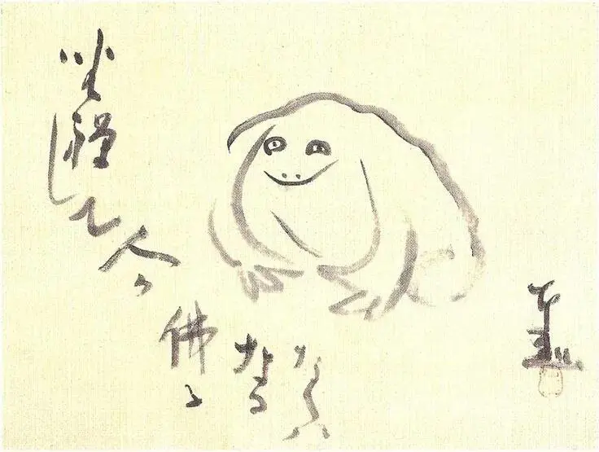

{width="736" height="555" data-color="#f0efd0"}

Если кто и стал буддой,
Это я в дзадзэн.
Обычная лягушка,
Какой я был
Когда-то.

Сэнгай (1750-1837)

«Дзадзэн» означает «сидящий в медитации». Похоже, и лягушка в саду принимает ту же позу. Если бы практика созерцания в дзэн сводилась лишь к положению тела, лягушка уже давным-давно стала бы буддой. Но проникнуться духом дзэн не значит принять сидячую позу. Главное— пробуждение в бессознательном.

Из «Сэнгай. Каталог тематической выставки»
Издательство Kokusai-Bunka Shinkokai, 1961
