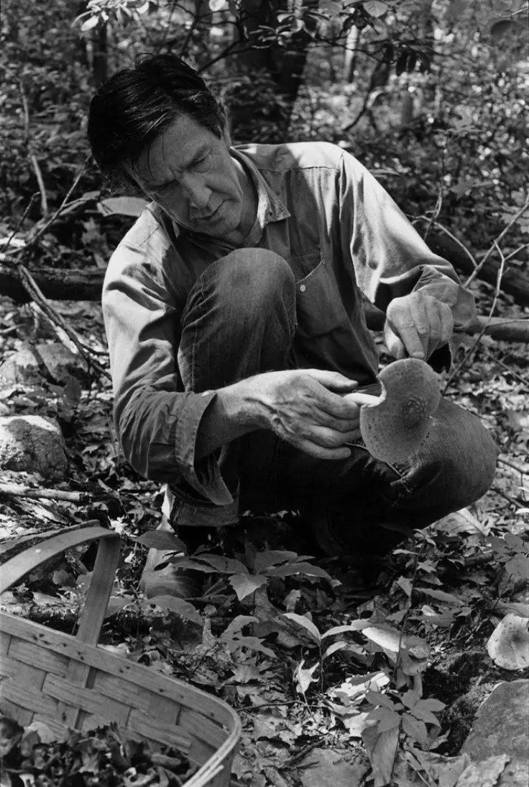
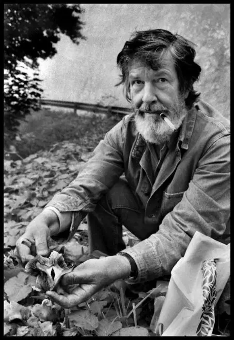
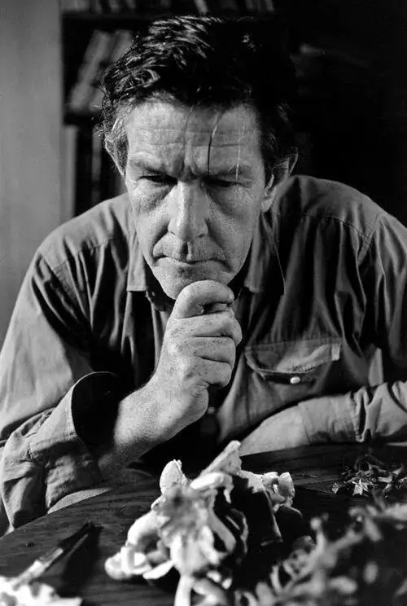

Я очень люблю собирать грибы, особенно лисички. Вырезаю их семьями в лесу. Кто вообще не любит «тихую охоту»? Один известный российский писатель-фантаст даже сделал грибы одной из центральных тем своего творчества. Такое не одобряем.

Американский композитор Джон Кейдж, ведущий представитель послевоенного авангарда, которого мы знаем прежде всего по его 4'33", тоже очень любил собирать грибы. «…Мне не хватало личного пространства, и я стал уходить гулять в лес. А поскольку был август, лес был полон грибов. Меня привлек их яркий цвет (все мы дети). Помню, во время депрессии я как-то неделю питался одними грибами, и решил не пожалеть времени и узнать о них побольше».
«Я  участвовал в телевизионной викторине, которую выиграл, отвечая на вопросы о грибах, и это были первые в моей жизни ощутимые деньги. (Только через два года, в 1960-м, я начал зарабатывать музыкой)».
Однажды композитор случайно подал на стол ядовитую чемерицу, которую перепутал со скунсовой капустой. Плохо стало всем, кто сидел тогда за столом, а самого Кейджа госпитализировали (он съел больше всех) и сделали промывание желудка.

Но люди учатся на своих ошибках. В итоге Кейдж получил премию Микологического общества Северной Америки и читал курс по распознаванию грибов в Новой школе социальных исследований. В конце концов стал сооснователем Нью-Йоркского микологического общества.

Кейдж придавал особый смысл тому, что в словаре слова гриб (mushroom) и музыка (music) находятся рядом друг с другом. В 1954 году композитор написал статью, в которой сравнил сбор грибов с состоянием новой музыки: «Забавная мысль: гриб вырастает за очень короткое время, и, если повезет найти его, когда он свеж, это все равно что наткнуться на звук, который тоже живет очень короткое время».

Давайте напоследок вспомним самые известные и любимые публикой сочинения Джона Кейджа:

4'33" — 4 минуты и 33 секунды тишины. Однако тишина в этом произведении не равнозначна полному отсутствию звука, поскольку Кейдж, помимо прочего, стремился привлечь внимание слушателей к естественным звукам той среды, в которой исполняется 4'33"
[https://youtu.be/JTEFKFiXSx4?feature=shared](https://youtu.be/JTEFKFiXSx4?feature=shared)

Водная прогулка (Water walk)
— пример конкретной музыки (Musique concrète), суть которой записать шумы и звуки, главным образом природного происхождения и распределить во времени, возможно добавив аудио-эффектов. Вместо нот Кейдж использовал схему, на которой были написаны определенные звуковые действия в определенный промежуток времени, который он отслеживал по секундомеру.
[https://youtu.be/gXOIkT1-QWY?feature=shared](https://youtu.be/gXOIkT1-QWY?feature=shared)

Сонаты для подготовленного (или препарированного) фортепиано — фортепиано, звук которого создаётся с помощью различных предметов, которые помещаются на струны, между ними или же на молоточки. В результате фортепианное звучание совмещается с перкуссионным, создавая особый неповторимый звук.
[https://youtu.be/N0-y8oNDLgU?feature=shared](https://youtu.be/N0-y8oNDLgU?feature=shared)

:::gallery
{width="736" height="1092" data-color="#4a4a4a"}

{width="483" height="700" data-color="#656565"}

{width="500" height="744" data-color="#474747"}

{width="640" height="861" data-color="#565656"}
:::
