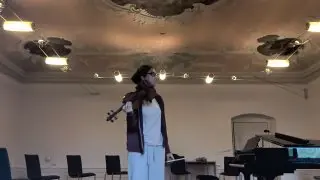

[{width="320" height="180" data-color="#6b5c52"}](https://t.me/gattavasis/39){.video data-duration="77"}

Дано:
Гулкая акустика ужасно неудобная, если только вы не собираетесь петь a capella или мучить Баха

Задача:
Вычислите скорость вращения Баха в гробу

Интересно, какая акустика в колодце? Не то чтобы я хотела проверить, хотя да
