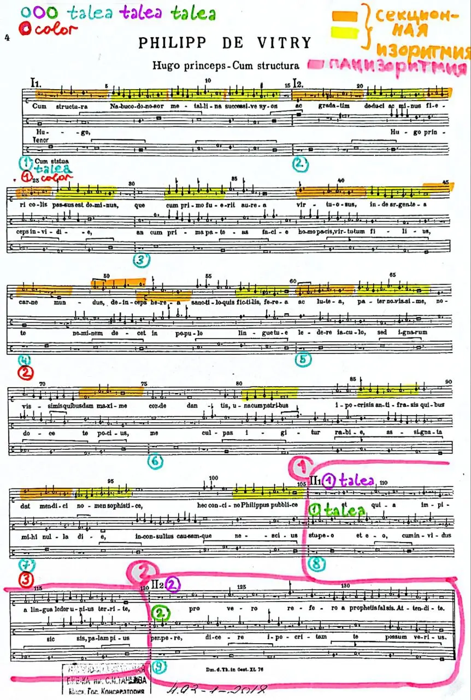

**Ситуация:**
**Вы хотите задиссить обидчика, но родились в 14 веке**

Выход есть!
Вам нужно всего лишь изучить искусство контрапункта и записать изоритмический мотет, где вы иносказательно назовёте парижского магистра-астронома магистром Зависти, христопродавцем, учителем невежд и лжепророком.
Ходите теперь и оглядывайтесь.

Думаю, астроном Хуго в итоге пожалел, что связался с автором этого мотета Филиппом де Витри, так как теперь он запечатлен в истории почти как Герострат мира музыки. Бедный.

Правда, с «всего лишь изучить искусство контрапункта» я, конечно, загнула.
Как говорится, не пугай нас сопроматом, технарь! У нас в этом году дисциплина под названием полифония (читай контрапункт). Она переводится с греческого как многоголосие. Хотя не всякое многоголосие — полифония, а только то, где соединяются две и больше самостоятельных мелодий. Звучит довольно просто, но сейчас пока только сентябрь))

Вот вчера на полифонии мы изучали мензуральную нотацию и ритмику, изоритмию — сложные умозрительные системы и правила, по которым нужно было сочинять и записывать музыку.

Если вкратце, то до того, как музыканты придумали современную нотную запись, у них были всякие разные танцы с бубнами.
Вот мензуральная нотация 14 века, например, чертовски трудная, и, скажем, «порог входа» у неё, как сейчас принято говорить, намного выше, чем у современной. Так что можно сказать, что наша родная современная нотная запись в этом плане более демократичная))

На картинке этот самый памфлет Филиппа де Витри, епископа, композитора, поэта, автора трактата «Ars Nova» \[Новое искусство\], который дал название целому периоду в истории западноевропейской музыки – Арс Нова.

 🎧[Слушать мотет Hugo, Hugo, princeps invidie](https://youtu.be/cS9bdjm0hN0?feature=shared)

{width="862" height="1280" data-color="#d2d0cb"}
