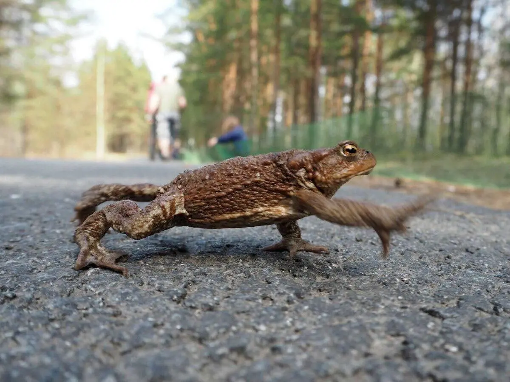
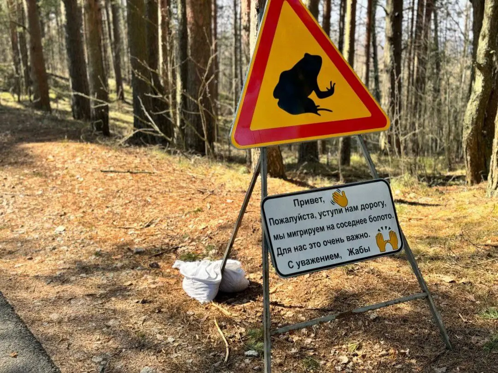

Друзья мои, в какой сезон, как вы считаете, лучше всего приехать в Санкт-Петербург?
С погодой на самом деле трудно угадать, Петербург может быть не очень приветлив с октября по июбрь.

Советую середину апреля. Именно в это время на Сестрорецком болоте, рядом со знаменитыми поэтическими и художественными местами Курортного района Петербурга, начинается период миграции серых жаб. Он длится до середины мая.
Каждый год заказник набирает волонтёров, чтобы перенести жаб через ближайшие автодороги. В противном случае бедняжки могут угодить под колеса автомобилей.
В прошлом году вызвались 700 человек, которые общими усилиями перенесли около 17500 жаб.
«Добровольцы ходят вооруженные пластиковыми ведеркамм, в них удобно собрать побольше жаб и одновременно выпустить их в безопасной зоне. Только включать режим грибника и наполнять ведро доверху не надо – жабы будут чувствовать себя так же неуютно, как пассажиры в автобусе в час-пик.»
Я знаю, чем займусь следующей весной. Кто со мной?

:::gallery
{width="1200" height="900" data-color="#7f7c71"}

{width="1080" height="810" data-color="#8e7551"}
:::
