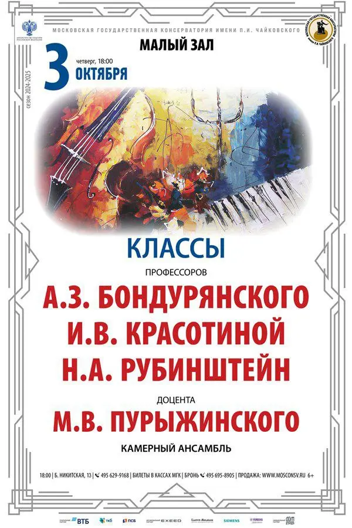

{width="600" height="900" data-color="#d6c7c6"}

Концерт класса наших дорогих профессоров по камерному ансамблю))
Приходите нас поддержать!

**Начало в 18 часов.**
Билеты по [ссылке](http://www.mosconsv.ru/ru/concert/189613).

Большая Никитская ул., д. 13/6
[📍На карте](https://yandex.ru/maps/org/moskovskaya_gosudarstvennaya_konservatoriya_imeni_p_i_chaykovskogo_maly_zal/156510578885?si=hkgv88xffz97ba3h76tajv9ey0)
