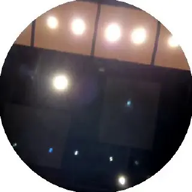

[{width="320" height="320" data-color="#6b6466"}](https://t.me/gattavasis/53){.video .round data-duration="7"}

Сегодня всей консерваторской ватагой идём на закрытый концерт Курентзиса. В программе сочинения Антона Рубинштейна, в т.ч. Симфония №2 «Океан». Концерт проводится совместно с Центром по сохранению наследия Антона Рубинштейна.
