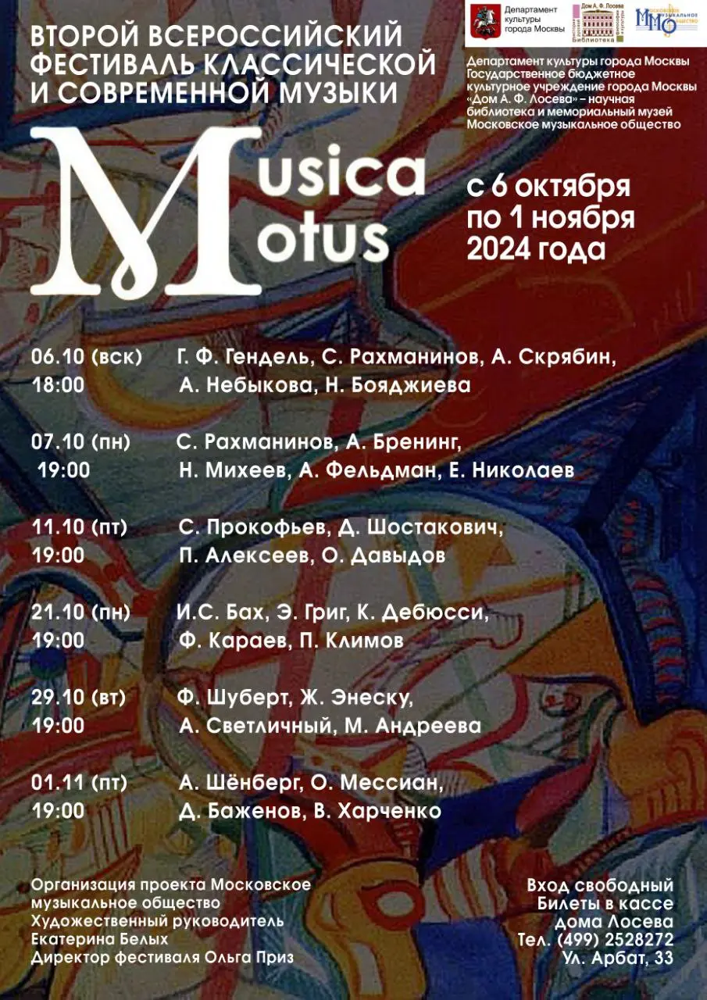

{width="905" height="1280" data-color="#4f3c3c"}

Уникальность проекта в том, что «...в каждом концерте проводится **встреча с двумя ныне живущими авторами**, которым слушатели смогут задать интересующие их вопросы по поводу творчества и сочинений.

Вот лишь некоторые фамилии приглашенных композиторов в этом году: **Фарадж Караев**, отметивший в прошлом году свой 80-летний юбилей обширной серией концертов, **Аркадий Фельдман** – художественный руководитель и дирижер Калининградского симфонического оркестра, **Алина Небыкова** – председатель Совета Союза композиторов Евразии, основатель издательства «Шостаковичи и Стравинские» и многие другие.»
[Из анонса classicalmusicnews.ru](https://www.classicalmusicnews.ru/anons/musica-motus-2024/)

Прилагаю афишу и расписание фестиваля.

Художественный руководитель фестиваля — моя дорогая подруга **Екатерина Белых**, прекрасная пианистка и композитор. С ней на фестивале мы представим творчество современного композитора на одном из концертов. Расскажу ближе к делу)

📍[Дом А. Ф. Лосева](https://yandex.ru/maps/org/dom_a_f_loseva/1717853514?si=hkgv88xffz97ba3h76tajv9ey0)
[ул. Арбат, 33](https://yandex.ru/maps/org/dom_a_f_loseva/1717853514?si=hkgv88xffz97ba3h76tajv9ey0)
