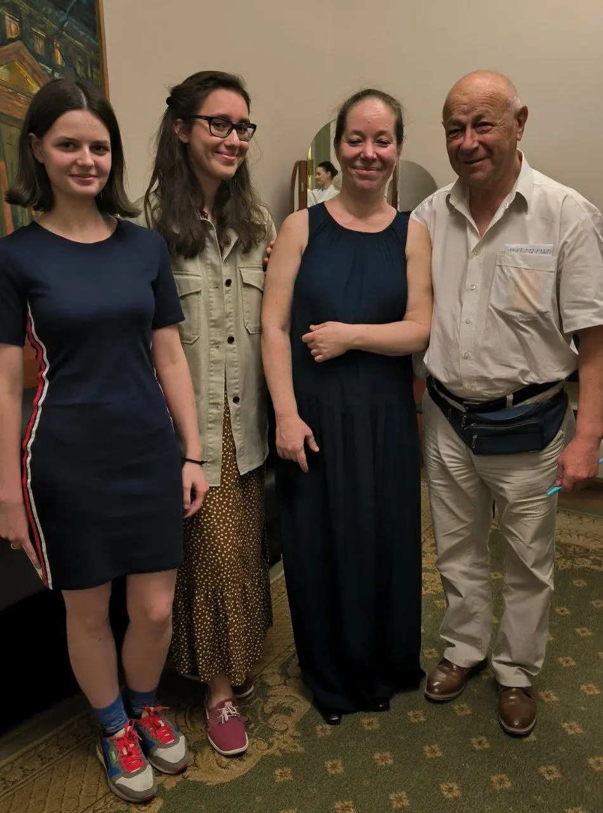
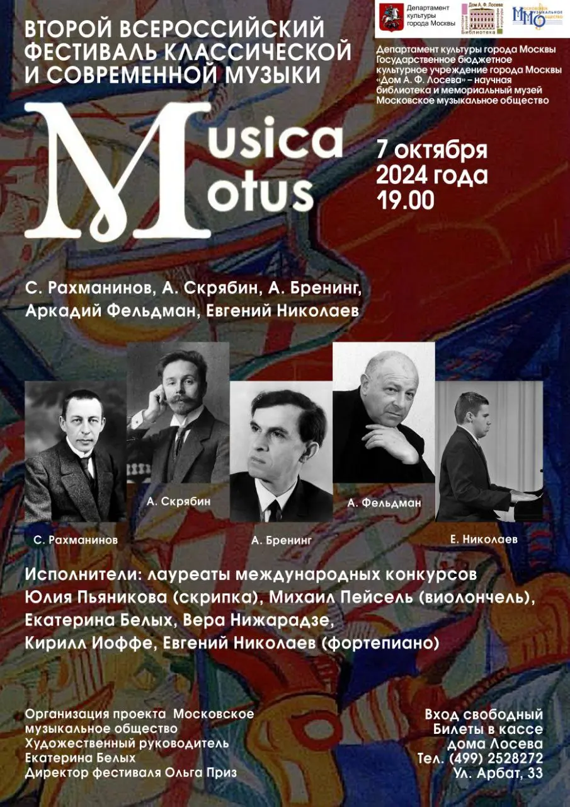
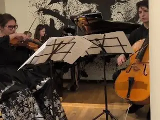

:::gallery
{width="950" height="1280" data-color="#4d4035"}

{width="905" height="1280" data-color="#544442"}
:::

На фото мы с Катей после концерта Брамс-трио в Малом зале консерватории 30 мая с Наталией Александровной Рубинштейн и Аркадием Айзиковичем Фельдманом. На этом концерте мы впервые познакомились с его музыкой.

А это мы завтра на фестивале [Musica Motus](https://vk.com/musicamotus) исполним его **Элегическое трио**, которое нам так понравилось!

Если вы привыкли, что современная академическая музыка — это сложная умозрительная абракадабра, которую придется слушать со справочником, приходите завтра!
Мы с Екатериной Белых, Михаилом Пейселем и другими исполнителями попробуем вас разубедить!

Но если что-то все равно останется неопределённым, Аркадий Айзикович сам расскажет о своём творчестве на концерте, и вы сможете задать ему интересующие вопросы.

**Завтра в 19 часов!**

Вход свободный.

📍[Дом А. Ф. Лосева](https://yandex.ru/maps/org/dom_a_f_loseva/1717853514?si=hkgv88xffz97ba3h76tajv9ey0)
[ул. Арбат, 33](https://yandex.ru/maps/org/dom_a_f_loseva/1717853514?si=hkgv88xffz97ba3h76tajv9ey0)

[{width="320" height="241" data-color="#5f4b3a"}](https://t.me/gattavasis/60){.video data-duration="68"}

Речитативный фрагмент 1й части трио
