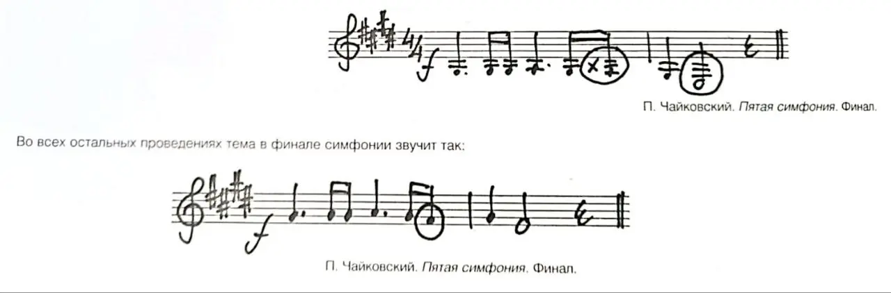

{width="1280" height="422" data-color="#efefef"}

**Из воспоминаний Г. Н. Рождественского о Шостаковиче**:
«Д.Д. не переносил музыки французских импрессионистов. Однажды в Москве после исполнения его сыном Ноктюрнов Дебюсси он задумчиво сказал мне «Как приятно, что не я один пишу г... музыку».

На другом концерте в Эдинбурге, после исполнения Пятой симфонии Чайковского, он обронил: «В этой симфонии у меня вызывает припадок отвращения нота *фисис* (*фа-дубль-диез*) в финале, а остальное ничего, ничего, так сказать... **Дело в том, что у скрипок нет этого самого фа-диеза, поэтому они вынуждены играть фисис, фисис, понимаете ли...»**
Злополучный же *фисис* при первом проведении возник из-за того, что на скрипке нельзя извлечь *фа-диез* малой октавы, ее последняя нижняя нота *соль*, то есть *фа-дубль-диез (фисис).* От себя добавлю, что еще более «отвратительное» впечатление производит невозможность для скрипачей сыграть вторую ноту во втором такте. Создается впечатление, что **кто-то «заткнул рот скрипачам, вместо которых альты довольно тупо тянут это ми**!»
