:::gallery
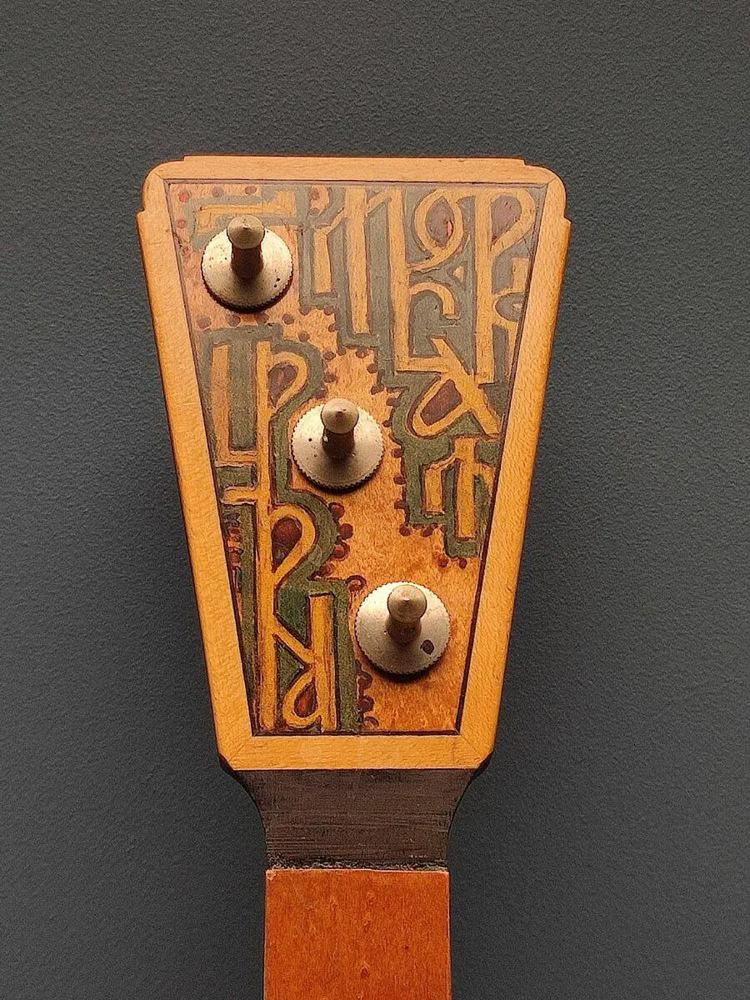{width="900" height="1200" data-color="#6d543f"}

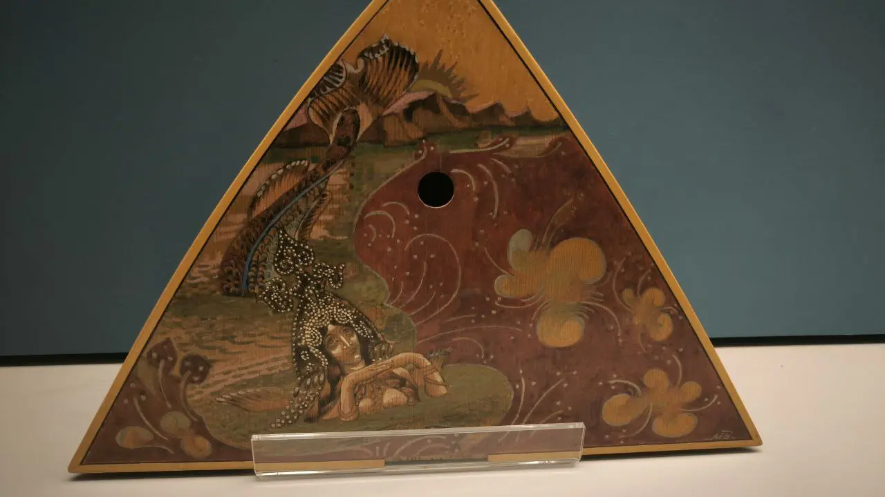{width="1280" height="720" data-color="#594c3c"}

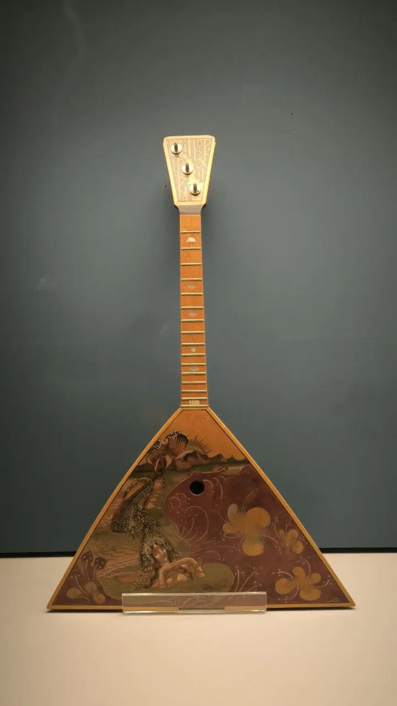{width="720" height="1280" data-color="#645f52"}
:::

Балалайка в зале Михаила Врубеля

**Балалайка в Третьяковке**

Вчера посетила основную экспозицию в Лаврушинском переулке и в зале Михаила Врубеля обнаружила кое-что потрясающее.

Оказывается, Врубель часто бывал у княгини Тенишевой в Талашкино. Там он писал картины, делал наброски и эскизы для зарождавшихся талашкинских мастерских.
В это время она заказала несколько балалаек для школьного оркестра балалечников, и эти балалайки стояли в виде деревянных заготовок, еще не покрытых лаком, в мастерской Тенишевой.

Увидев пустые деки балалаек в мастерской княгини, художник решил разрисовать их.

 «Сидя со мной, он, бывало, рисовал и часами мечтал вслух, давая волю своей богатой, пышной фантазии. Малейший его эскиз кричал о его огромном даровании. В это время я была занята раскраской акварелью по дереву небольшой рамки, и этот способ его заинтересовал. Шутя, он набросал на рамках и деках несколько рисунков, удивительно богатых по колориту и фантазии, оставив мне их потом на память о своем пребывании в Талашкине". И в 1898 году им была расписана балалайка "Рыбки". На ней красуется дарственная надпись «На память».

Балалайки, расписанные Врубелем, Коровиным, Давыдовым, Малютиным и Головиным, были представлены на Парижской всемирной выставке в павильоне от России в 1900 году. Европейская публика воспринимала эти предметы прикладного искусства как национальную версию авангарда, что на рубеже веков было востребовано и пользовалось огромным успехом.

:::gallery
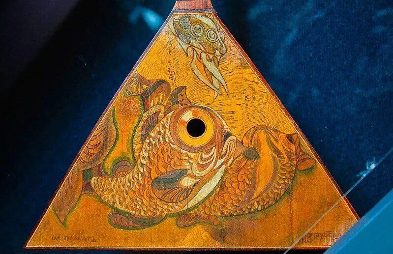{width="799" height="517" data-color="#5e472d"}

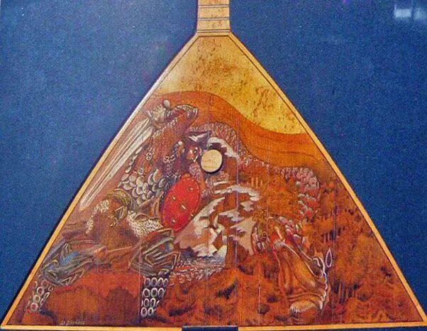{width="602" height="466" data-color="#70565c"}

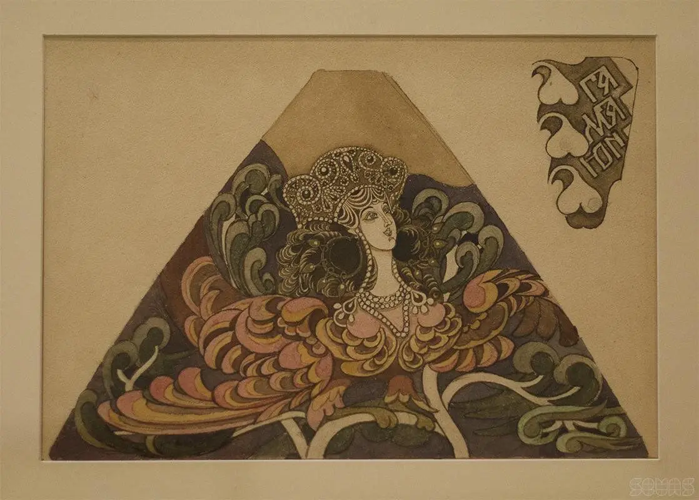{width="1118" height="800" data-color="#846a47"}

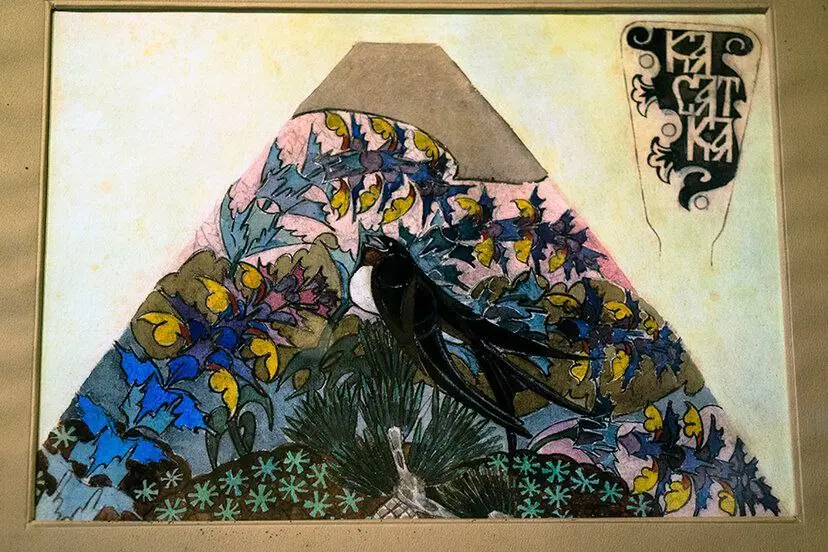{width="828" height="552" data-color="#827f70"}

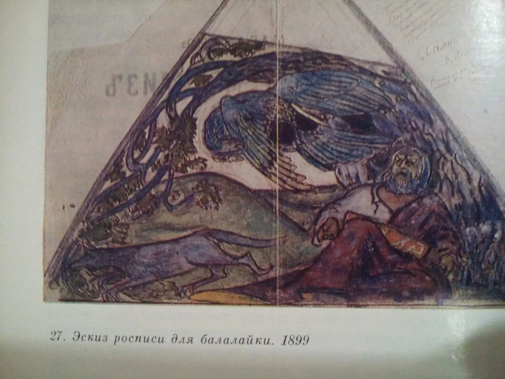{width="1280" height="960" data-color="#786d6d"}

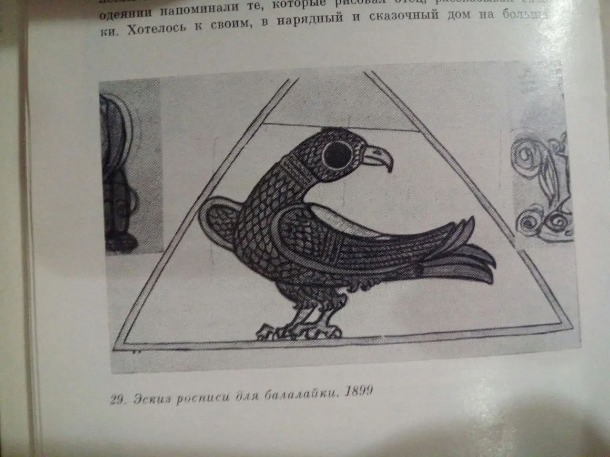{width="1280" height="960" data-color="#898681"}

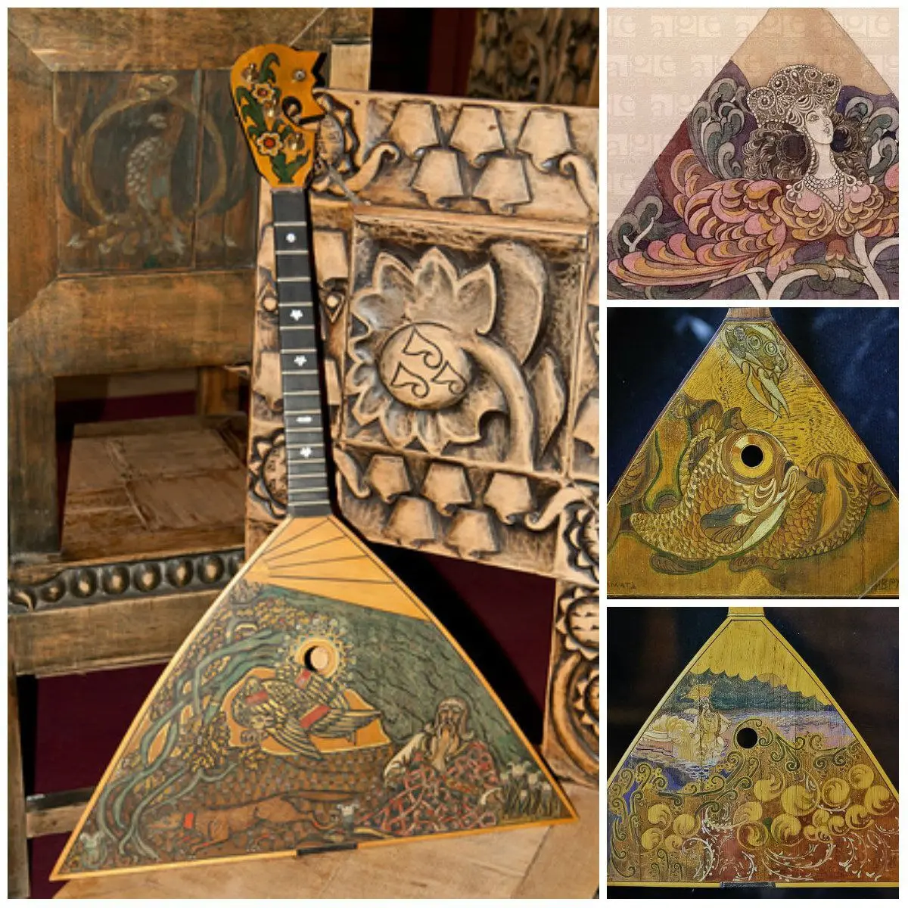{width="1200" height="1200" data-color="#7d6344"}

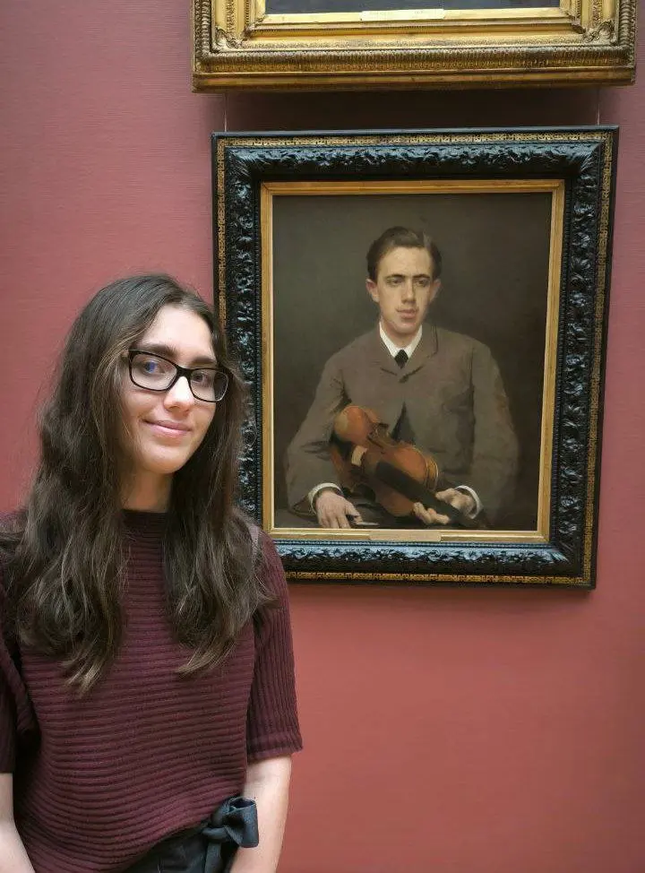{width="720" height="974" data-color="#60463a"}
:::

Ещё несколько Талашкинских балалаек и эскизов

На самом деле, находить и рассматривать музыкальные инструменты в работах великих мастеров прошлого — моё большое увлечение. Без этого не обходится ни один мой поход на выставку или в музей. Когда-нибудь напишу об этом))

**Иван Николаевич Крамской**
Портрет Николая Ивановича Крамского, сына художника  1882
