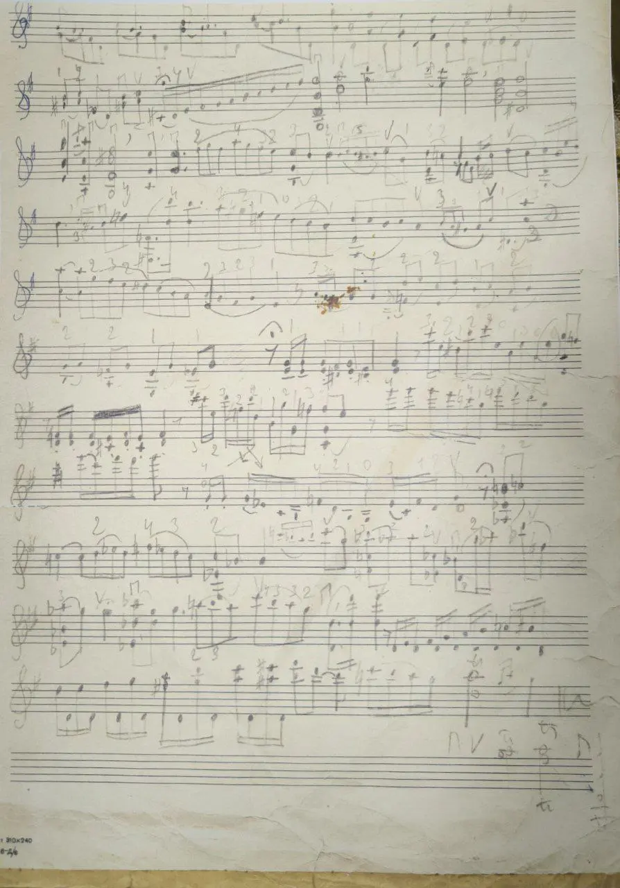

{width="894" height="1280" data-color="#c3c0b2"}

Один из великих скрипачей двадцатого столетия. С детства очень люблю его записи.

У него учился мой профессор в цмш и консерватории Сергей Иванович Кравченко!

🎧 [Слушать Леонид Коган - Интерпретации (1978)](https://youtu.be/CEtvfMwGc5M?feature=shared)
