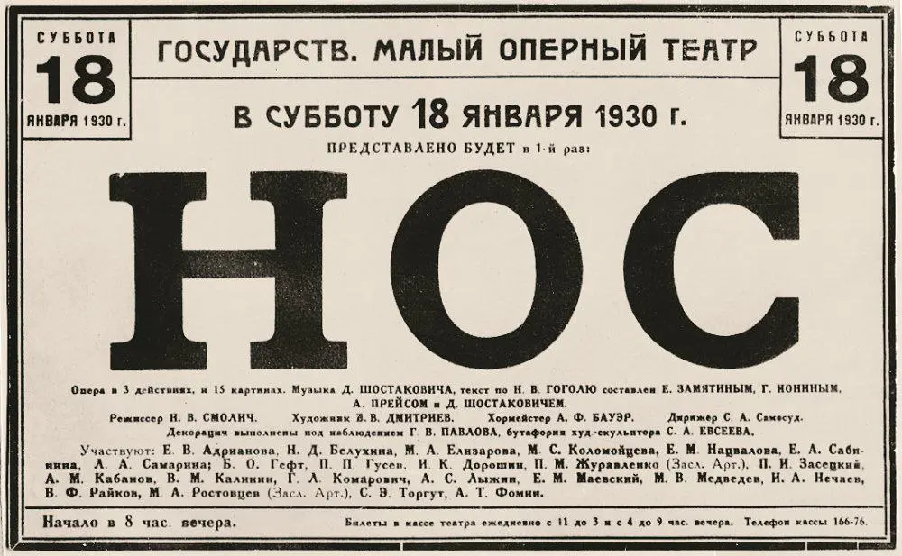

{width="1000" height="617" data-color="#aca498"}

Недавно наткнулась на интересную афишу.

Премьера первой оперы Шостаковича «Нос» состоялась 18 января 1930 года в Ленинграде, в Малом оперном театре — МАЛЕГОТе. Так в советское время назывался Михайловский театр, которому вернули историческое имя в 2001 году.

Премьера прошла под управлением легендарного Самуила Самосуда, который был в то время главным дирижером МАЛЕГОТа.

Вы заметили неожиданную фамилию в списке либреттистов?
Неужели тот самый?

Евгений Замятин, которого мы знаем по первому в своём роде роману-антиутопии «Мы», приложил руку к «Носу» Шостаковича! ~~извините, не удержалась~~

Оказывается, они познакомились в доме Кустодиевых в 1922 году и довольно близко общались вплоть до переезда Замятина во Францию в 1931 году.
