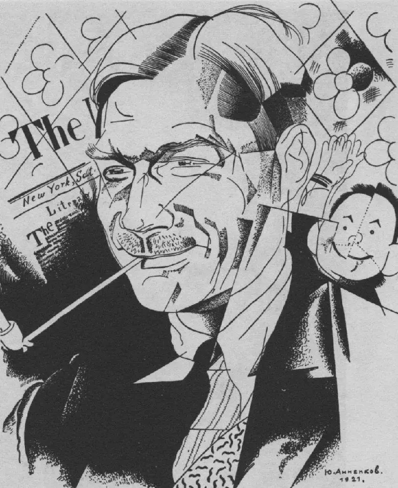
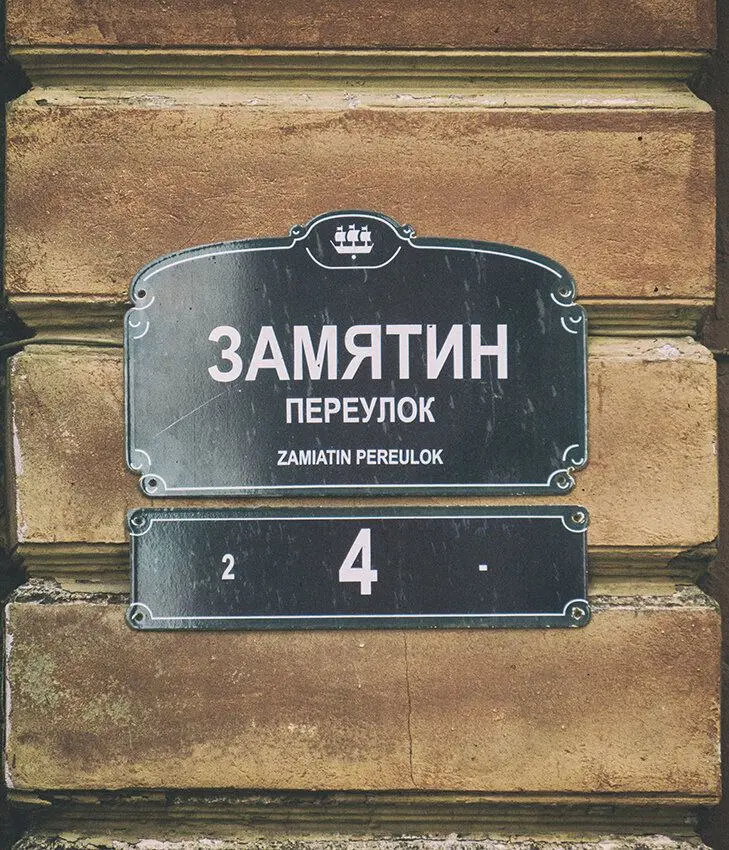

«Еретиком» Замятин сам себя окрестил в «Беседах еретика». В общем, по-моему, ему очень подходит.

Вообще, личность потрясающая во всех отношениях:

Отец его преподавал закон Божий. Золотую медаль, которую получил по окончании Воронежской гимназии, заложил в ломбард за 25 рублей.

Затем учился на морского инженера в Петербургском Политехе. Был изгнан из Петербурга за участие в большевистских выступлениях.

Обе революции принял с большим восторгом: «...что-то сильное, огромное, как смерч, поднимающий голову к небу, — ради чего стоит жить».

 Поэтому сразу после Великого Октября вернулся в Россию из Англии, где в это время участвовал в строительстве ледоколов (!) , в т. ч. «Святого Александра Невского», который позже стал «Лениным».

Правда, в 1920-м году уже был написан роман «Мы». Революционная лодка разбилась... довольно быстро.

Ещё Замятин вёл курс художественной прозы в Петроградском доме искусств, а его студентами там были Михаил Зощенко, Вениамин Каверин, Константин Федин и другие. Можно сказать, что это был первый в СССР и России курс писательского мастерства!

Благодарные студенты вспоминали о нем: «Гроссмейстер литературы, почти совсем инженер и почти совсем не писатель».

Хотя его метод, наверное, и правда казался  абсолютно чуждым для русской литературы с её психологизмом, традицией отражения в тексте самых глубоких человеческих переживаний.

:::gallery
{width="813" height="995" data-color="#8a8a8a"}

{width="729" height="850" data-color="#7f715e"}
:::

В Петербурге, кстати, есть Замятин переулок, он проходит от Английской набережной до Конногвардейского бульвара.

Хотя назван не в честь писателя, а в честь Гаврилы Григорьевича Замятина, статского советника, который служил Петру I))
