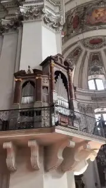

[{width="180" height="320" data-color="#766a65"}](https://t.me/gattavasis/9){.video data-duration="14"}

Сколько же тут органов? Я не досчиталась парочки, жду ваших версий (см. гифку под постом)

А главное зачем? ==На это тоже есть ответ:=={.spoiler} [https://youtu.be/A71nRg\_GLns?feature=shared](https://youtu.be/A71nRg_GLns?feature=shared)

Теперь у меня есть мечта🥺🥺🥺
