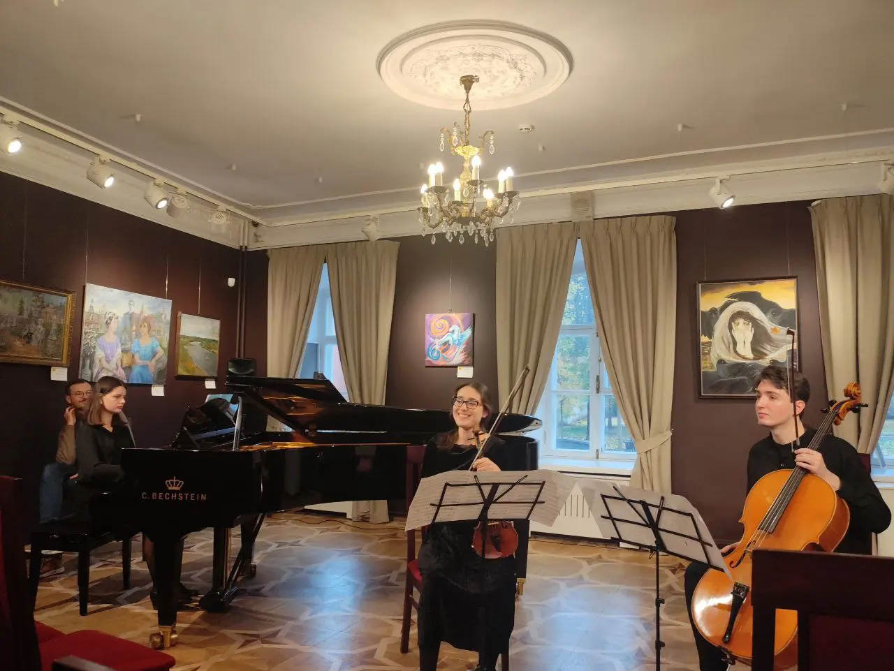
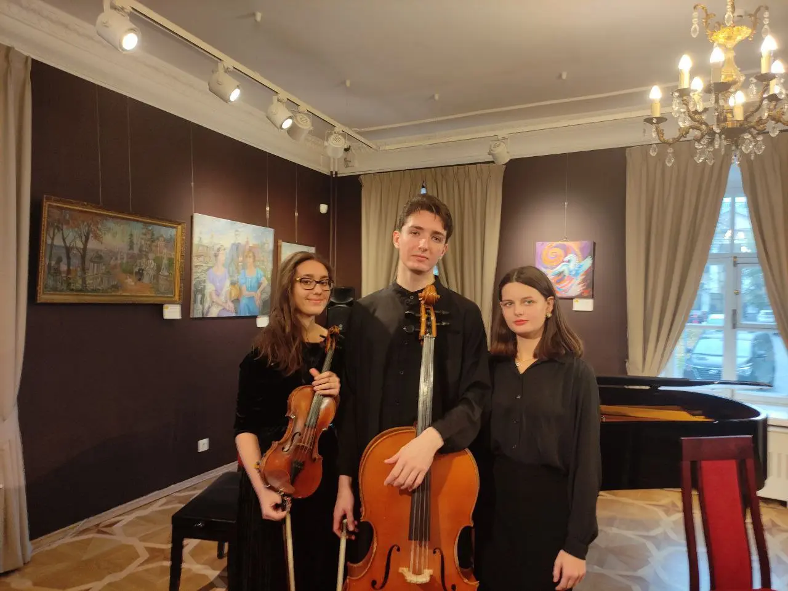
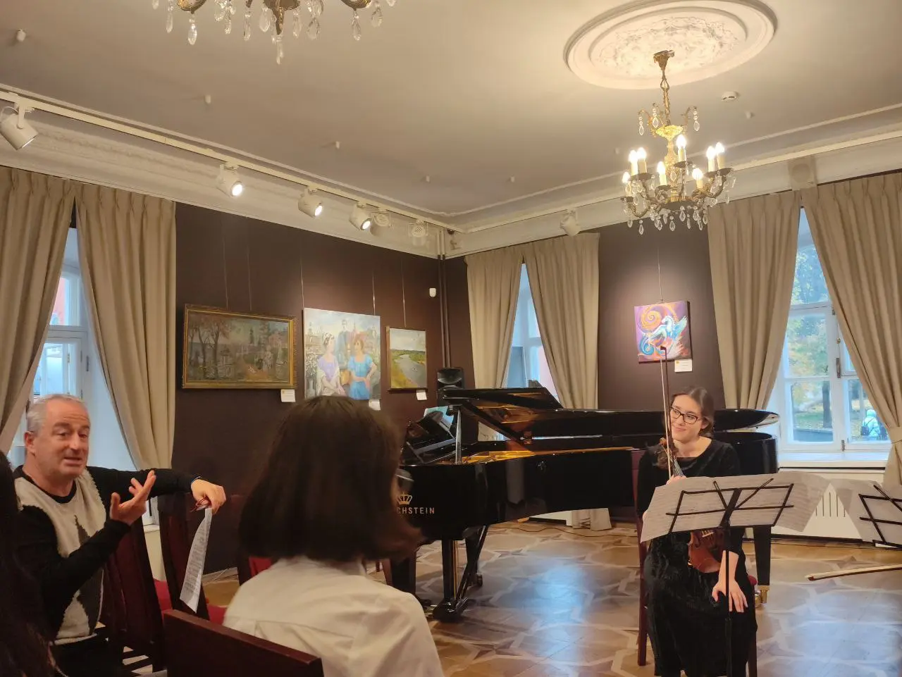
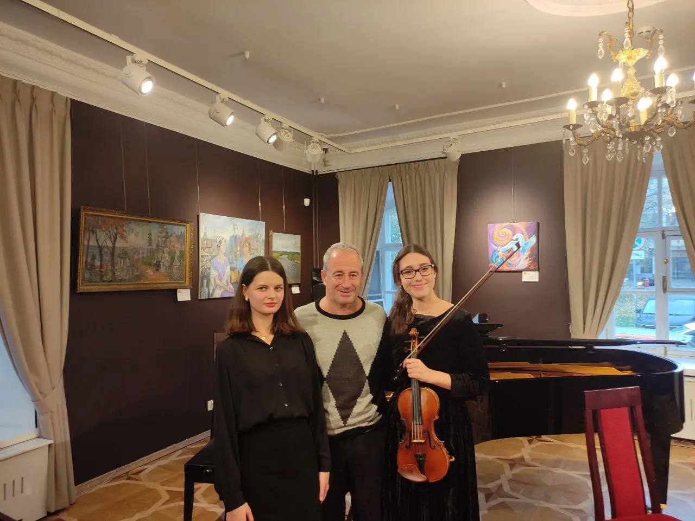
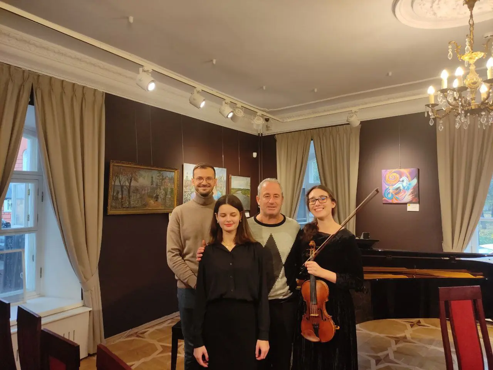

:::gallery
{width="1280" height="961" data-color="#715f4e"}

{width="1280" height="961" data-color="#6c5645"}

{width="1280" height="961" data-color="#7c6857"}

{width="1280" height="961" data-color="#725e4d"}

{width="1280" height="961" data-color="#745d49"}
:::

На мастер-классе французского пианиста, профессора Парижской консерватории Итамара Голана

Спасибо дорогим [Елене](https://t.me/elenamoiseyenkopiano) и Антону!✨✨✨
