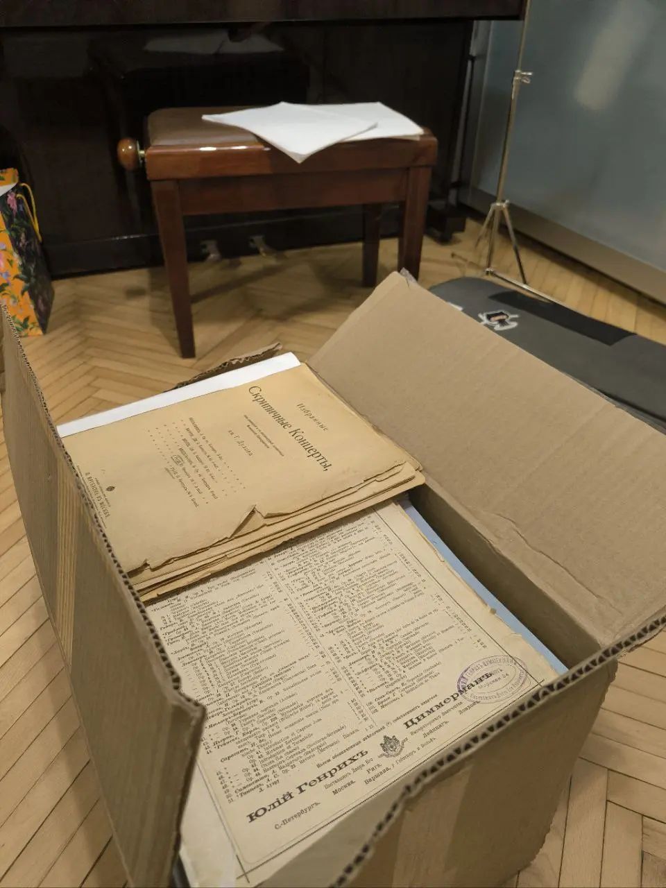
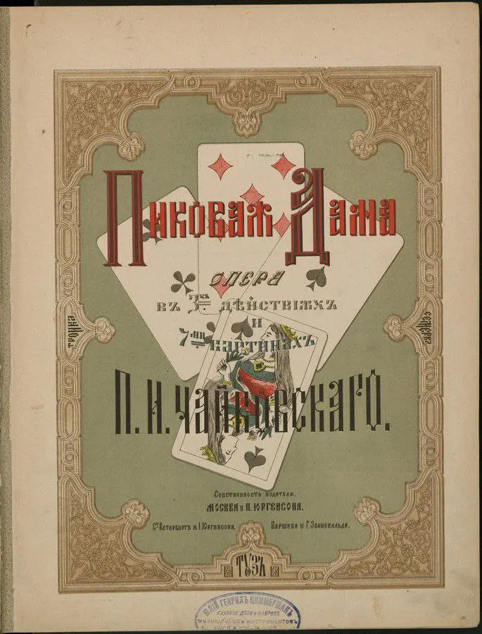
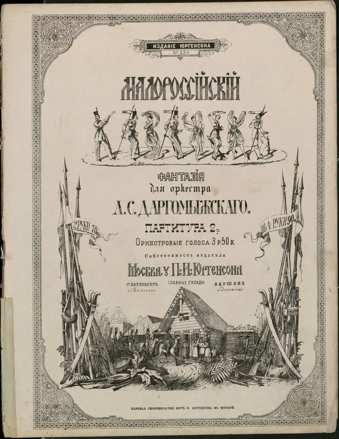
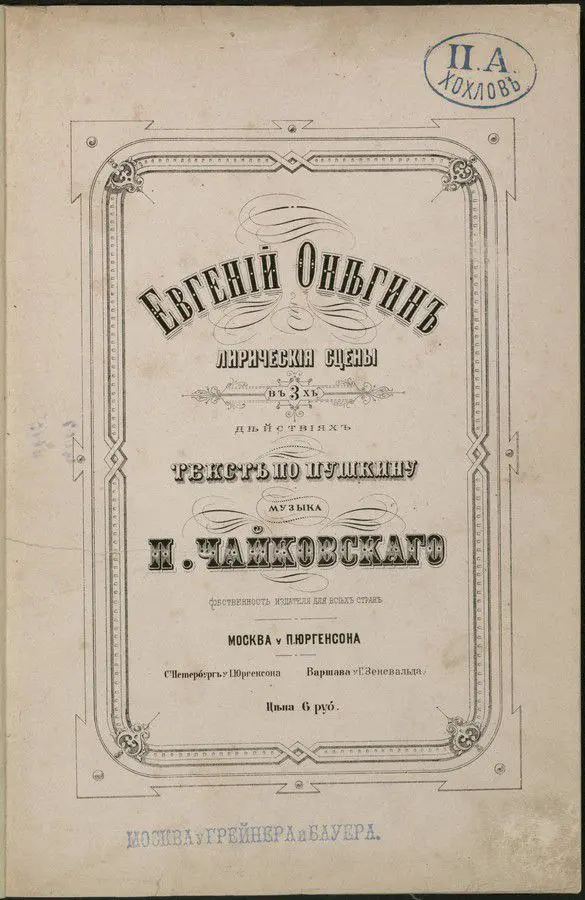
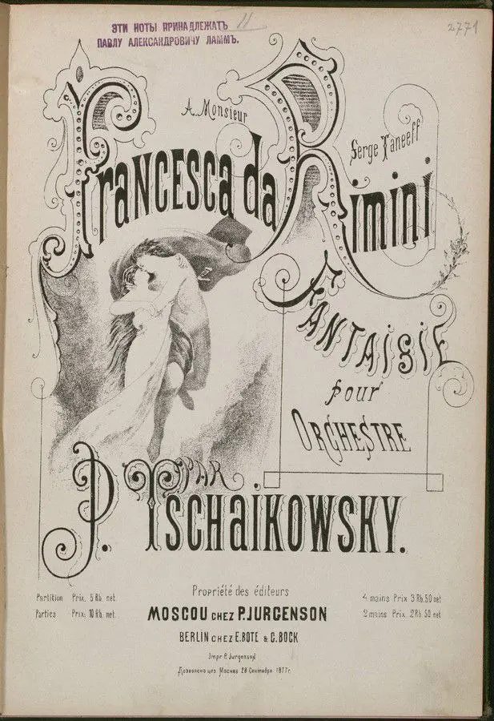
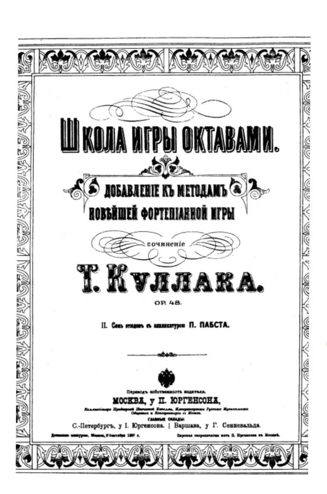
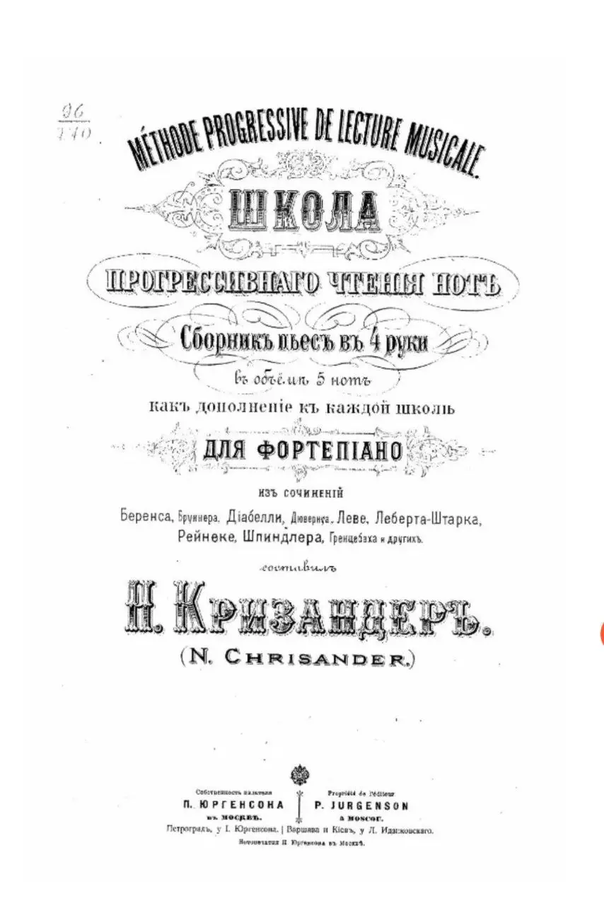
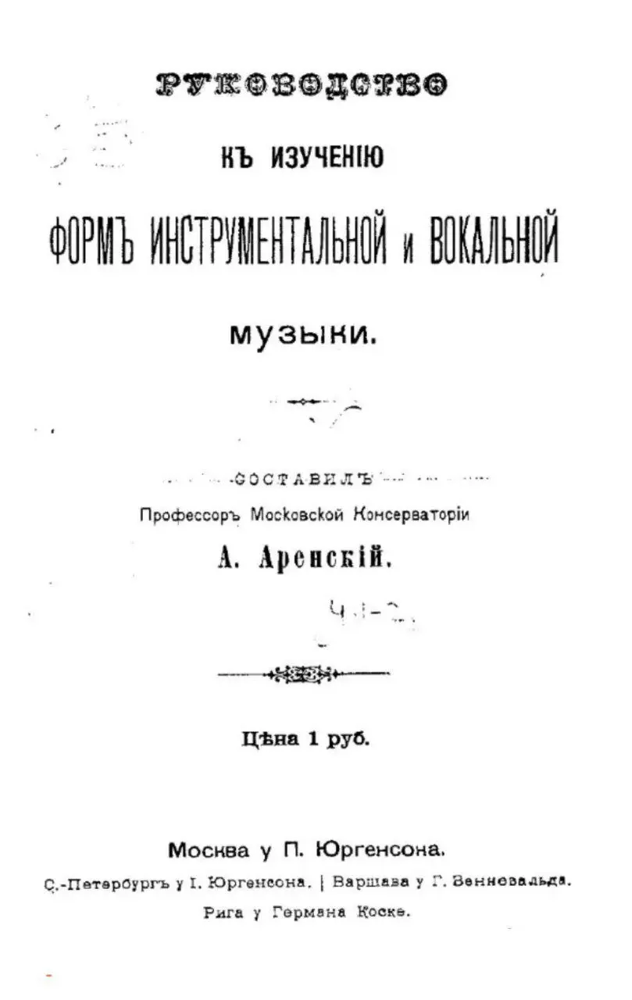

:::gallery
{width="960" height="1280" data-color="#7f6d52"}

{width="685" height="900" data-color="#a18e6f"}

{width="695" height="900" data-color="#b1a797"}

{width="585" height="900" data-color="#bdaf9e"}

{width="617" height="900" data-color="#b5ada1"}

{width="656" height="437" data-color="#737677"}

{width="848" height="1280" data-color="#d9d9d9"}

{width="854" height="1280" data-color="#eeeeee"}

{width="809" height="1280" data-color="#f5f5f5"}
:::

В том числе дореволюционного издательства Петра Юргенсона, которое в 1918 году было национализировано, а потом стало всем известным издательством «Музыка».

Вот так выглядели их нотные издания! ✨✨✨

Сейчас такие не печатают...

10 августа 1861 года в Москве на углу Большой Дмитровки и Столешникова переулка открылся музыкальный магазин Петра Юргенсона. Так началась история первого крупного музыкального издательства в России.

Он привлек внимание основателя Московской консерватории Николая Рубинштейна.
Солидное музыкальное издательство было совершенно необходимым и недостающим элементом музыкальной жизни Москвы. Он и посоветовал Юргенсону открыть собственное дело.

Позднее Петр Иванович Юргенсон стал одним из главных сподвижников Московского отделения Императорского Русского Музыкального Общества.

А представительство издательства было даже в Аргентине!

Юргенсон также первым стал выпускать **серии учебной литературы,** «дешёвых» изданий для широкой публики. М. И. Чайковский отмечал: «…он умел примирить эгоистическую тенденцию наживы с искренним желанием послужить и делу распространения хорошей, настоящей музыки в России. Несмотря на всю прибыльность, он отказался от лёгкой музыки (танцев, цыганских песен и проч.) и явился первым русским издателем бессмертных образцов классического немецкого искусства. Несмотря на всю неприбыльность, он также первый принялся за издание произведений начинающих русских композиторов…»
