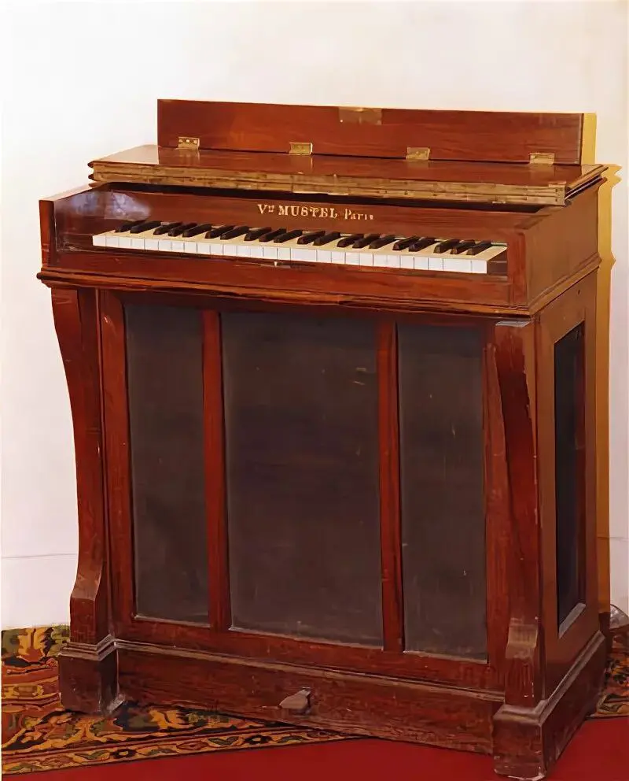
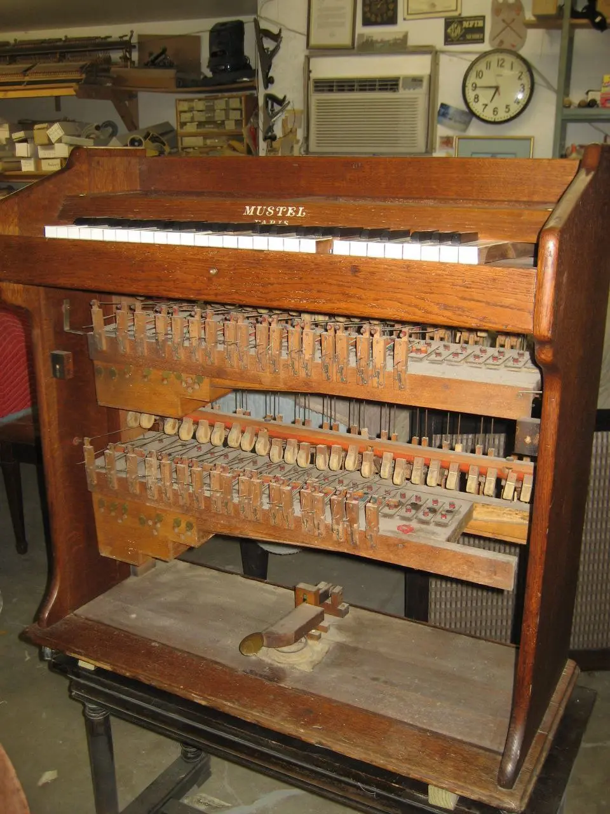
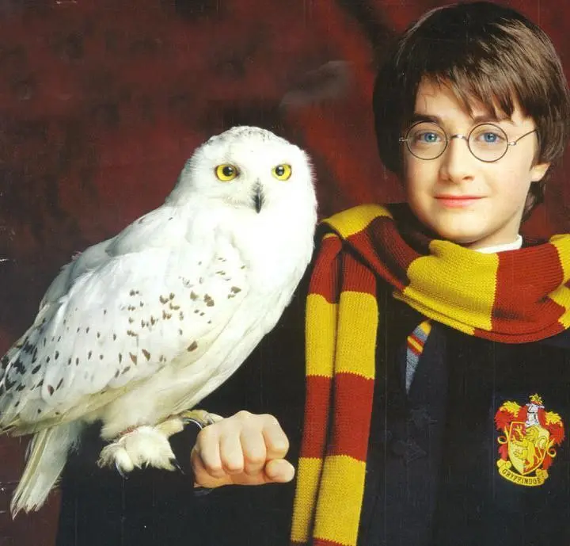

:::gallery
{width="800" height="992" data-color="#7b4e42"}

{width="960" height="1280" data-color="#7a5637"}

{width="720" height="689" data-color="#88745c"}
:::

> и Глазунов пронюхают, раньше меня воспользуются его необыкновенными эффектами. Я предвижу колоссальный эффект от этого нового инструмента.

— так **Пётр Чайковский** в письме своему другу и издателю [Петру Юргенсону, про которого я недавно писала](https://t.me/gattavasis/95), излагал секретный план по покупке (за 1200 франков!) и доставке этого необыкновенного инструмента в Петербург (так, чтобы об этом ни в коем случае не прознали его конкуренты!)

Челеста впервые была представлена на Всемирной выставке в Париже в 1889 году. Инструмент был награждён Гран-при выставки, а сам изобретатель Огюст Мюстель получил в награду Орден Почётного легиона.

Челеста выглядит как маленькое фортепиано с упрощенной фортепианной механикой с молоточками, металлическими пластинками или трубками.

Челеста используется композиторами для создания особого, неземного колорита звучания.
Позже челесту использовали Малер, Дебюсси, Прокофьев и многие другие композиторы.

Этот инструмент, получивший название **celesta**, что в переводе с итальянского означает «небесный», известен своим волшебным звучанием и в первую очередь бесспорно ассоциируется с новогодним чудом. По двум причинам!

🔮 Во-первых, по основной теме оригинального саундтрека к серии фильмов о Гарри Поттере, которую принято пересматривать холодными зимними вечерами. Она известна также как [тема любимой совы Гарри Хедвиг](https://youtu.be/tc9nVR6jOxU?feature=shared)🎧

🍬 Во-вторых, [по танцу феи Драже🎧](https://m.vk.com/video38726126_456239017) из балета «Щелкунчик».
Сочиняя её, Чайковский следовал просьбе Мариуса Петипа: великий балетмейстер хотел, чтобы музыка была похожа на «падение капель воды в фонтанах».
