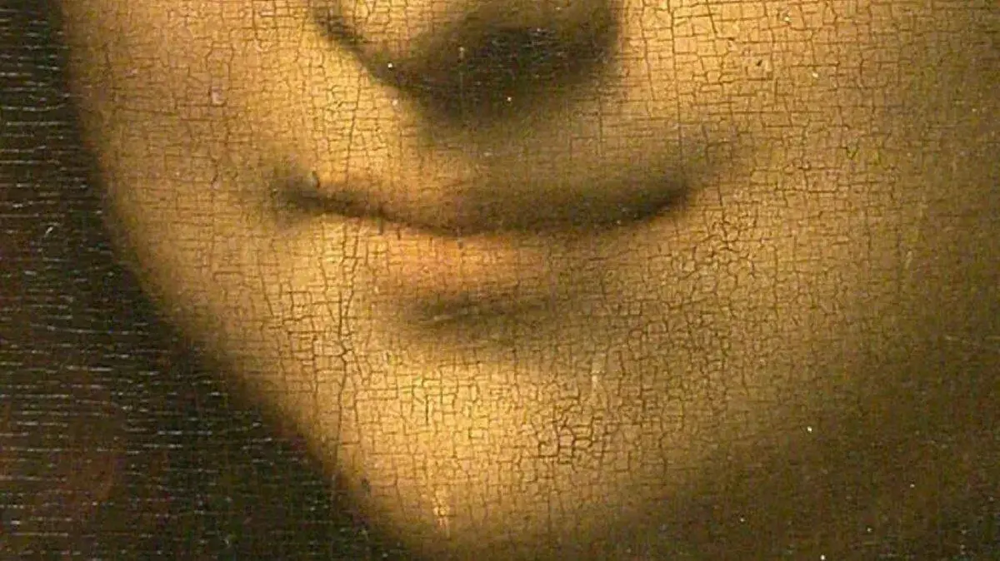

{width="1200" height="674" data-color="#7f5e2c"}

Не думаю, что хотя бы одна красавица сравнится с Лизой Герардини, женой торговца шёлком.

Хотя считается, что настоящую известность «Мона Лиза» приобрела уже после своего похищения, на самом деле, её взгляд покорял сердца людей на протяжении веков.

Легенда гласит, что в 1852 году некий французский художник Люк Масперо покончил собой, не выдержал безответной любви к Джоконде: «В течение многих лет я отчаянно боролся с её улыбкой», — написал он.

На самом деле, чтобы выразить свои чувства к ней, совершенно не обязательно действовать столь радикально. Даже ехать в Париж не потребуется. Там толпы туристов не дадут вам остаться с ней наедине.

Дело в том, что у неё есть собственный почтовый ящик для любовных писем в музее. Просто отправьте письмо по адресу:

Musée du Louvre,
Service des publics,
A l’attention de Mona Lisa,
75058 Paris Cedex 01,
France
