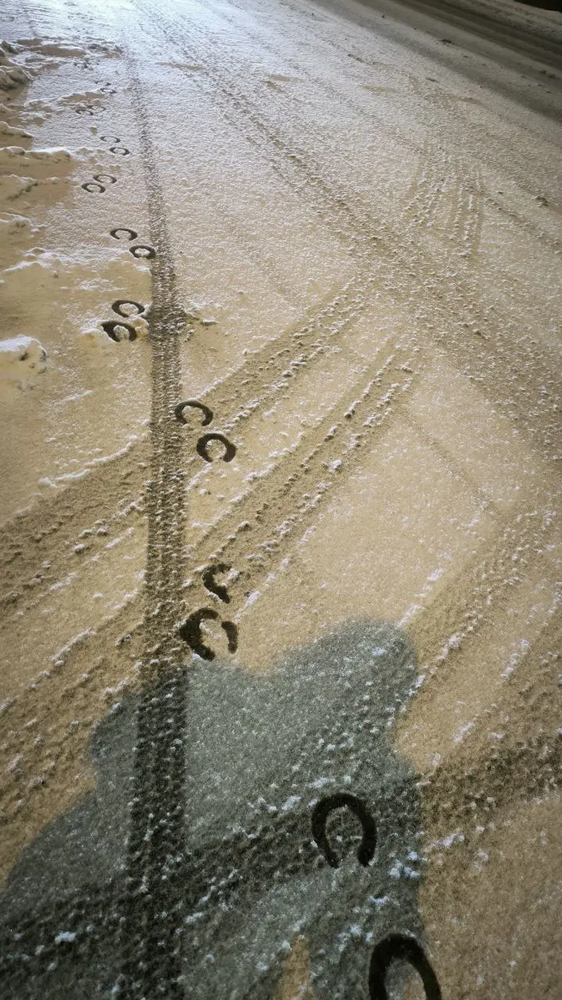

{width="720" height="1280" data-color="#918875"}

Когда возвращаюсь домой в Петербург, иногда начинаю поневоле себя чувствовать героиней романа в направлении исторического сюрреализма.

Например, каждый вечер лошади возвращаются со своего неизменного поста на Дворцовой площади по проспекту, на котором я живу.

Беспокоят ли вас по ночам звуки мотоциклетных моторов? А в сочетании с гулким цоканьем лошадей?))

[Шаги на снегу — Клод Дебюсси - Прелюдии (1-я тетрадь) № 6](https://t.me/gattavasis/180){.audio data-duration="244"}

У каждой прелюдии [Клода Дебюсси](https://www.belcanto.ru/debussy.html) из [этого цикла](https://www.belcanto.ru/debussy_preludes.html) есть программное название, но композитор указывает его только в конце пьесы. Так что он совсем не навязывает слушателю и исполнителю свой образ.

Из-за метафоричности замысла Дебюсси поневоле пришлось добавить ремарку в начале этой пьесы: **«Этот ритм должен иметь звуковое значение фона печального и обледенелого пейзажа»**.

**Но возможно ли передать шаги на снегу музыкальными звуками?**
