:::gallery
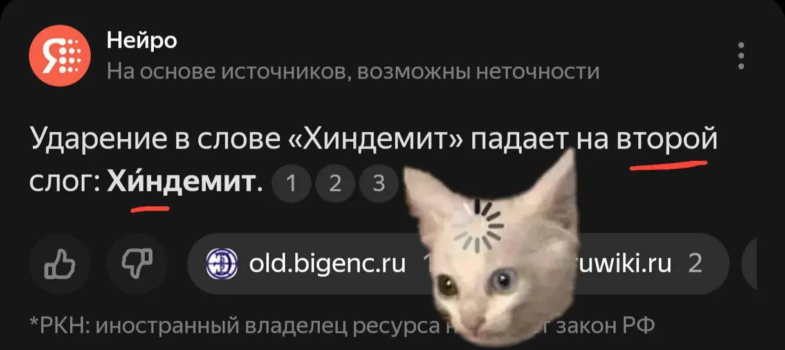{width="1220" height="545" data-color="#322f2e"}

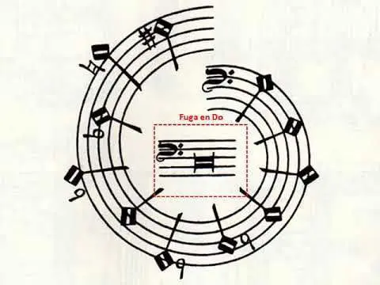{width="480" height="360" data-color="#d9d8d1"}

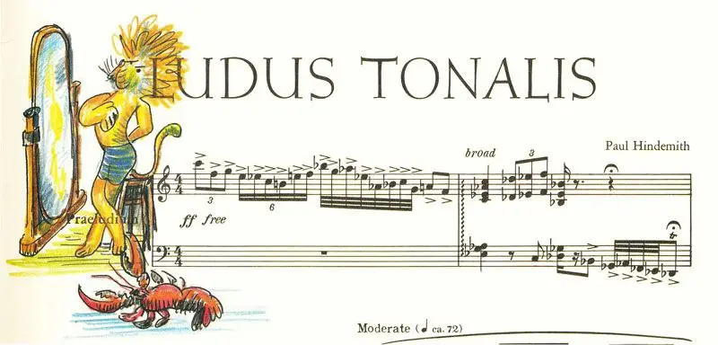{width="800" height="384" data-color="#e5e3d3"}

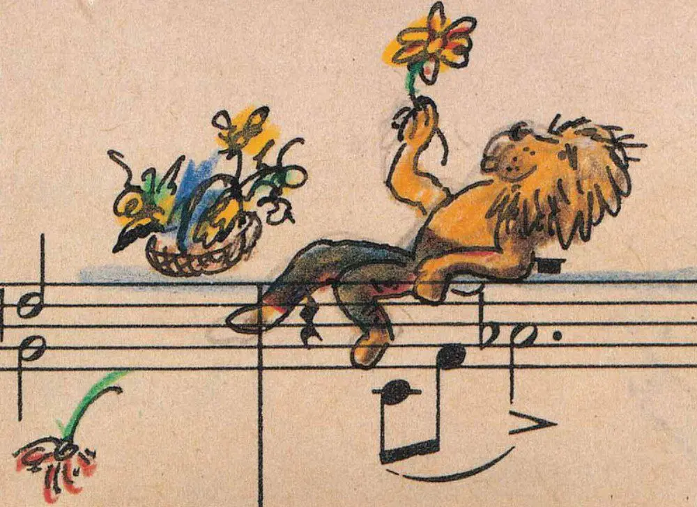{width="1000" height="728" data-color="#b89c82"}

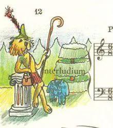{width="220" height="249" data-color="#cccfaf"}

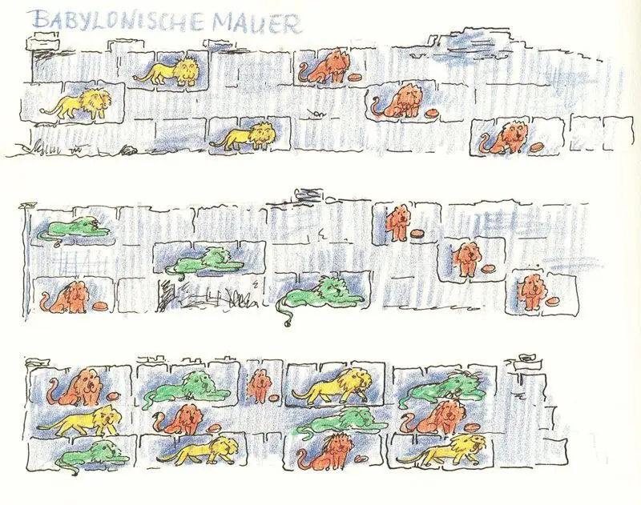{width="800" height="631" data-color="#e1e1db"}

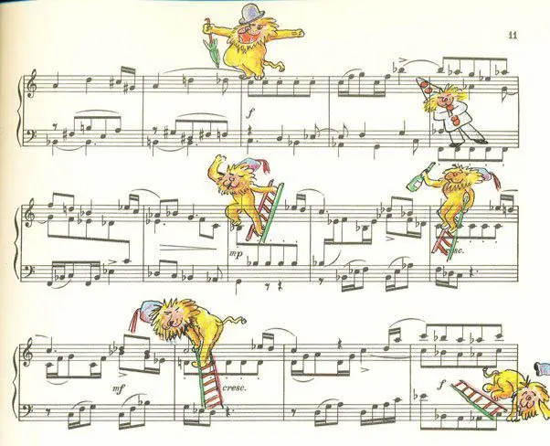{width="602" height="488" data-color="#e4e2d5"}

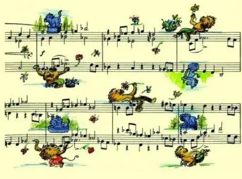{width="498" height="368" data-color="#cdd0a4"}

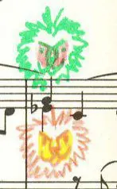{width="147" height="238" data-color="#d3dcc3"}

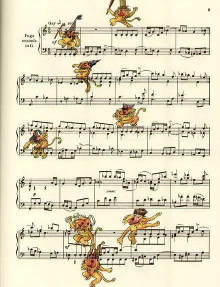{width="440" height="573" data-color="#dbd4bb"}

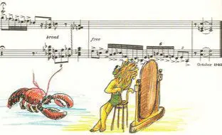{width="312" height="190" data-color="#e0dbcb"}
:::

Так на какой же слог падает ударение в фамилии Пауля Хиндемита?))

В 1942 году Хиндемит написал фортепианный цикл [«Ludus tonalis»](https://vk.com/video-36100537_456239650)🎧
— «тональную игру» в переводе.

Его создание было приурочено к приближающемуся двухсотлетнему юбилею написания Бахом [«Хорошо темперированного клавира»](https://youtube.com/playlist?list=PLAWi4gh2UCGhVZskrUEjaXx2jnLRTH_FS&feature=shared)🎧.

Главная цель создания баховского цикла состояла в том, чтобы в полной мере раскрыть образный потенциал каждой тональности и продемонстрировать возможности темперированного строя. [Немного о нем📺](https://youtu.be/ZWTWnCDwKNc?feature=shared)

А сам **Ludus tonalis** очень сложно устроен. Совсем нет настроения подробно останавливаться на этом))

Формообразующее действие на него оказывает полифония. О ней я как-то писала в одном из предыдущих постов:

см. «[Ситуация: вы хотите задиссить обидчика, но родились в 14 веке...](https://t.me/gattavasis/40)»

🦁🦁🦁
**В 1950 Хиндемит лично проиллюстрировал изданные ноты, нарисовал цветными карандашами множество львов** в разных позах и расположениях, напрямую связанных с музыкальной структурой фуг.

И заодно переименовал «Ludus tonalis» в **«Ludi Leonum» —«Игры львов»** 😁😁

**Львы танцуют вальс, пьют пиво, изучают астрономию, разбрасывают цветы из корзины, водят машины и т. д.**

Это стало подарком его жене Гертруде, рожденной под знаком Льва♌️, в день ее 50-летия.

Моим друзьям-теоретикам я рекомендую ознакомиться с прекрасной [статьёй](https://mtosmt.org/issues/mto.10.16.3/mto.10.16.3.walden.php) **Даниэля Уолдона** про иллюстрированные рукописи Мендельсона и Хиндемита.

Там он подробно разбирает, какой лев к какой стретте относится😆

Какая прелесть🥺🥺🥺

\_
**Иллюстрации П. Хиндемита на нотах «Ludus tonalis»**
