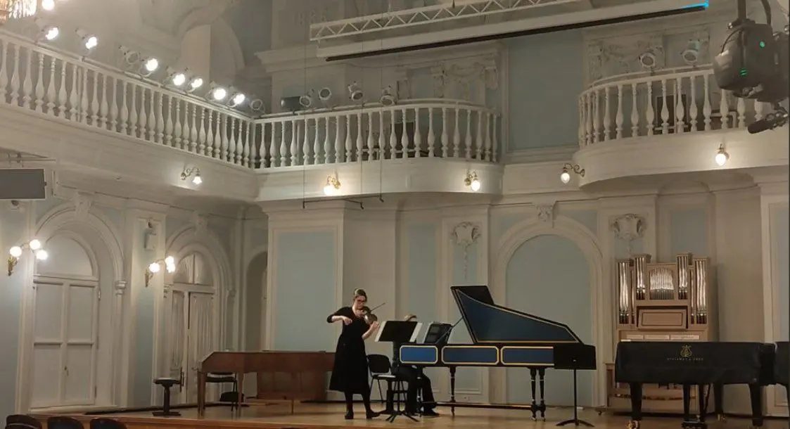
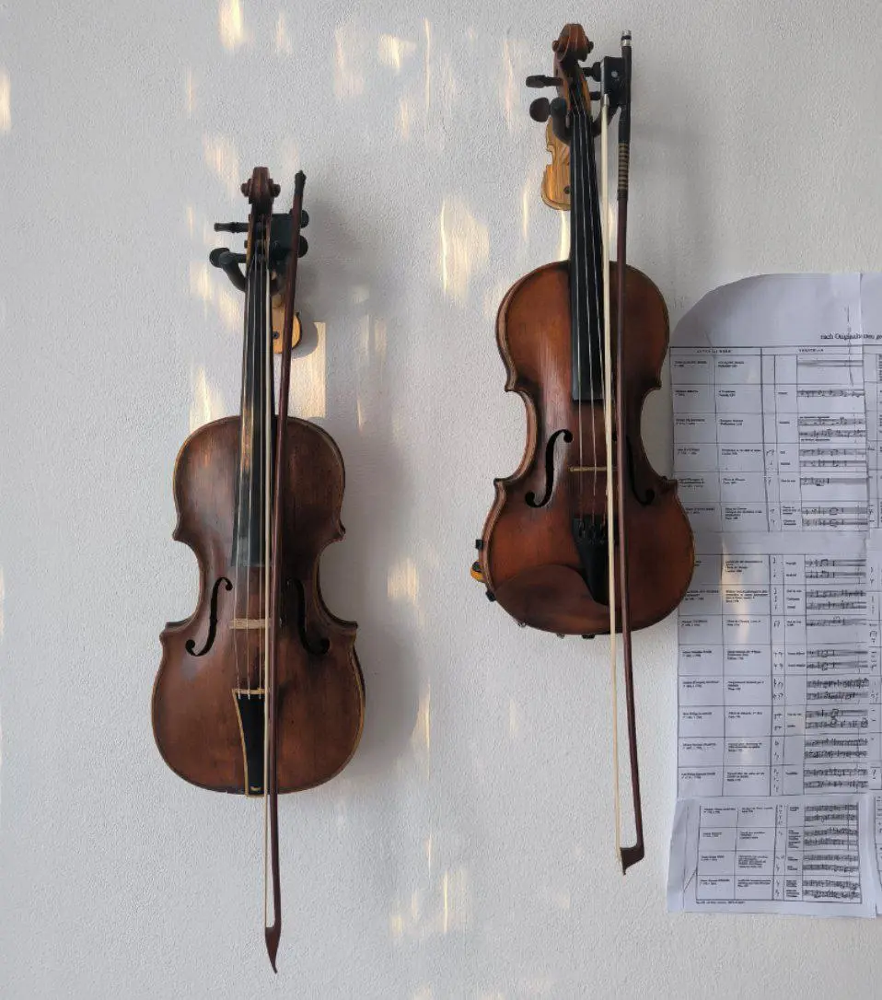

:::gallery
{width="1123" height="610" data-color="#6f6556"}

{width="958" height="1086" data-color="#999394"}
:::

Во-первых, по моему скромному мнению, Люциминия совсем не счастливая. По крайней мере, по ней это совершенно не слышно. Было бы лучше назвать эту сонату «Безутешная Люциминия» или как-то так.

Вообще, доподлинно неизвестно, кто такая эта Люциминия и почему великий скрипач 17 века Марко Учеллини назвал в честь неё сонату.

Но «La Luciminia contenta» трудно интерпретировать иначе...я посоветовалась с подругой-итальянисткой))

Так что для вас сегодня радостная, довольная Люциминия. Она просто сияет от счастья:
[https://youtu.be/fBVnxOCvg0M](https://youtu.be/fBVnxOCvg0M)

Необыкновенный инструмент [за моей спиной](https://youtu.be/fBVnxOCvg0M) — клавесин.
А я играю не на современной, а на барочной скрипке (слева). Они немного различаются.

Другая форма смычка, другой материал струн — не металлические, а жильные из 🫣 ==бараньих кишок=={.spoiler}, они звучат иначе, конечно; другая форма подставки (дощечка под струнами), более низкий строй (A=415Hz) и так далее...
