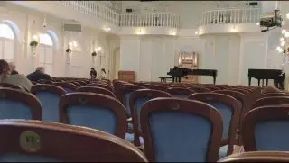

[{width="320" height="181" data-color="#726762"}](https://t.me/gattavasis/195){.video data-duration="31"}

Это прямо-таки грандиозная церемония.
Сначала — торжественное поднесение зачетки к столу комиссии через весь потрясающей красоты и акустики Рахманиновский зал.

Затем поднимаешься на сцену, кланяешься и минут двадцать играешь для профессуры свою любимую музыку.

На этом всё!

Никаких сотен билетов, строгих преподавателей, валящих студентов, с очными ставками и допросами с пристрастием...
==Ладно, не без этого, но тем не менее😁=={.spoiler}

А как проходят/проходили экзамены у вас в вузе?
