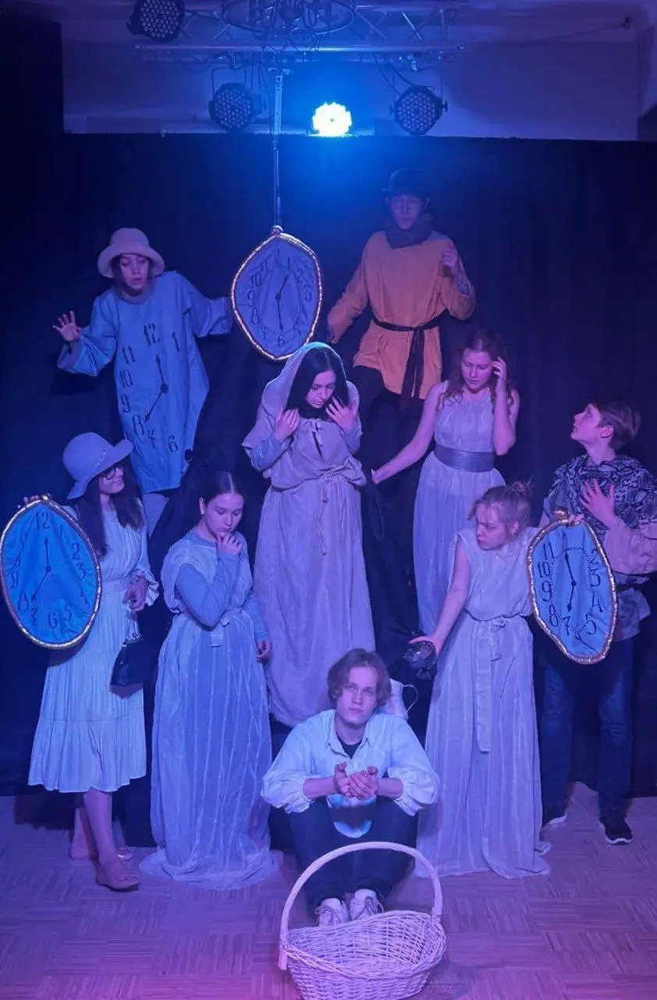
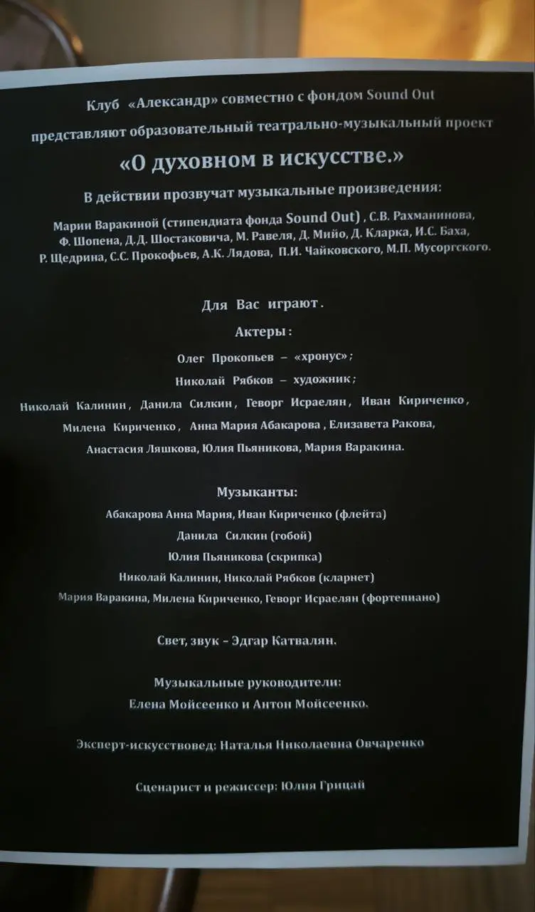

:::gallery
{width="842" height="1280" data-color="#3a3d99"}

{width="752" height="1280" data-color="#1d1e1b"}
:::

Дорогие друзья!
 С радостью приглашаю вас на [премьеру нашего спектакля](https://ano-prosvetitelskiy-klub.timepad.ru/event/3219966/), в основе которого лежат идеи великого художника Василия Кандинского, которые он изложил в своём философском трактате [«О духовном в искусстве»](https://predanie.ru/book/218910-o-duhovnom-v-iskusstve/)📖.

Здесь музыка встречается с поэзией, литературой и художественным искусством.
В этом очень много [Gesamtkunstwerk Рихарда Вагнера](https://www.wassilykandinsky.ru/gesamtkunstwerk.php) — прекрасной романтической идеи о синтезе искусств.

Конечно, в основном я отвечаю за музыку, но мне доверили и важную драматическую роль гётевской фифы💅

Позади три месяца напряжённой работы! Долгожданная премьера состоится **7-го февраля в 19:00**.
В феврале всего будет четыре показа:
[07.02 пт 19:00](https://ano-prosvetitelskiy-klub.timepad.ru/event/3219966/)
[13.02 чт 19:00](https://ano-prosvetitelskiy-klub.timepad.ru/event/3219966/)
[15.02 сб 19:00](https://ano-prosvetitelskiy-klub.timepad.ru/event/3219966/)
[27.02 чт 19:00](https://ano-prosvetitelskiy-klub.timepad.ru/event/3219966/)

Приходите! Буду очень рада всех видеть❤️

🎫 [Билеты по ссылке🔗](https://ano-prosvetitelskiy-klub.timepad.ru/event/3219966/)

📍[Нащокинский переулок, 14](https://yandex.ru/maps/org/aleksandr/86343990352?si=hkgv88xffz97ba3h76tajv9ey0)
     [Клуб «Александр»](https://yandex.ru/maps/org/aleksandr/86343990352?si=hkgv88xffz97ba3h76tajv9ey0)
     [м. Кропоткинская](https://yandex.ru/maps/org/aleksandr/86343990352?si=hkgv88xffz97ba3h76tajv9ey0)

*«Клуб «Александр» совместно с фондом «Soundout» представляют образовательный театрально-музыкальный проект «О духовном в искусстве».*

*Каждое художественное произведение — дитя своего времени.*

*В этом театрально-музыкальном проекте мы попробуем поговорить о духовном в искусстве и соприкоснуться с творчеством известных художников, композиторов и поэтов»*
— из аннотации к спектаклю.
